# 🤖 AI Systems Suite

> **Enterprise multi-app Claude configuration with complete isolation architecture for QE automation**

[](#)
[](#)
[](#)
[](#)

**Modular AI automation suite with completely isolated applications**
- 🏗️ **Complete isolation** - Zero cross-contamination between apps
- 🚀 **Smart routing** - Natural language commands automatically routed
- 🛡️ **Enterprise security** - Hierarchical isolation with violation detection
- ♾️ **Infinite scalability** - Add unlimited apps following standard patterns

---

## 🚀 Quick Start

```bash
# Method 1: Natural language (AI router handles everything)
"Generate test plan for ACM-20640"
"Debug the Jenkins pipeline failure"
"Analyze this automation issue"

# Method 2: Direct app navigation
cd apps/claude-test-generator/
"Generate test plan for ACM-20640"
```

### Prerequisites
- [Claude Code CLI](https://claude.ai) - **Required**
- `kubectl/oc` - **Optional** (intelligent fallbacks available)
- `jira CLI` - **Optional** (WebFetch fallback available)

**🎯 Zero configuration required** - framework works out of the box with intelligent defaults.

---

## 🏗️ How It Works

```mermaid
graph TB
    USER[👤 User Request] --> ROUTER[🧠 Smart Proxy Router]
    ROUTER --> APP1[📋 Test Generator]
    ROUTER --> APP2[🔍 Z-Stream Analysis]
    ROUTER --> APP3[⚙️ AI Conflict Resolver]
    
    subgraph "Complete Isolation"
        APP1 --> RESULT1[✅ Test Plans]
        APP2 --> RESULT2[✅ Bug Analysis]
        APP3 --> RESULT3[🚧 In Development]
    end
    
    style USER fill:#e3f2fd,stroke:#1976d2,stroke-width:2px,color:#000000
    style ROUTER fill:#f3e5f5,stroke:#7b1fa2,stroke-width:2px,color:#000000
    style APP1 fill:#e8f5e8,stroke:#388e3c,stroke-width:2px,color:#000000
    style APP2 fill:#e8f5e8,stroke:#388e3c,stroke-width:2px,color:#000000
    style APP3 fill:#fff3e0,stroke:#f57c00,stroke-width:2px,color:#000000
    style RESULT1 fill:#c8e6c8,stroke:#2e7d32,stroke-width:2px,color:#000000
    style RESULT2 fill:#c8e6c8,stroke:#2e7d32,stroke-width:2px,color:#000000
    style RESULT3 fill:#fff9c4,stroke:#f57f17,stroke-width:2px,color:#000000
```



**Enterprise Isolation:** Each app operates independently with zero cross-contamination

---

## 🎯 Available Applications

### 📋 Claude Test Generator
**Status:** ✅ **Production Ready**  
**Location:** `apps/claude-test-generator/`  
**Purpose:** AI-powered test plan generation for any JIRA ticket

**Key Features:**
- 🚀 **10 minutes** from ticket to professional test cases
- 🛡️ **Evidence-based** validation prevents fictional content
- 🔧 **4-agent architecture** with progressive context inheritance
- 🎯 **Universal support** for any technology stack

**Usage:**
```bash
cd apps/claude-test-generator/
"Generate test plan for ACM-20640"
```

### 🔍 Z-Stream Analysis
**Status:** ✅ **Production Ready**  
**Location:** `apps/z-stream-analysis/`  
**Purpose:** Jenkins pipeline failure analysis with definitive bug classification

**Key Features:**
- ⚡ **5 minutes** from pipeline failure to root cause analysis
- 🎯 **Definitive classification** - PRODUCT BUG vs AUTOMATION BUG
- 🔧 **Environment validation** with merge-ready fix generation
- 📊 **Citation enforcement** for all technical claims

**Usage:**
```bash
cd apps/z-stream-analysis/
"Analyze https://jenkins-url/job/pipeline/123/"
```

### ⚙️ AI Conflict Resolver
**Status:** 🚧 **In Development**  
**Location:** `apps/ai-conflict-resolver/`  
**Purpose:** Automated resolution of merge conflicts and code integration issues

**Planned Features:**
- 🤖 **AI-powered conflict resolution** with context understanding
- 🔧 **Automated merge suggestions** with safety validation

**Note:** This app is currently under active development and not yet functional for production use.

---

## 💡 Usage Examples

### Quick Commands
```bash
# Test generation
"Generate test plan for ACM-20640"
"Create RBAC validation tests for ACM-21316"

# Pipeline analysis
"Analyze Jenkins failure: https://jenkins.example.com/job/123/"
"Debug clc-e2e-pipeline-3313"

# Natural language (works from anywhere)
"I need to validate the new cluster management feature"
"Help me analyze this automation issue"
```

---

## 🔮 Future App Concepts

### 💡 Concept Directory
**Location:** `concepts/`  
**Purpose:** App ideas and design concepts for future development

**Current Concepts:**
- **Universal AI Knowledge Assistant** - Comprehensive design for intelligent knowledge management
- **Additional concepts** in planning phase

These represent potential future applications that could be added to the suite following the established isolation architecture.

---

## 🏗️ Isolation Architecture

### Core Design Principles
- **Zero Context Contamination**: Claude never mixes up which app you're using
- **Complete Self-Containment**: Each app works without knowledge of others
- **Prefixed AI Services**: `tg_` (test-generator), `za_` (z-stream-analysis) namespacing
- **Independent Configurations**: Minimal global config, comprehensive app-specific configs

### App Structure Template
```
apps/your-app/
├── .app-config              # App identity and isolation rules
├── CLAUDE.md               # Self-contained configuration
├── .claude/                # App-specific AI services (prefixed)
├── runs/                   # Independent results storage
└── docs/                   # App-specific documentation
```

### Benefits
- **Team Ownership**: Different teams can own different apps without conflicts
- **Parallel Development**: Work on apps simultaneously without interference  
- **Easy Extension**: Add unlimited apps following standard patterns
- **Maintenance Safety**: Update one app without affecting others

---

## 🔧 Adding New Applications

Follow the proven isolation pattern:

1. **Create App Directory**: `apps/your-app-name/`
2. **Add App Config**: `.app-config` with unique name and AI service prefix
3. **Create Isolated CLAUDE.md**: Include isolation headers and self-contained logic
4. **Implement AI Services**: Use unique prefix for all service files
5. **Verify Isolation**: Test independence using verification guidelines
6. **Update Global**: Add basic app description to this file

**Template Available**: `shared/templates/app-extension-guide.md` provides complete step-by-step instructions

---

## 📚 Documentation

### Architecture Documentation
- **[Isolation Architecture](shared/docs/isolation-architecture.md)** - Complete technical implementation
- **[Usage Guide](shared/docs/usage-guide.md)** - Daily usage patterns and commands
- **[Smart Router Technical](shared/docs/smart-router-technical.md)** - AI-powered routing implementation

### App-Specific Documentation
- **[Test Generator](apps/claude-test-generator/README.md)** - Comprehensive test generation guide
- **[Z-Stream Analysis](apps/z-stream-analysis/README.md)** - Pipeline failure analysis guide

### Extension Resources
- **[App Extension Guide](shared/templates/app-extension-guide.md)** - Standard patterns for adding new apps
- **[JIRA API Setup](shared/docs/JIRA_API_SETUP.md)** - Common setup guides

---

## 🌟 Related Projects

- [Test Generator App](apps/claude-test-generator/) - AI-powered test plan generation
- [Z-Stream Analysis App](apps/z-stream-analysis/) - Jenkins pipeline failure analysis
- [Future Concepts](concepts/) - App ideas and design concepts

## 📄 License

This project is licensed under the MIT License - see the [LICENSE](LICENSE) file for details.

---

<div align="center">
  <strong>Built with ❤️ by the ACM QE AI Systems Suite Team</strong>
  <br>
  <sub><strong>Architecture:</strong> Enterprise Isolation | <strong>Last Updated:</strong> 2025-08-30</sub>
  <br><br>
  <a href="shared/docs/">📚 Documentation</a> •
  <a href="apps/">🚀 Applications</a> •
  <a href="concepts/">💡 Future Concepts</a>
</div>