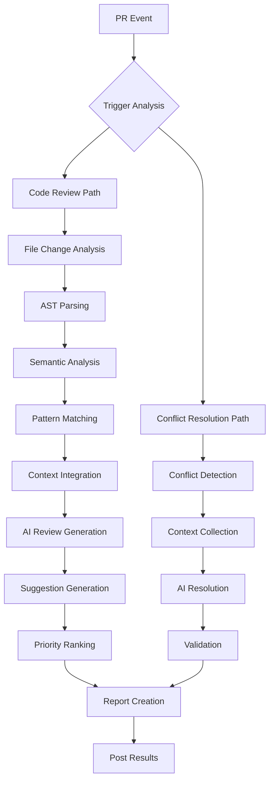
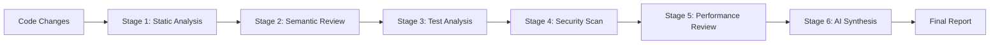

# AI Code Review & Conflict Resolution - Core Intelligence Framework

## 🧠 Core Intelligence Services

### 1. Code Review Intelligence Service
**Purpose**: Comprehensive PR analysis with deep code understanding

```yaml
service: code-review-intelligence
capabilities:
  ast_analysis:
    - syntax_tree_parsing
    - code_flow_analysis
    - dependency_mapping
    - complexity_calculation
  
  semantic_understanding:
    - intent_recognition
    - pattern_matching
    - anti_pattern_detection
    - best_practice_validation
  
  test_intelligence:
    - coverage_analysis
    - test_quality_metrics
    - missing_scenario_detection
    - test_effectiveness_scoring
  
  security_intelligence:
    - vulnerability_detection
    - auth_flow_analysis
    - data_exposure_scanning
    - dependency_vulnerability_check
```

### 2. Improvement Suggestion Engine
**Purpose**: Generate actionable, context-aware improvement suggestions

```yaml
service: suggestion-intelligence
analysis_layers:
  code_optimization:
    description: "Performance and efficiency improvements"
    techniques:
      - algorithm_analysis
      - time_complexity_reduction
      - space_optimization
      - caching_strategies
  
  quality_enhancement:
    description: "Code quality and maintainability"
    areas:
      - readability_improvements
      - complexity_reduction
      - duplication_removal
      - naming_conventions
  
  test_improvements:
    description: "Test coverage and quality"
    suggestions:
      - edge_case_scenarios
      - negative_test_cases
      - integration_test_gaps
      - mock_optimization
```

### 3. Context Integration Service
**Purpose**: Aggregate context from multiple sources for informed reviews

```yaml
service: enhanced-context-intelligence
sources:
  jira_deep_analysis:
    - requirement_parsing
    - acceptance_criteria_extraction
    - test_scenario_mapping
    - implementation_verification
  
  codebase_intelligence:
    - historical_patterns
    - team_conventions
    - architectural_decisions
    - dependency_impacts
  
  test_framework_knowledge:
    - cypress_best_practices
    - jest_patterns
    - testing_conventions
    - coverage_standards
```

## 🔄 Enhanced Workflows

### Comprehensive PR Review Flow


### Multi-Stage Review Pipeline


## 📊 Review Intelligence Categories

### 1. Implementation Analysis
```yaml
implementation_review:
  requirement_alignment:
    - jira_ticket_matching
    - acceptance_criteria_check
    - feature_completeness
    - edge_case_handling
  
  code_structure:
    - architectural_compliance
    - design_pattern_usage
    - separation_of_concerns
    - dependency_injection
  
  logic_validation:
    - algorithm_correctness
    - boundary_conditions
    - error_scenarios
    - state_management
```

### 2. Test Quality Analysis
```yaml
test_review:
  coverage_metrics:
    - line_coverage
    - branch_coverage
    - function_coverage
    - statement_coverage
  
  test_effectiveness:
    - assertion_quality
    - mock_appropriateness
    - test_isolation
    - setup_teardown_review
  
  scenario_completeness:
    - happy_path_coverage
    - error_path_coverage
    - edge_case_coverage
    - integration_scenarios
```

### 3. Security Analysis
```yaml
security_review:
  vulnerability_scanning:
    - sql_injection
    - xss_vulnerabilities
    - csrf_protection
    - authentication_flaws
  
  data_protection:
    - sensitive_data_exposure
    - encryption_usage
    - secure_communication
    - access_control
  
  dependency_security:
    - vulnerable_packages
    - outdated_libraries
    - license_compliance
    - supply_chain_risks
```

## 🤖 AI Review Prompts

### Code Review System Prompt
```markdown
You are an expert code reviewer for a QE automation team. Your role is to:

1. Understand the implementation deeply
2. Verify it matches JIRA requirements
3. Ensure comprehensive test coverage
4. Identify security vulnerabilities
5. Suggest performance improvements
6. Maintain team coding standards

Provide actionable suggestions with code examples.
Focus on high-impact improvements.
Consider the existing codebase patterns.
```

### Improvement Suggestion Prompt
```markdown
Analyze this code change and suggest improvements:

Context:
- Repository: {repository}
- PR Title: {title}
- JIRA Tickets: {tickets}
- Files Changed: {files}

Code Changes:
{diff}

Related Tests:
{tests}

Existing Patterns:
{patterns}

Provide suggestions in these categories:
1. Code Quality (readability, maintainability)
2. Performance Optimization
3. Test Coverage Gaps
4. Security Concerns
5. Best Practice Violations

Format each suggestion with:
- Category
- Severity (High/Medium/Low)
- Current Code
- Suggested Code
- Explanation
```

## 📈 Review Scoring System

### Health Score Calculation
```yaml
health_score:
  components:
    code_quality: 25%
    test_coverage: 25%
    security: 20%
    performance: 15%
    documentation: 15%
  
  scoring:
    excellent: 90-100
    good: 75-89
    needs_improvement: 60-74
    poor: below_60
  
  factors:
    positive:
      - high_test_coverage
      - clean_code_practices
      - security_best_practices
      - performance_optimization
    
    negative:
      - code_duplication
      - complex_functions
      - missing_tests
      - security_vulnerabilities
```

## 🔧 Suggestion Prioritization

### Priority Matrix
```yaml
suggestion_priority:
  critical:
    - security_vulnerabilities
    - breaking_changes
    - data_loss_risks
    - authentication_issues
  
  high:
    - missing_test_coverage
    - performance_bottlenecks
    - error_handling_gaps
    - api_contract_violations
  
  medium:
    - code_duplication
    - naming_improvements
    - documentation_gaps
    - minor_optimizations
  
  low:
    - style_violations
    - optional_enhancements
    - future_considerations
    - nice_to_have_features
```

## 📝 Report Generation

### Structured Report Format
```yaml
report_structure:
  executive_summary:
    - overall_health_score
    - critical_issues_count
    - test_coverage_percentage
    - security_status
    - top_recommendations
  
  detailed_sections:
    - implementation_review
    - test_analysis
    - security_findings
    - performance_review
    - code_quality_metrics
  
  suggestions:
    - categorized_by_priority
    - includes_code_examples
    - estimated_effort
    - impact_assessment
  
  metrics:
    - quantitative_scores
    - trend_analysis
    - comparison_baseline
    - improvement_tracking
```

## 🚀 Advanced Features

### Intelligent Learning
```yaml
learning_system:
  feedback_loop:
    - track_accepted_suggestions
    - monitor_rejected_feedback
    - analyze_manual_changes
    - update_patterns
  
  pattern_recognition:
    - team_coding_styles
    - common_mistakes
    - preferred_solutions
    - technology_trends
  
  continuous_improvement:
    - model_fine_tuning
    - threshold_adjustment
    - priority_calibration
    - context_enhancement
```

### Cross-PR Intelligence
```yaml
cross_pr_analysis:
  pattern_detection:
    - repeated_issues
    - common_improvements
    - architectural_trends
    - team_knowledge_gaps
  
  recommendation_correlation:
    - similar_pr_suggestions
    - successful_patterns
    - avoided_antipatterns
    - learning_opportunities
```

## 🔌 Integration Points

### Enhanced GitHub Integration
```yaml
github_integration:
  review_comments:
    - inline_suggestions
    - file_level_comments
    - pr_summary_comment
    - review_approval_status
  
  status_checks:
    - review_health_score
    - test_coverage_gate
    - security_scan_status
    - performance_check
  
  actions:
    - auto_assign_reviewers
    - label_management
    - milestone_tracking
    - project_updates
```

### JIRA Synchronization
```yaml
jira_sync:
  review_tracking:
    - update_ticket_status
    - add_review_results
    - link_suggestions
    - track_tech_debt
  
  metrics_reporting:
    - code_quality_trends
    - test_coverage_stats
    - security_findings
    - review_velocity
```