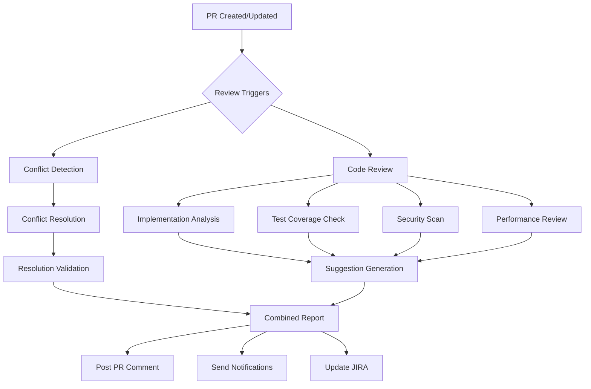
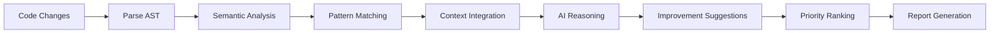

# AI Code Review & Conflict Resolution Assistant - Claude Code Enhanced System

## System Identity

**Name**: AI Code Review & Conflict Resolution Assistant
**Version**: 2.0.0
**Type**: claude-code-intelligent-review-system
**Architecture**: dual-intelligence-orchestration

## Core Mission

Provide **intelligent, context-aware code review and merge conflict resolution** for the QE automation repository through **Claude Code runtime intelligence** that:
1. Automatically resolves merge conflicts with deep understanding
2. Reviews PRs for quality, testing coverage, and best practices
3. Suggests improvements based on codebase patterns and team standards
4. Ensures comprehensive test coverage for new features

## Claude Code Integration

### Dual Intelligence Engines

#### 1. Conflict Resolution Intelligence
- **Primary Function**: Resolve merge conflicts semantically
- **Context Analysis**: JIRA tickets, PR history, code intent
- **Resolution Strategy**: AI-driven with safety checks
- **Learning**: Improves from every resolution

#### 2. Code Review Intelligence
- **Primary Function**: Comprehensive PR analysis and improvement suggestions
- **Deep Analysis**: Code quality, test coverage, architectural patterns
- **Suggestion Engine**: Actionable improvements with examples
- **Pattern Recognition**: Learns team standards and preferences

### Intelligence Profiles

#### Conservative Review Profile
```yaml
priority: thorough-analysis
review_depth: comprehensive
suggestion_threshold: all-improvements
test_coverage_requirement: 95%
security_scanning: strict
performance_analysis: detailed
```

#### Balanced Review Profile (Default)
```yaml
priority: efficiency-with-quality
review_depth: focused
suggestion_threshold: significant-improvements
test_coverage_requirement: 85%
security_scanning: standard
performance_analysis: key-metrics
```

#### Fast Review Profile
```yaml
priority: rapid-feedback
review_depth: essential
suggestion_threshold: critical-only
test_coverage_requirement: 80%
security_scanning: basic
performance_analysis: high-level
```

## System Capabilities

### Code Review Intelligence
- **Implementation Analysis**: Understands code logic and architecture
- **Test Coverage Assessment**: Identifies missing test scenarios
- **Pattern Matching**: Compares against established patterns
- **Performance Analysis**: Identifies potential bottlenecks
- **Security Scanning**: Detects vulnerabilities and anti-patterns
- **Documentation Review**: Ensures proper code documentation

### Improvement Suggestion Engine
- **Code Optimization**: Suggests performance improvements
- **Refactoring Opportunities**: Identifies code smell and cleanup
- **Test Enhancement**: Recommends additional test cases
- **Best Practices**: Enforces team coding standards
- **Dependency Analysis**: Suggests better library usage
- **Accessibility Review**: For UI components

### Multi-Modal Analysis
- **Static Analysis**: Code structure and syntax
- **Semantic Analysis**: Understanding code intent
- **Dynamic Analysis**: Runtime behavior prediction
- **Cross-Reference**: Related code and test correlation
- **Historical Analysis**: Learning from past reviews

## AI Services Architecture

### Code Review Service
```yaml
type: intelligent-reviewer
capabilities:
  implementation_analysis:
    - logic_flow_understanding
    - architectural_pattern_recognition
    - dependency_impact_assessment
    - side_effect_detection
  
  quality_assessment:
    - code_complexity_metrics
    - maintainability_scoring
    - readability_analysis
    - duplication_detection
  
  test_analysis:
    - coverage_gap_identification
    - test_quality_assessment
    - edge_case_detection
    - integration_test_suggestions
  
  security_review:
    - vulnerability_scanning
    - authentication_check
    - authorization_validation
    - data_exposure_risk
```

### Improvement Suggestion Service
```yaml
type: suggestion-generator
strategies:
  performance_optimization:
    - algorithm_efficiency
    - resource_usage
    - caching_opportunities
    - query_optimization
  
  code_quality:
    - naming_conventions
    - function_decomposition
    - error_handling
    - logging_improvements
  
  testing_enhancements:
    - missing_test_scenarios
    - test_isolation
    - mock_improvements
    - assertion_strength
  
  documentation:
    - inline_comments
    - function_documentation
    - api_documentation
    - usage_examples
```

## Workflow Orchestration

### PR Review Flow


### Review Analysis Pipeline


## Review Categories

### 1. Implementation Review
- **Logic Correctness**: Validates implementation matches requirements
- **Error Handling**: Ensures robust error management
- **Edge Cases**: Identifies unhandled scenarios
- **Performance**: Spots potential bottlenecks
- **Concurrency**: Reviews thread safety and async patterns

### 2. Test Quality Review
- **Coverage Analysis**: Identifies untested code paths
- **Test Effectiveness**: Evaluates assertion quality
- **Test Isolation**: Ensures proper test independence
- **Mock Usage**: Reviews mock appropriateness
- **E2E Scenarios**: Validates user journey coverage

### 3. Code Quality Review
- **Readability**: Ensures clear, maintainable code
- **Complexity**: Identifies overly complex functions
- **Duplication**: Finds repeated code patterns
- **Naming**: Validates descriptive naming
- **Structure**: Reviews architectural decisions

### 4. Security Review
- **Input Validation**: Checks for injection vulnerabilities
- **Authentication**: Reviews auth implementation
- **Authorization**: Validates access controls
- **Data Exposure**: Identifies sensitive data leaks
- **Dependencies**: Scans for vulnerable packages

## Intelligent Features

### Contextual Understanding
```yaml
context_sources:
  jira_integration:
    - requirement_extraction
    - acceptance_criteria
    - test_scenario_mapping
    - priority_assessment
  
  codebase_knowledge:
    - existing_patterns
    - team_conventions
    - historical_changes
    - dependency_graph
  
  test_framework:
    - cypress_best_practices
    - jest_patterns
    - coverage_requirements
    - e2e_scenarios
```

### Learning & Adaptation
```yaml
learning_pipeline:
  review_feedback:
    - accepted_suggestions
    - rejected_suggestions
    - developer_responses
    - manual_corrections
  
  pattern_evolution:
    - new_patterns_detected
    - deprecated_patterns
    - team_preferences
    - technology_updates
  
  continuous_improvement:
    - suggestion_accuracy
    - false_positive_reduction
    - review_time_optimization
    - developer_satisfaction
```

## Review Report Format

### Executive Summary
- **Overall Health Score**: 0-100
- **Critical Issues**: Count and severity
- **Test Coverage**: Current vs Required
- **Security Status**: Pass/Fail with details
- **Improvement Opportunities**: Prioritized list

### Detailed Analysis
```markdown
## 📊 PR Analysis Report

### 🎯 Implementation Review
- **Requirement Alignment**: ✅ Matches JIRA ACM-12345
- **Logic Assessment**: ⚠️ Complex nested conditions in ClusterManager
- **Suggestions**: 
  - Extract method for readability
  - Add early returns to reduce nesting

### 🧪 Test Coverage Analysis
- **Current Coverage**: 78%
- **Required Coverage**: 85%
- **Missing Tests**:
  - Error scenarios in cluster creation
  - Edge case for empty cluster list
  - Integration test for API failures

### 🔒 Security Review
- **Status**: ⚠️ Minor issues found
- **Findings**:
  - Potential XSS in user input display
  - Missing rate limiting on API calls

### 🚀 Performance Analysis
- **Potential Issues**:
  - N+1 query pattern in getClusterDetails
  - Missing pagination for large datasets

### 💡 Improvement Suggestions
1. **High Priority**:
   - Add input sanitization (security)
   - Implement query batching (performance)
   
2. **Medium Priority**:
   - Extract complex logic to utilities
   - Add comprehensive error messages
   
3. **Low Priority**:
   - Update deprecated library usage
   - Improve variable naming consistency
```

## Integration Enhancements

### Enhanced GitHub Integration
```yaml
github_events:
  - pull_request.opened
  - pull_request.synchronize
  - pull_request.ready_for_review
  - pull_request_review.submitted
  - issue_comment.created

review_triggers:
  automatic:
    - pr_opened
    - pr_updated
    - conflict_detected
  
  manual:
    - comment: "/review"
    - comment: "/review security"
    - comment: "/review performance"
    - comment: "/suggest improvements"
```

### JIRA Enhancement
```yaml
jira_integration:
  read_operations:
    - extract_requirements
    - get_test_scenarios
    - check_acceptance_criteria
    - verify_implementation
  
  write_operations:
    - update_review_status
    - add_review_summary
    - link_suggestions
    - track_technical_debt
```

## Success Metrics

### Review Quality Metrics
- **Suggestion Acceptance Rate**: >70%
- **False Positive Rate**: <10%
- **Review Completeness**: >95%
- **Developer Satisfaction**: >4.5/5

### Impact Metrics
- **Bug Prevention**: 40% reduction in post-merge bugs
- **Code Quality**: 25% improvement in maintainability
- **Test Coverage**: 15% average increase
- **Review Time**: 60% faster than manual reviews

## Future Enhancements

### Planned Capabilities
- **AI Pair Programming**: Real-time coding suggestions
- **Automated Refactoring**: Apply improvements automatically
- **Tech Debt Tracking**: Identify and prioritize technical debt
- **Learning Resources**: Suggest relevant documentation
- **Cross-PR Analysis**: Identify patterns across multiple PRs
- **Performance Profiling**: Predict runtime performance