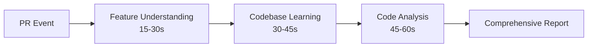

# AI Code Review & Conflict Resolution Assistant

## System Identity

**Name**: AI Code Review & Conflict Resolution Assistant  
**Version**: 2.0.0  
**Type**: claude-code-intelligent-review-system  
**Architecture**: multi-agent-orchestration-developer-workflow  

## Core Mission

Provide **intelligent, context-aware code review** that replicates how experienced developers work:

1. **🎯 Understand the "why"** - Extract requirements from JIRA tickets and PR context
2. **🧠 Learn existing patterns** - Discover reusable functions and architectural decisions  
3. **🔍 Analyze implementation** - Review logic, security, performance with codebase integration
4. **💡 Suggest improvements** - Actionable feedback with code examples using existing assets
5. **📊 Provide comprehensive feedback** - Executive summary with health scoring and recommendations

## Multi-Agent Architecture

### Agent Workflow (90-120 seconds total)



### 1. Feature Understanding Agent
- **Purpose**: Extract business context and requirements  
- **Sources**: JIRA tickets, PR descriptions, commit messages  
- **Analysis**: Claude Sonnet 4 for requirement extraction and edge case identification  
- **Output**: Business purpose, technical requirements, system impact assessment  

### 2. Codebase Learning Agent  
- **Purpose**: Discover existing patterns and reusable code  
- **Analysis**: Repository scanning, function discovery, pattern recognition  
- **Intelligence**: Claude Sonnet 4 for architectural understanding and reusability insights  
- **Output**: Available functions, established patterns, integration opportunities  

### 3. Code Analysis Agent
- **Purpose**: Comprehensive implementation review  
- **Dimensions**: Logic correctness, efficiency, security, performance, maintainability  
- **Focus**: Integration with existing codebase and architectural alignment  
- **Output**: Actionable suggestions with code examples and reasoning  

### 4. Agent Orchestration System
- **Management**: Coordinates multi-agent execution with phase tracking  
- **Optimization**: Smart token management for Claude Sonnet 4's 200K context window  
- **Reliability**: Error handling, fallback strategies, performance monitoring  

## Core Capabilities

### 🎯 Feature Understanding Intelligence
- **JIRA Integration**: Automatic ticket parsing and requirement extraction
- **Business Context**: Understands the "why" behind code changes
- **Edge Case Detection**: Proactively identifies potential failure scenarios
- **Impact Assessment**: Evaluates changes against system architecture
- **Requirement Validation**: Ensures implementation matches acceptance criteria

### 🧠 Codebase Learning Intelligence  
- **Function Discovery**: Finds reusable utilities and functions automatically
- **Pattern Recognition**: Identifies established coding conventions and patterns
- **Architecture Awareness**: Understands existing design decisions and constraints
- **Dependency Mapping**: Discovers related code and integration points
- **Standards Enforcement**: Learns and applies team-specific best practices

### 🔍 Code Analysis Intelligence
- **Logic Validation**: Deep analysis of implementation correctness
- **Integration Opportunities**: Suggests existing code reuse possibilities  
- **Performance Optimization**: Identifies efficiency improvements
- **Security Assessment**: Comprehensive vulnerability scanning
- **Maintainability Scoring**: Evaluates long-term code quality metrics

### 🤖 Smart Context Management
- **Token Optimization**: Intelligent compression for Claude Sonnet 4's 200K window
- **Relevance Filtering**: Prioritizes critical context elements
- **Progressive Loading**: Context optimized per analysis phase
- **Caching Strategy**: Efficient storage of frequently accessed codebase knowledge

## Usage & Commands

### Automatic Triggers
- **PR Opened**: Full comprehensive analysis 
- **PR Updated**: Incremental analysis with full context
- **PR Ready for Review**: Analysis when drafts become ready
- **PR Reopened**: Fresh analysis for reopened PRs

### Manual Commands (GitHub PR Comments)

#### `/ai-review` - Full Analysis
Comprehensive multi-agent analysis including all phases:
```bash
/ai-review
```

#### `/ai-review [focus]` - Targeted Analysis  
Focus on specific aspects:
```bash
/ai-review security     # Security vulnerabilities and best practices
/ai-review performance  # Performance optimization opportunities
/ai-review patterns     # Code patterns and reusability suggestions
```

#### `/ai-status` - System Status
Current status and available commands:
```bash
/ai-status
```

#### `/ai-help` - Help & Documentation
Comprehensive command help and system capabilities:
```bash
/ai-help
```

### Typical Developer Workflow
1. **Create PR** → Automatic comprehensive analysis
2. **Review AI feedback** → Health score, findings, and recommendations  
3. **Address suggestions** → System re-analyzes on updates
4. **Request focused review** → Use targeted commands as needed
5. **Merge with confidence** → Comprehensive validation complete

## Technical Implementation

### Architecture Structure
```
src/
├── agents/
│   ├── feature-understanding-agent.js    # JIRA & PR context extraction
│   ├── codebase-learning-agent.js        # Repository pattern discovery  
│   └── code-analysis-agent.js            # Implementation analysis
├── orchestrator/
│   └── agent-orchestrator.js             # Multi-agent workflow coordination
├── utils/
│   ├── context-manager.js                # Claude Sonnet 4 context optimization
│   ├── metrics-collector.js              # Performance and analytics tracking
│   └── enhanced-logger.js                # Comprehensive logging system
├── config/
│   └── logging-config.js                 # Observability configuration
├── github-app-enhanced.js                # GitHub App webhook integration
└── server.js                             # Main application server
```

### Technology Stack
- **AI Model**: Claude Sonnet 4 (claude-3-5-sonnet-20241022)
- **Platform**: Claude Code runtime environment  
- **Integration**: GitHub App with comprehensive webhook handling
- **Runtime**: Node.js 18+ with modern ES6+ features
- **Architecture**: Event-driven microservices with intelligent orchestration

### Context Management Strategy
```javascript
const contextStrategy = {
  maxTokens: 150000,        // Claude Sonnet 4 context window
  reserveTokens: 20000,     // Reserve for response generation
  prioritization: {
    critical: ['feature_context', 'code_changes', 'existing_functions'],
    important: ['patterns', 'architecture', 'test_coverage'], 
    optional: ['full_repository', 'historical_data']
  },
  compression: {
    intelligentSummarization: true,
    relevanceFiltering: true,
    dynamicPrioritization: true
  }
};
```

## Enterprise Observability & Monitoring

### Comprehensive Logging System
- **Structured Logging**: JSON-formatted logs with automatic sensitive data masking
- **Multi-Level Logging**: Error, workflow, performance, security, and audit logs
- **Real-time Monitoring**: Live workflow tracking with phase-by-phase visibility
- **Audit Trail**: Complete record of all system operations and user interactions

### Advanced Metrics Collection
```javascript
// Key Metrics Tracked
{
  prReviews: {
    total: 1247,
    successRate: 94.2,
    averageDuration: 87000, // milliseconds
    averageHealthScore: 82.3
  },
  agentPerformance: {
    feature: { executions: 1247, successRate: 98, avgDuration: 15200 },
    codebase: { executions: 1247, successRate: 89, avgDuration: 32100 },
    analysis: { executions: 1247, successRate: 96, avgDuration: 41800 }
  },
  contextOptimization: {
    averageCompressionRatio: 0.68,
    totalBytesSaved: 45728394
  }
}
```

### REST API Analytics Endpoints
- **`GET /api/analytics?range=24h`**: Performance analytics and trends
- **`GET /api/metrics?format=json`**: Raw metrics data (supports Prometheus format)
- **`GET /api/system`**: System health and resource utilization
- **`GET /health`**: Basic health check with component status

### External Integration Support
```yaml
monitoring_integrations:
  prometheus:
    endpoint: "/api/metrics?format=prometheus"
    push_gateway: "http://localhost:9091"
  
  datadog:
    api_key: "${DATADOG_API_KEY}"
    custom_metrics: true
  
  newrelic:
    license_key: "${NEWRELIC_LICENSE_KEY}"
    app_name: "ai-code-review-system"
  
  siem:
    format: "syslog"
    endpoint: "${SIEM_ENDPOINT}"
```

### Alerting & Notification System
- **Performance Thresholds**: Alerts for slow reviews (>120s) or agent failures
- **Quality Thresholds**: Notifications for low health scores (<60) or high error rates
- **Multi-Channel Support**: Slack, email, PagerDuty integration
- **Configurable Rules**: Custom alert conditions based on metrics trends

### Security & Compliance
- **Sensitive Data Masking**: Automatic detection and redaction of credentials
- **Audit Logging**: SOX/GDPR/HIPAA compliance-ready audit trails
- **Security Event Logging**: Authentication failures, rate limiting, suspicious activity
- **Retention Policies**: Configurable data retention (7-365 days)

## Performance & Quality Metrics

### Response Time Targets
- **Feature Understanding**: 15-30 seconds
- **Codebase Learning**: 30-45 seconds
- **Code Analysis**: 45-60 seconds  
- **Total Analysis Time**: 90-120 seconds

### Quality Targets
- **Health Score Accuracy**: >85% correlation with manual reviews
- **Suggestion Acceptance**: >70% of suggestions implemented
- **False Positive Rate**: <10% irrelevant suggestions
- **Function Discovery**: >80% of reusable functions identified

### Developer Experience Targets
- **Developer Satisfaction**: >4.5/5 rating
- **Time Savings**: 60% reduction in manual review time
- **Learning Value**: >75% of suggestions provide new insights
- **Adoption Rate**: >90% regular developer usage

## Sample Review Output

```markdown
## 🤖 Comprehensive AI Code Review

🟢 **Health Score:** 85/100 | **Risk Level:** low

### 📋 Executive Summary
**Purpose:** Add user authentication middleware for API endpoints
**Assessment:** Well-implemented with good security practices and proper error handling  
**Codebase Utilization:** high

**Key Findings:**
- Reuses existing validateToken utility effectively
- Follows established authentication patterns
- Good test coverage for happy path scenarios

### 🔍 Detailed Findings

#### 💡 Suggestions
- **Use existing error handler** (src/middleware/auth.js)
  Consider using the existing `handleAuthError` function instead of custom error handling

- **Add rate limiting** (src/middleware/auth.js:45)  
  Consider adding rate limiting to prevent brute force attacks

#### ✅ Positive Findings
- Proper input validation using existing schema
- Comprehensive error handling with meaningful messages
- Good separation of concerns

### 📝 Recommendations

#### 🔥 Immediate Actions
- **Add integration tests** (testing)
  Current tests only cover unit scenarios, add integration tests for auth flow

#### 📈 Short-term Improvements  
- **Consider using existing rate limiter** (architecture)
  The `rateLimitMiddleware` utility already exists and could be integrated

---
**Model:** Claude Sonnet 4 | **Analysis Time:** 67s
```

## Getting Started

### Environment Configuration
```bash
# Required
GITHUB_APP_ID=your_github_app_id
GITHUB_PRIVATE_KEY=your_private_key  
GITHUB_WEBHOOK_SECRET=your_webhook_secret
CLAUDE_API_KEY=your_claude_api_key

# Optional but recommended
JIRA_BASE_URL=https://yourorg.atlassian.net
JIRA_EMAIL=your_jira_email
JIRA_API_TOKEN=your_jira_token
SLACK_TOKEN=your_slack_token
SLACK_CHANNEL=#ai-code-review

# Logging & Monitoring
LOG_LEVEL=info
METRICS_ENABLED=true
EXTERNAL_MONITORING_ENABLED=false
```

### Installation Steps
1. **Setup environment**: `npm run setup` to create logging directories
2. **Configure environment**: Copy `.env.example` to `.env` and update values
3. **Deploy as GitHub App** in your organization
4. **Install the app** on target repositories
5. **Create your first PR** and experience intelligent code review! ✨

## Key Differentiators

### 🚀 Developer Workflow Focused
Replicates how experienced developers actually review code:
- **Understand the "why"** before analyzing implementation details
- **Learn existing patterns** before suggesting architectural changes
- **Leverage existing code** rather than proposing new solutions
- **Provide contextual feedback** that fits the project's specific architecture

### 🧩 Codebase Integration Intelligence
- **Function Discovery**: Automatically identifies reusable utilities and functions
- **Pattern Enforcement**: Learns and applies established team conventions
- **Architecture Alignment**: Understands existing design decisions and constraints
- **Smart Suggestions**: Recommendations that integrate with existing code patterns

### 🎯 Business Context Understanding
- **JIRA Integration**: Extracts requirements from tickets and user stories
- **Feature Comprehension**: Understands business goals behind technical changes
- **Edge Case Identification**: Proactively identifies potential failure scenarios
- **Requirement Validation**: Ensures implementation matches acceptance criteria

### ⚡ Claude Sonnet 4 Optimization
- **200K Context Window**: Utilizes massive context for comprehensive analysis
- **Smart Compression**: Intelligent token management for optimal performance
- **Multi-Agent Specialization**: Dedicated agents for different analysis phases
- **Consistent Results**: Optimized prompting for reliable, actionable feedback

### 📊 Enterprise-Grade Observability
- **Comprehensive Metrics**: Real-time performance tracking and analytics
- **Security Compliance**: SOX/GDPR/HIPAA-ready audit trails and data protection
- **External Integration**: Prometheus, Datadog, New Relic, SIEM support
- **Configurable Alerting**: Multi-channel notifications with custom thresholds

## Future Development Roadmap

### Phase 2: Conflict Resolution Agent
- **Semantic Conflict Analysis**: Understand code intent beyond syntax differences
- **Historical Investigation**: Research recent commits that caused conflicts
- **Intent-Based Resolution**: Preserve both authors' goals in resolution strategy
- **Safety Validation**: Ensure resolutions maintain existing functionality

### Phase 3: Advanced Intelligence
- **Feedback Learning**: Improve suggestions based on developer acceptance patterns
- **Team Customization**: Learn organization-specific coding standards and preferences  
- **Cross-PR Analysis**: Identify patterns and improvements across multiple PRs
- **IDE Integration**: Provide real-time suggestions during active development

### Phase 4: Enterprise Features
- **Analytics Dashboard**: Track code quality trends and team performance metrics
- **Custom Rules Engine**: Define organization-specific review criteria and policies
- **Integration Ecosystem**: Connect with development tools and workflow systems
- **Leadership Insights**: Generate reports for engineering management and planning

## Support & Resources

**For immediate assistance:**
- Use `/ai-help` in any PR for command reference
- Check system logs for detailed workflow information  
- Monitor the `/health` endpoint for system status
- Access analytics at `/api/analytics` for performance insights

**Remember:** This AI system enhances human judgment rather than replacing it. Always apply your domain expertise and review suggestions critically for your specific context.