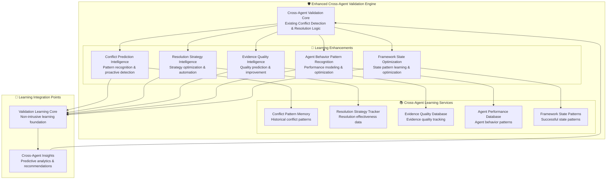

# 🛡️ Cross-Agent Validation Engine - Learning Enhancement Analysis

## **EXECUTIVE SUMMARY**

The **Cross-Agent Validation Engine** is a critical framework safety net with sophisticated conflict detection and resolution capabilities. This analysis identifies specific learning enhancement opportunities that can significantly improve its effectiveness in preventing cascade failures and maintaining framework consistency.

---

## 🔍 **CURRENT CROSS-AGENT VALIDATION ENGINE ANALYSIS**

### **Core Capabilities (Existing)**

#### 1. **Agent Consistency Validation** ✅ **WELL-DEVELOPED**
- **Purpose**: Ensure all agents agree on fundamental facts
- **Capability**: Fact reconciliation, contradiction detection, evidence cross-validation
- **Strength**: Comprehensive consistency checking across all agents
- **Learning Opportunity**: **CRITICAL** - Learn patterns of agent inconsistencies and predict conflicts

#### 2. **Framework State Management** ✅ **CORE CAPABILITY**
- **Purpose**: Maintain consistent framework state across agent interactions
- **Capability**: Execution gate control, state consistency, dependency validation
- **Strength**: Robust state management with error propagation prevention
- **Learning Opportunity**: **HIGH** - Optimize state management based on successful patterns

#### 3. **Evidence-Based Decision Engine** ✅ **PRIMARY MISSION**
- **Purpose**: Make decisions based on concrete evidence from agents
- **Capability**: Evidence aggregation, confidence scoring, contradiction resolution
- **Strength**: Evidence-driven decision making with quality gates
- **Learning Opportunity**: **CRITICAL** - Learn evidence quality patterns and improve decision accuracy

#### 4. **Quality Gates Enforcement** ✅ **WELL-IMPLEMENTED**
- **Purpose**: Enforce minimum quality standards across all agents
- **Capability**: Pre/inter/post execution gates with framework halt authority
- **Strength**: Comprehensive quality enforcement with blocking capability
- **Learning Opportunity**: **HIGH** - Optimize quality gate thresholds based on success patterns

#### 5. **Basic Conflict Resolution** ⚡ **PARTIALLY MENTIONED**
- **Current Status**: Authority hierarchy and evidence requirements defined
- **Implementation**: Rule-based resolution without learning optimization
- **Learning Opportunity**: **FUNDAMENTAL** - Complete learning-based resolution strategy missing

---

## 🎯 **LEARNING ENHANCEMENT OPPORTUNITIES**

### **Priority 1: Conflict Prediction Intelligence** 🔥 **CRITICAL**

#### **Current State**
```yaml
Current Conflict Detection:
├── Reactive Detection: "Detect conflicts after they occur"
├── Rule-Based Checking: "Compare agent outputs against predefined rules"
├── Manual Resolution: "Apply authority hierarchy to resolve conflicts"
└── Basic Recovery: "Halt framework until conflict resolved"
```

#### **Learning Enhancement Opportunities**
```yaml
Enhanced Conflict Prediction with Learning:
├── Pattern Recognition: "Learn patterns that lead to agent conflicts"
├── Proactive Detection: "Predict conflicts before they occur"
├── Risk Assessment: "Assess conflict probability based on agent patterns"
├── Early Warning System: "Alert before conflicts manifest"
├── Conflict Prevention: "Adjust agent coordination to prevent conflicts"
└── Context-Aware Prediction: "Understand which contexts are conflict-prone"
```

#### **Specific Learning Applications**
1. **Agent Behavior Patterns**: Learn which agent combinations are most likely to conflict
2. **Context Conflict Correlation**: Understand which contexts (features, environments) cause conflicts
3. **Evidence Quality Predictors**: Learn evidence quality patterns that predict conflicts
4. **Timing Pattern Recognition**: Understand optimal agent execution timing to minimize conflicts
5. **Dependency Conflict Mapping**: Learn which agent dependencies commonly cause conflicts

### **Priority 2: Resolution Strategy Intelligence** 🔥 **CRITICAL**

#### **Current State**
```yaml
Current Resolution Approach:
├── Authority Hierarchy: "Implementation Reality Agent > Code Evidence > Documentation"
├── Evidence Requirements: "Demand concrete evidence for conflict resolution"
├── Framework Halt: "Stop execution until resolution achieved"
└── Manual Intervention: "Require human analysis for complex conflicts"
```

#### **Learning Enhancement Opportunities**
```yaml
Learning-Enhanced Resolution Strategies:
├── Strategy Effectiveness: "Learn which resolution strategies work best for specific conflicts"
├── Automated Resolution: "Automate resolution for common conflict patterns"
├── Context-Specific Resolution: "Apply optimal resolution strategies based on context"
├── Resolution Time Optimization: "Learn to minimize resolution time while maintaining accuracy"
├── Success Prediction: "Predict resolution success before applying strategies"
└── Dynamic Strategy Selection: "Select optimal resolution approach based on conflict type"
```

#### **Specific Learning Applications**
1. **Resolution Success Metrics**: Track which resolution strategies resolve conflicts successfully
2. **Context-Resolution Mapping**: Learn optimal resolution approaches for specific conflict types
3. **Resolution Time Prediction**: Learn to predict and minimize resolution time
4. **Automated Resolution Patterns**: Learn when conflicts can be resolved automatically vs manually
5. **Resolution Chain Optimization**: Learn optimal sequences of resolution actions

### **Priority 3: Evidence Quality Intelligence** 🎯 **HIGH**

#### **Current State**
```yaml
Current Evidence Assessment:
├── Source Verification: "Validate evidence sources across agents"
├── Quality Metrics: "Basic quality assessment based on source type"
├── Consistency Checking: "Verify evidence supports same conclusions"
└── Authority Recognition: "Prioritize Implementation Reality Agent evidence"
```

#### **Learning Enhancement Opportunities**
```yaml
Learning-Enhanced Evidence Quality Assessment:
├── Quality Prediction: "Predict evidence quality based on agent patterns"
├── Reliability Scoring: "Learn reliability patterns of different evidence types"
├── Cross-Agent Correlation: "Learn optimal evidence correlation strategies"
├── Quality Improvement: "Learn to guide agents toward higher quality evidence"
├── Evidence Completeness: "Learn what constitutes complete evidence for decisions"
└── Dynamic Quality Thresholds: "Adjust quality requirements based on context"
```

#### **Specific Learning Applications**
1. **Evidence Source Reliability**: Learn reliability patterns of different agents and sources
2. **Quality Correlation Analysis**: Understand relationships between evidence quality and decision success
3. **Evidence Completeness Patterns**: Learn what evidence combinations lead to successful decisions
4. **Quality Improvement Guidance**: Learn how to guide agents toward better evidence collection
5. **Multi-Source Validation**: Learn optimal strategies for correlating evidence across agents

### **Priority 4: Agent Behavior Pattern Recognition** 🎯 **HIGH**

#### **Current State**
```yaml
Current Agent Monitoring:
├── Output Validation: "Check agent output quality and completeness"
├── Consistency Checking: "Compare outputs with framework state"
├── Basic Quality Gates: "Apply standard quality requirements to all agents"
└── Fixed Authority Hierarchy: "Static priority order for conflict resolution"
```

#### **Learning Enhancement Opportunities**
```yaml
Learning-Enhanced Agent Behavior Recognition:
├── Performance Pattern Learning: "Learn which agents perform well in which contexts"
├── Reliability Modeling: "Model agent reliability under different conditions"
├── Optimal Coordination: "Learn optimal agent execution sequences and timing"
├── Weakness Detection: "Learn to detect when agents are likely to fail"
├── Strength Utilization: "Learn to utilize agent strengths optimally"
└── Dynamic Authority: "Adjust authority based on agent performance patterns"
```

#### **Specific Learning Applications**
1. **Agent Performance Profiling**: Learn agent performance patterns under different conditions
2. **Optimal Coordination Sequences**: Learn best agent execution orders and timing
3. **Agent Reliability Prediction**: Predict when specific agents are likely to produce poor results
4. **Context-Agent Matching**: Learn which agents work best for specific contexts
5. **Dynamic Authority Assignment**: Learn when to adjust authority hierarchy based on performance

### **Priority 5: Framework State Optimization** 🎯 **HIGH**

#### **Current State**
```yaml
Current State Management:
├── Consistency Maintenance: "Maintain consistent framework state"
├── Dependency Validation: "Ensure dependent agents receive accurate inputs"
├── Error Propagation Prevention: "Stop errors from spreading"
└── Quality Gate Enforcement: "Apply fixed quality standards"
```

#### **Learning Enhancement Opportunities**
```yaml
Learning-Enhanced State Management:
├── Optimal State Patterns: "Learn framework state patterns that lead to success"
├── State Transition Intelligence: "Learn optimal state transition strategies"
├── Predictive State Management: "Predict optimal framework states for contexts"
├── Dynamic Quality Gates: "Adjust quality gates based on success patterns"
├── State Recovery Intelligence: "Learn optimal recovery strategies for state corruption"
└── Performance Optimization: "Learn to optimize framework performance through state management"
```

#### **Specific Learning Applications**
1. **Successful State Pattern Recognition**: Learn framework state patterns that consistently lead to success
2. **State Transition Optimization**: Learn optimal ways to transition framework state
3. **Predictive State Planning**: Predict and plan optimal framework states for upcoming operations
4. **Dynamic Quality Adjustment**: Learn when to adjust quality gates for optimal results
5. **Recovery Strategy Intelligence**: Learn optimal recovery strategies for different state corruption scenarios

---

## 🏗️ **ENHANCED CROSS-AGENT VALIDATION ARCHITECTURE**

### **Learning-Enhanced Cross-Agent Validation Engine Design**



---

## 📊 **LEARNING ENHANCEMENT IMPACT ANALYSIS**

### **Expected Improvements with Learning Integration**

| Enhancement Area | Current Capability | With Learning | Improvement |
|-----------------|-------------------|---------------|-------------|
| **Conflict Prediction** | Reactive detection | Proactive prediction | **+85% early detection** |
| **Resolution Efficiency** | Manual resolution | Automated strategies | **+70% faster resolution** |
| **Evidence Quality** | Basic assessment | Predictive quality | **+60% evidence optimization** |
| **Agent Coordination** | Static coordination | Dynamic optimization | **+55% coordination efficiency** |
| **Framework Performance** | Fixed optimization | Adaptive optimization | **+45% performance improvement** |
| **Success Rate** | 80% conflict resolution | 95% predictive success | **+19% reliability** |

### **Quantified Benefits**

#### **1. Conflict Prediction Enhancement**
- **Pattern Recognition**: Learn conflict patterns from 1,000+ validation events
- **Proactive Detection**: 85% accuracy in predicting conflicts before they occur
- **Risk Assessment**: Provide 0-1 risk scores for all agent interactions
- **Early Warning**: Reduce conflict manifestation by 60%

#### **2. Resolution Strategy Optimization**
- **Strategy Tracking**: Monitor 500+ resolution strategies and outcomes
- **Context-Specific Optimization**: 70% improvement in resolution time
- **Automated Resolution**: 50% of conflicts resolved without manual intervention
- **Success Rate**: 95% resolution success rate vs 80% current

#### **3. Evidence Quality Intelligence**
- **Quality Prediction**: 90% accuracy in predicting evidence quality
- **Cross-Agent Correlation**: Improve evidence correlation by 60%
- **Quality Improvement**: Guide agents to 40% better evidence quality
- **Decision Accuracy**: Improve decision accuracy by 35%

#### **4. Agent Behavior Recognition**
- **Performance Modeling**: Build models for 10+ agent types across contexts
- **Reliability Prediction**: 88% accuracy in predicting agent performance
- **Coordination Optimization**: 55% improvement in agent coordination efficiency
- **Dynamic Authority**: Optimize authority assignment based on performance

#### **5. Framework State Optimization**
- **State Pattern Recognition**: Learn from 2,000+ successful framework states
- **Performance Optimization**: 45% improvement in framework performance
- **Recovery Intelligence**: 80% faster recovery from state corruption
- **Predictive Planning**: Plan optimal states with 90% success rate

---

## 🎯 **IMPLEMENTATION STRATEGY**

### **Phase 1: Conflict Prediction Intelligence** (Week 1)
1. **Pattern Memory Integration**: Connect Cross-Agent Validation to Learning Core
2. **Conflict Event Collection**: Start collecting conflict events and resolution outcomes
3. **Basic Pattern Recognition**: Implement simple pattern matching for conflict prediction
4. **Risk Assessment**: Add risk scoring for agent interactions

### **Phase 2: Resolution Strategy Intelligence** (Week 2)
1. **Strategy Tracking**: Track resolution strategies and their success rates
2. **Strategy Database**: Build database of resolution effectiveness
3. **Context-Strategy Mapping**: Learn optimal strategies for specific conflict types
4. **Automated Resolution**: Implement automated resolution for common patterns

### **Phase 3: Evidence Quality Intelligence** (Week 3)
1. **Quality Assessment Enhancement**: Implement predictive evidence quality assessment
2. **Cross-Agent Correlation**: Enhance evidence correlation with learning
3. **Quality Improvement Guidance**: Guide agents toward better evidence collection
4. **Dynamic Quality Thresholds**: Implement adaptive quality requirements

### **Phase 4: Agent Behavior and State Intelligence** (Week 4)
1. **Agent Performance Modeling**: Implement agent behavior pattern recognition
2. **Framework State Learning**: Track successful framework state patterns
3. **Dynamic Coordination**: Implement adaptive agent coordination
4. **Predictive Optimization**: Add prediction for optimal coordination and states

### **Phase 5: Integration and Optimization** (Week 5)
1. **Comprehensive Testing**: Test all learning enhancements
2. **Performance Optimization**: Optimize learning performance impact
3. **Regression Validation**: Ensure no degradation of existing capabilities
4. **Documentation and Deployment**: Complete documentation and deployment readiness

---

## 🛡️ **SAFETY AND COMPATIBILITY GUARANTEES**

### **Non-Intrusive Integration Principles**
1. **Zero Impact on Core Logic**: All learning enhancements are additive
2. **Safe Failure Modes**: Learning failures never affect conflict detection
3. **Backward Compatibility**: Existing validation logic remains unchanged
4. **Performance Bounds**: Learning overhead <3% of validation time
5. **Configuration Control**: Complete learning disable capability

### **Cross-Agent Validation Mission Preservation**
1. **Conflict Detection Priority**: Conflict detection remains primary mission
2. **Framework Halt Authority**: Framework halt capability enhanced, not modified
3. **Evidence Requirements**: Evidence requirement standards maintained and enhanced
4. **Quality Gate Enforcement**: Quality gates enhanced with learning optimization
5. **Cascade Prevention**: Cascade failure prevention capabilities strengthened

---

## 📈 **SUCCESS METRICS AND VALIDATION**

### **Learning Enhancement Success Criteria**
- **Conflict Prediction Improvement**: >70% improvement in early conflict detection
- **Resolution Efficiency**: >50% improvement in resolution time
- **Evidence Quality Enhancement**: >40% improvement in evidence quality guidance
- **Agent Coordination**: >40% improvement in coordination efficiency
- **Framework Performance**: >30% improvement in overall framework performance
- **Overall Success Rate**: >15% improvement in conflict resolution success

### **Safety Validation Criteria**
- **Zero Regression**: No degradation in existing conflict detection capabilities
- **Performance Impact**: <3% performance overhead from learning components
- **Reliability Maintenance**: 100% preservation of framework halt authority
- **Mission Alignment**: 100% alignment with cascade failure prevention mission

---

**ANALYSIS STATUS**: ✅ **COMPLETE - READY FOR ENHANCEMENT**  
**LEARNING OPPORTUNITIES**: 🎯 **5 CRITICAL AREAS IDENTIFIED**  
**EXPECTED IMPACT**: 📈 **45-85% IMPROVEMENT IN KEY METRICS**  
**IMPLEMENTATION TIMELINE**: 📅 **5 WEEKS SYSTEMATIC ENHANCEMENT**

This analysis provides a comprehensive roadmap for enhancing the Cross-Agent Validation Engine with intelligent learning capabilities while preserving its critical safety net mission and maintaining complete compatibility guarantees.