# 🧠 Validation Learning Core - Architecture Design

## **DESIGN OVERVIEW**

The Validation Learning Core serves as the **non-intrusive foundation** for intelligent learning capabilities across all validation systems. This design ensures zero impact on existing framework operations while enabling sophisticated learning and predictive capabilities.

---

## 🏗️ **CORE ARCHITECTURE**

### **Foundation Principles**

```python
"""
VALIDATION LEARNING CORE DESIGN PRINCIPLES:

1. NON-INTRUSIVE: Zero impact on existing validation operations
2. SAFE-FAILURE: Learning failures never affect validation outcomes  
3. ASYNC-FIRST: All learning operations are asynchronous and non-blocking
4. CONFIG-CONTROLLED: Complete control via environment variables
5. MODULAR: Support for different learning components and strategies
6. LIGHTWEIGHT: Minimal memory and CPU overhead
7. ISOLATED: Learning data completely isolated from validation logic
"""
```

### **System Architecture Diagram**

```mermaid
graph TB
    subgraph "🔧 Validation Systems (Existing - Unchanged)"
        EVE[Evidence Validation Engine]
        CAV[Cross-Agent Validation Engine] 
        CVE[Context Validation Engine]
        FRA[Framework Reliability Architecture]
    end
    
    subgraph "🧠 Validation Learning Core (NEW)"
        VLC[Validation Learning Core<br/>Non-Intrusive Controller]
        
        subgraph "📚 Learning Services"
            VPM[Validation Pattern Memory<br/>Pattern storage & retrieval]
            VAS[Validation Analytics Service<br/>Learning insights & prediction]
            VKB[Validation Knowledge Base<br/>Accumulated learning data]
        end
        
        subgraph "🔄 Learning Processors"
            ALP[Async Learning Processor<br/>Non-blocking learning operations]
            ING[Insight Generation Engine<br/>Predictive analytics]
            PAT[Pattern Analysis Tool<br/>Pattern recognition & categorization]
        end
        
        subgraph "🛡️ Safety & Control"
            CFG[Configuration Controller<br/>Environment-based control]
            SFM[Safe Failure Manager<br/>Error isolation & recovery]
            MON[Learning Monitoring<br/>Health & performance tracking]
        end
    end
    
    subgraph "💾 Learning Data Storage"
        LDS[Learning Data Store<br/>Isolated learning storage]
        PAD[Pattern Archive Database<br/>Historical pattern storage]
        INS[Insights Storage<br/>Generated insights & predictions]
    end
    
    %% Validation Systems connect to Learning Core (non-intrusive)
    EVE -.->|Optional Learning Events| VLC
    CAV -.->|Optional Learning Events| VLC
    CVE -.->|Optional Learning Events| VLC
    FRA -.->|Optional Learning Events| VLC
    
    %% Learning Core internal connections
    VLC --> VPM
    VLC --> VAS
    VLC --> VKB
    VLC --> ALP
    VLC --> ING
    VLC --> PAT
    VLC --> CFG
    VLC --> SFM
    VLC --> MON
    
    %% Learning services connect to storage
    VPM --> LDS
    VAS --> PAD
    VKB --> INS
    
    %% Configuration controls all learning
    CFG -.->|Control| VPM
    CFG -.->|Control| VAS
    CFG -.->|Control| VKB
    CFG -.->|Control| ALP
    CFG -.->|Control| ING
    CFG -.->|Control| PAT
```



---

## 🔧 **CORE COMPONENTS DESIGN**

### **1. Validation Learning Core Controller**

```python
import asyncio
import os
from datetime import datetime
from typing import Dict, Optional, List, Any
from dataclasses import dataclass
from enum import Enum
import logging
import threading
import json

class LearningMode(Enum):
    DISABLED = "disabled"
    CONSERVATIVE = "conservative" 
    STANDARD = "standard"
    ADVANCED = "advanced"

@dataclass
class ValidationEvent:
    """Container for validation events to be learned from"""
    event_id: str
    event_type: str  # 'evidence_validation', 'cross_agent_validation', etc.
    context: Dict[str, Any]
    result: Dict[str, Any]
    timestamp: datetime
    source_system: str
    success: bool
    confidence: float
    metadata: Dict[str, Any]

@dataclass 
class ValidationInsights:
    """Container for learning-generated insights"""
    insight_type: str
    confidence: float
    recommendations: List[Dict[str, Any]]
    predictions: List[Dict[str, Any]]
    patterns_matched: List[str]
    generated_at: datetime

class ValidationLearningCore:
    """
    Non-intrusive learning foundation for all validation systems
    
    Key Features:
    - Zero impact on validation operations
    - Async-first learning processing
    - Safe failure handling
    - Configuration-controlled operation
    - Modular learning services
    """
    
    def __init__(self):
        # Configuration-based initialization
        self.learning_mode = LearningMode(
            os.getenv('CLAUDE_VALIDATION_LEARNING', 'disabled')
        )
        self.storage_path = os.getenv(
            'CLAUDE_LEARNING_STORAGE_PATH', 
            './.claude/learning/validation'
        )
        self.async_queue_size = int(os.getenv('CLAUDE_LEARNING_QUEUE_SIZE', '1000'))
        self.safe_failure_mode = True
        
        # Initialize learning services only if enabled
        if self.is_enabled():
            self._initialize_learning_services()
        
        # Always initialize safety components
        self._initialize_safety_components()
        
        # Async processing queue
        self.learning_queue = asyncio.Queue(maxsize=self.async_queue_size)
        self.processing_task = None
        self.shutdown_event = threading.Event()
    
    def is_enabled(self) -> bool:
        """Check if learning is enabled"""
        return self.learning_mode != LearningMode.DISABLED
    
    def is_safe_to_learn(self) -> bool:
        """Check if it's safe to perform learning operations"""
        if not self.is_enabled():
            return False
        
        # Safety checks
        try:
            # Check system resources
            if not self._check_system_resources():
                return False
            
            # Check storage availability
            if not self._check_storage_available():
                return False
            
            # Check no active validation critical operations
            if self._is_critical_validation_active():
                return False
                
            return True
            
        except Exception:
            # If safety check fails, assume not safe
            return False
    
    def learn_from_validation(self, validation_event: ValidationEvent) -> None:
        """
        Non-blocking learning from validation events
        
        Key guarantees:
        - Never blocks validation operations
        - Silent failure on errors
        - Async processing
        - Resource-bounded
        """
        if not self.is_safe_to_learn():
            return
        
        try:
            # Add to async queue (non-blocking)
            if not self.learning_queue.full():
                asyncio.create_task(self._queue_learning_event(validation_event))
        except Exception as e:
            # Silent failure - learning never impacts validation
            self._log_learning_error(f"Failed to queue learning event: {e}")
    
    def get_validation_insights(self, validation_context: Dict) -> Optional[ValidationInsights]:
        """
        Provide learning insights if available and safe
        
        Returns:
        - ValidationInsights if learning enabled and insights available
        - None if learning disabled or insights unavailable
        """
        if not self.is_enabled():
            return None
        
        try:
            return self._generate_insights_safe(validation_context)
        except Exception as e:
            self._log_learning_error(f"Failed to generate insights: {e}")
            return None
    
    async def _queue_learning_event(self, event: ValidationEvent) -> None:
        """Queue learning event for async processing"""
        try:
            await self.learning_queue.put(event)
            
            # Start processing task if not running
            if not self.processing_task or self.processing_task.done():
                self.processing_task = asyncio.create_task(self._process_learning_queue())
                
        except Exception as e:
            self._log_learning_error(f"Failed to queue event: {e}")
    
    async def _process_learning_queue(self) -> None:
        """Process learning events from queue"""
        while not self.shutdown_event.is_set():
            try:
                # Get event with timeout
                event = await asyncio.wait_for(
                    self.learning_queue.get(), 
                    timeout=1.0
                )
                
                # Process event safely
                await self._process_learning_event_safe(event)
                
            except asyncio.TimeoutError:
                # Normal timeout - continue processing
                continue
            except Exception as e:
                self._log_learning_error(f"Learning queue processing error: {e}")
                # Continue processing - don't let one error stop learning
                continue
    
    def _initialize_learning_services(self) -> None:
        """Initialize learning services (only when enabled)"""
        try:
            from .learning_services import ValidationPatternMemory
            from .learning_services import ValidationAnalyticsService  
            from .learning_services import ValidationKnowledgeBase
            
            self.pattern_memory = ValidationPatternMemory(
                storage_path=self.storage_path,
                learning_mode=self.learning_mode
            )
            
            self.analytics_service = ValidationAnalyticsService(
                storage_path=self.storage_path,
                learning_mode=self.learning_mode
            )
            
            self.knowledge_base = ValidationKnowledgeBase(
                storage_path=self.storage_path,
                learning_mode=self.learning_mode  
            )
            
        except Exception as e:
            self._log_learning_error(f"Failed to initialize learning services: {e}")
            # Disable learning if initialization fails
            self.learning_mode = LearningMode.DISABLED
    
    def _initialize_safety_components(self) -> None:
        """Initialize safety components (always initialized)"""
        self.logger = logging.getLogger('validation_learning_core')
        self.error_count = 0
        self.max_errors = int(os.getenv('CLAUDE_LEARNING_MAX_ERRORS', '100'))
        self.resource_monitor = ResourceMonitor()
        self.storage_monitor = StorageMonitor(self.storage_path)
    
    def _log_learning_error(self, error_message: str) -> None:
        """Log learning errors safely"""
        try:
            self.error_count += 1
            self.logger.warning(f"Learning error ({self.error_count}): {error_message}")
            
            # Disable learning if too many errors
            if self.error_count > self.max_errors:
                self.learning_mode = LearningMode.DISABLED
                self.logger.error("Learning disabled due to excessive errors")
                
        except Exception:
            # Even error logging should not fail
            pass
```

### **2. Learning Services Design**

```python
class ValidationPatternMemory:
    """
    Pattern storage and retrieval service
    
    Responsibilities:
    - Store validation patterns and outcomes
    - Retrieve similar patterns for prediction
    - Maintain pattern success rates
    - Pattern categorization and indexing
    """
    
    def __init__(self, storage_path: str, learning_mode: LearningMode):
        self.storage_path = storage_path
        self.learning_mode = learning_mode
        self.pattern_db = self._initialize_pattern_storage()
        
    def store_pattern(self, pattern: ValidationPattern) -> None:
        """Store validation pattern for future reference"""
        if not self._is_storage_safe():
            return
            
        try:
            # Async storage to avoid blocking
            asyncio.create_task(self._store_pattern_async(pattern))
        except Exception as e:
            self._log_storage_error(f"Pattern storage failed: {e}")
    
    def find_similar_patterns(self, context: Dict) -> List[ValidationPattern]:
        """Find similar patterns for prediction"""
        if not self._is_retrieval_safe():
            return []
        
        try:
            return self._find_patterns_safe(context)
        except Exception:
            return []  # Safe failure - return empty list
    
    def get_pattern_success_rate(self, pattern_id: str) -> float:
        """Get success rate for specific pattern"""
        try:
            pattern = self.pattern_db.get(pattern_id)
            if pattern:
                return pattern.calculate_success_rate()
            return 0.0
        except Exception:
            return 0.0  # Safe failure
    
    async def _store_pattern_async(self, pattern: ValidationPattern) -> None:
        """Async pattern storage"""
        # Implementation with proper error handling
        pass

class ValidationAnalyticsService:
    """
    Learning insights and prediction service
    
    Responsibilities:
    - Generate predictive insights
    - Analyze validation trends
    - Provide recommendations
    - Performance analytics
    """
    
    def __init__(self, storage_path: str, learning_mode: LearningMode):
        self.storage_path = storage_path
        self.learning_mode = learning_mode
        self.analytics_engine = self._initialize_analytics_engine()
    
    def generate_insights(self, context: Dict) -> Optional[ValidationInsights]:
        """Generate insights based on historical patterns"""
        if not self._is_analytics_safe():
            return None
        
        try:
            return self._generate_insights_safe(context)
        except Exception:
            return None  # Safe failure
    
    def predict_validation_outcome(self, context: Dict) -> Optional[ValidationPrediction]:
        """Predict likely validation outcome"""
        try:
            return self._predict_outcome_safe(context)
        except Exception:
            return None  # Safe failure
    
    def analyze_validation_trends(self) -> Optional[ValidationTrendAnalysis]:
        """Analyze validation trends over time"""
        try:
            return self._analyze_trends_safe()
        except Exception:
            return None  # Safe failure

class ValidationKnowledgeBase:
    """
    Accumulated learning data management
    
    Responsibilities:
    - Maintain learning knowledge base
    - Knowledge base optimization
    - Knowledge base queries
    - Knowledge base maintenance
    """
    
    def __init__(self, storage_path: str, learning_mode: LearningMode):
        self.storage_path = storage_path
        self.learning_mode = learning_mode
        self.knowledge_db = self._initialize_knowledge_storage()
    
    def update_knowledge(self, learning_data: LearningData) -> None:
        """Update knowledge base with new learning data"""
        if not self._is_update_safe():
            return
        
        try:
            asyncio.create_task(self._update_knowledge_async(learning_data))
        except Exception as e:
            self._log_knowledge_error(f"Knowledge update failed: {e}")
    
    def query_knowledge(self, query: KnowledgeQuery) -> Optional[KnowledgeResult]:
        """Query knowledge base for specific information"""
        try:
            return self._query_knowledge_safe(query)
        except Exception:
            return None  # Safe failure
    
    def optimize_knowledge_base(self) -> None:
        """Optimize knowledge base for performance"""
        if self.learning_mode in [LearningMode.STANDARD, LearningMode.ADVANCED]:
            try:
                asyncio.create_task(self._optimize_knowledge_async())
            except Exception:
                pass  # Silent failure
```

### **3. Safety and Control Systems**

```python
class ConfigurationController:
    """
    Environment-based configuration control
    
    Provides complete control over learning behavior via environment variables
    """
    
    def __init__(self):
        self.config = self._load_configuration()
        self.config_lock = threading.Lock()
    
    def _load_configuration(self) -> Dict[str, Any]:
        """Load configuration from environment variables"""
        return {
            'learning_mode': os.getenv('CLAUDE_VALIDATION_LEARNING', 'disabled'),
            'storage_path': os.getenv('CLAUDE_LEARNING_STORAGE_PATH', './.claude/learning'),
            'max_memory_mb': int(os.getenv('CLAUDE_LEARNING_MAX_MEMORY', '100')),
            'max_storage_mb': int(os.getenv('CLAUDE_LEARNING_MAX_STORAGE', '500')),
            'learning_rate': float(os.getenv('CLAUDE_LEARNING_RATE', '0.1')),
            'pattern_retention_days': int(os.getenv('CLAUDE_PATTERN_RETENTION_DAYS', '30')),
            'analytics_enabled': os.getenv('CLAUDE_LEARNING_ANALYTICS', 'true').lower() == 'true',
            'prediction_enabled': os.getenv('CLAUDE_LEARNING_PREDICTION', 'true').lower() == 'true',
            'safe_failure_mode': os.getenv('CLAUDE_LEARNING_SAFE_FAILURE', 'true').lower() == 'true'
        }
    
    def get_config(self, key: str) -> Any:
        """Get configuration value safely"""
        with self.config_lock:
            return self.config.get(key)
    
    def is_feature_enabled(self, feature: str) -> bool:
        """Check if specific learning feature is enabled"""
        with self.config_lock:
            if self.config['learning_mode'] == 'disabled':
                return False
            return self.config.get(f'{feature}_enabled', True)
    
    def reload_configuration(self) -> None:
        """Reload configuration from environment"""
        with self.config_lock:
            self.config = self._load_configuration()

class SafeFailureManager:
    """
    Error isolation and recovery system
    
    Ensures learning failures never impact validation operations
    """
    
    def __init__(self):
        self.error_stats = {}
        self.circuit_breakers = {}
        self.failure_recovery = {}
    
    def handle_learning_failure(self, operation: str, error: Exception) -> None:
        """Handle learning operation failure safely"""
        try:
            # Track error statistics
            self._track_error(operation, error)
            
            # Apply circuit breaker if needed
            self._check_circuit_breaker(operation)
            
            # Attempt recovery if possible
            self._attempt_recovery(operation, error)
            
        except Exception:
            # Even failure handling should not fail
            pass
    
    def is_operation_safe(self, operation: str) -> bool:
        """Check if operation is safe to perform"""
        try:
            return not self.circuit_breakers.get(operation, False)
        except Exception:
            return False  # Safe default
    
    def reset_circuit_breaker(self, operation: str) -> None:
        """Reset circuit breaker for operation"""
        try:
            self.circuit_breakers[operation] = False
        except Exception:
            pass

class LearningMonitoring:
    """
    Learning system health and performance monitoring
    
    Provides visibility into learning operations without impacting validation
    """
    
    def __init__(self):
        self.metrics = {
            'events_processed': 0,
            'patterns_stored': 0,
            'insights_generated': 0,
            'predictions_made': 0,
            'errors_encountered': 0,
            'memory_usage_mb': 0,
            'storage_usage_mb': 0,
            'avg_processing_time_ms': 0
        }
        self.metrics_lock = threading.Lock()
    
    def record_metric(self, metric_name: str, value: float) -> None:
        """Record performance metric"""
        try:
            with self.metrics_lock:
                if metric_name in self.metrics:
                    self.metrics[metric_name] = value
        except Exception:
            pass  # Silent failure
    
    def get_health_status(self) -> Dict[str, Any]:
        """Get current learning system health status"""
        try:
            with self.metrics_lock:
                return {
                    'status': 'healthy' if self.metrics['errors_encountered'] < 10 else 'degraded',
                    'metrics': self.metrics.copy(),
                    'timestamp': datetime.utcnow().isoformat()
                }
        except Exception:
            return {
                'status': 'unknown',
                'metrics': {},
                'timestamp': datetime.utcnow().isoformat()
            }
```

---

## 🔌 **INTEGRATION INTERFACE**

### **Validation System Integration Pattern**

```python
class ValidationSystemLearningMixin:
    """
    Mixin for adding learning capabilities to existing validation systems
    
    Usage pattern for existing validation systems:
    ```
    class EnhancedValidationSystem(ExistingValidationSystem, ValidationSystemLearningMixin):
        def enhanced_validation_method(self, *args, **kwargs):
            # Standard validation (unchanged)
            result = super().standard_validation_method(*args, **kwargs)
            
            # Learning integration (non-intrusive)
            self._learn_from_validation_result(result, *args, **kwargs)
            
            return result
    ```
    """
    
    def __init__(self, *args, **kwargs):
        super().__init__(*args, **kwargs)
        self.learning_core = ValidationLearningCore()
    
    def _learn_from_validation_result(self, result: Any, *args, **kwargs) -> None:
        """Learn from validation result (non-intrusive)"""
        if not self.learning_core.is_enabled():
            return
        
        try:
            # Create learning event
            event = ValidationEvent(
                event_id=self._generate_event_id(),
                event_type=self._get_validation_type(),
                context=self._extract_learning_context(*args, **kwargs),
                result=self._extract_learning_result(result),
                timestamp=datetime.utcnow(),
                source_system=self.__class__.__name__,
                success=self._is_validation_successful(result),
                confidence=self._extract_confidence(result),
                metadata=self._extract_metadata(*args, **kwargs)
            )
            
            # Submit for learning (non-blocking)
            self.learning_core.learn_from_validation(event)
            
        except Exception:
            # Silent failure - learning never impacts validation
            pass
    
    def _get_validation_insights(self, context: Dict) -> Optional[ValidationInsights]:
        """Get learning insights for validation context"""
        if not self.learning_core.is_enabled():
            return None
        
        return self.learning_core.get_validation_insights(context)
    
    def _enhance_validation_with_insights(self, standard_result: Any, insights: Optional[ValidationInsights]) -> Any:
        """Enhance validation result with learning insights"""
        if not insights:
            return standard_result
        
        # Add insights to result without modifying core structure
        if hasattr(standard_result, '__dict__'):
            standard_result.learning_insights = insights
        elif isinstance(standard_result, dict):
            standard_result['learning_insights'] = insights
        
        return standard_result
```

### **Configuration Examples**

```bash
# Complete learning disabled (default)
export CLAUDE_VALIDATION_LEARNING=disabled

# Conservative learning mode
export CLAUDE_VALIDATION_LEARNING=conservative
export CLAUDE_LEARNING_ANALYTICS=false
export CLAUDE_LEARNING_PREDICTION=false

# Standard learning mode  
export CLAUDE_VALIDATION_LEARNING=standard
export CLAUDE_LEARNING_MAX_MEMORY=100
export CLAUDE_LEARNING_MAX_STORAGE=500

# Advanced learning mode with full capabilities
export CLAUDE_VALIDATION_LEARNING=advanced
export CLAUDE_LEARNING_ANALYTICS=true
export CLAUDE_LEARNING_PREDICTION=true
export CLAUDE_PATTERN_RETENTION_DAYS=60

# Custom storage location
export CLAUDE_LEARNING_STORAGE_PATH=/custom/path/learning

# Safety controls
export CLAUDE_LEARNING_MAX_ERRORS=50
export CLAUDE_LEARNING_SAFE_FAILURE=true
```

---

## 📊 **DESIGN VALIDATION**

### **Non-Intrusive Operation Verification**

```python
class LearningCoreTestSuite:
    """
    Test suite to verify non-intrusive operation
    """
    
    def test_disabled_mode_zero_impact(self):
        """Verify zero impact when learning is disabled"""
        os.environ['CLAUDE_VALIDATION_LEARNING'] = 'disabled'
        
        core = ValidationLearningCore()
        
        # All learning operations should be no-ops
        assert not core.is_enabled()
        assert core.learn_from_validation(mock_event) is None
        assert core.get_validation_insights(mock_context) is None
        
        # Performance should be identical
        start_time = time.time()
        for _ in range(1000):
            core.learn_from_validation(mock_event)
        duration = time.time() - start_time
        
        assert duration < 0.01  # Should be nearly instant
    
    def test_learning_failure_isolation(self):
        """Verify learning failures don't impact validation"""
        os.environ['CLAUDE_VALIDATION_LEARNING'] = 'standard'
        
        core = ValidationLearningCore()
        
        # Simulate learning system failure
        core.pattern_memory = None  # Break learning system
        
        # Learning operations should fail silently
        result = core.learn_from_validation(mock_event)
        assert result is None  # No exception thrown
        
        result = core.get_validation_insights(mock_context)
        assert result is None  # No exception thrown
    
    def test_performance_overhead(self):
        """Verify minimal performance overhead when enabled"""
        os.environ['CLAUDE_VALIDATION_LEARNING'] = 'standard'
        
        # Measure overhead
        overhead = measure_learning_overhead()
        assert overhead < 0.01  # Less than 1% overhead
```

### **Safety Verification**

```python
def verify_safety_guarantees():
    """Verify all safety guarantees are met"""
    
    # Test 1: Configuration control
    assert_configuration_control_works()
    
    # Test 2: Safe failure handling
    assert_safe_failure_handling()
    
    # Test 3: Resource limits
    assert_resource_limits_respected()
    
    # Test 4: Async operation
    assert_async_non_blocking_operation()
    
    # Test 5: Storage isolation
    assert_storage_isolation()
    
    print("✅ All safety guarantees verified")
```

---

## 🚀 **IMPLEMENTATION PLAN**

### **Development Phases**

#### **Phase 1: Core Foundation (Week 1)**
- ✅ Design complete
- 🔄 Implement ValidationLearningCore base class
- 🔄 Implement ConfigurationController
- 🔄 Implement SafeFailureManager  
- 🔄 Implement basic LearningMonitoring
- 🔄 Create comprehensive test suite

#### **Phase 2: Learning Services (Week 2)**
- 🔄 Implement ValidationPatternMemory
- 🔄 Implement ValidationAnalyticsService
- 🔄 Implement ValidationKnowledgeBase
- 🔄 Create storage infrastructure
- 🔄 Implement async processing

#### **Phase 3: Integration Interface (Week 3)**
- 🔄 Implement ValidationSystemLearningMixin
- 🔄 Create integration examples
- 🔄 Implement configuration templates
- 🔄 Create monitoring interfaces
- 🔄 Comprehensive integration testing

### **Success Criteria**
- ✅ Zero impact when disabled
- ✅ <1% performance overhead when enabled
- ✅ 100% safe failure handling
- ✅ Complete configuration control
- ✅ Comprehensive test coverage

---

**STATUS**: ✅ **DESIGN COMPLETE - READY FOR IMPLEMENTATION**  
**ARCHITECTURE**: 🏗️ **NON-INTRUSIVE MODULAR DESIGN**  
**SAFETY**: 🛡️ **COMPREHENSIVE SAFETY GUARANTEES**  
**TIMELINE**: 📅 **3 WEEKS TO FULL IMPLEMENTATION**

This design provides a solid foundation for intelligent learning capabilities while maintaining absolute safety and backward compatibility.