# 🤖 Claude Test Generator

> **AI-powered test plan generation that transforms JIRA tickets into comprehensive E2E test cases in 10 minutes**

[](#)
[](#)
[](#)
[](#)

**Transform any JIRA ticket into professional test plans automatically**
- 🚀 **10 minutes** from ticket to test cases
- 🎯 **Universal support** for any technology stack  
- 🛡️ **Evidence-based** validation prevents fictional content
- 🔧 **Zero maintenance** with automated cleanup

---

## 🚀 Quick Start

```bash
# 1. Navigate to the framework
cd apps/claude-test-generator

# 2. Generate your first test plan
"Generate test plan for ACM-22079"

# 3. View results
ls runs/ACM-22079/*/
```

### Prerequisites
- [Claude Code CLI](https://claude.ai) - **Required**
- `kubectl/oc` - **Optional** (intelligent fallbacks available)
- `jira CLI` - **Optional** (WebFetch fallback available)

### What You Get
```
📁 runs/ACM-20640/ACM-20640-20250830-033501/
├── 📋 ACM-20640-Test-Cases.md        # 5 comprehensive test cases
└── 📊 ACM-20640-Complete-Analysis.md # Full analysis report
```

**View Real Sample**: [ACM-20640 Test Cases](runs/ACM-20640/ACM-20640-Test-Cases.md)

---

## 🏗️ How It Works

```mermaid
graph LR
    A[📋 JIRA Ticket] --> B[🤖 4 AI Agents]
    B --> C[🛡️ Evidence Validation]
    C --> D[📊 Professional Test Plan]
    
    subgraph "Agent Specialization"
        B1[🔍 Agent A: JIRA Analysis]
        B2[🌐 Agent D: Environment]
        B3[📚 Agent B: Documentation]
        B4[💻 Agent C: Code Analysis]
    end
    
    B --> B1
    B --> B2
    B --> B3
    B --> B4
    
    style A fill:#ffffff,stroke:#1976d2,stroke-width:3px,color:#000000
    style B fill:#ffffff,stroke:#7b1fa2,stroke-width:3px,color:#000000
    style C fill:#ffffff,stroke:#f57c00,stroke-width:3px,color:#000000
    style D fill:#ffffff,stroke:#2e7d32,stroke-width:3px,color:#000000
    style B1 fill:#f8f9fa,stroke:#1976d2,stroke-width:2px,color:#000000
    style B2 fill:#f8f9fa,stroke:#1976d2,stroke-width:2px,color:#000000
    style B3 fill:#f8f9fa,stroke:#1976d2,stroke-width:2px,color:#000000
    style B4 fill:#f8f9fa,stroke:#1976d2,stroke-width:2px,color:#000000
```



### **6-Phase Workflow**
**Foundation** → **Investigation** → **Analysis** → **Generation** → **Validation** → **Cleanup**

| Phase | What Happens | Output |
|-------|-------------|---------|
| **0** | 🧹 **Cleanup** | Clean execution environment |
| **1** | 🔍 **Foundation** | JIRA analysis + Environment assessment |
| **2** | 📊 **Investigation** | Documentation + Code analysis |
| **3** | 🧠 **AI Analysis** | Strategic intelligence synthesis |
| **4** | 📋 **Generation** | Professional test cases |
| **5** | ✨ **Final Cleanup** | Reports-only output |

---

## ✨ Key Features

### 🎯 **Evidence-Based Generation**
```yaml
# Real framework output example
Test Case 1A: ClusterPermission Foundation - Core CR Lifecycle & Deployment

Prerequisites:
  - ACM Hub: 2.14+ with ClusterPermission controller running
  - Managed Clusters: 3+ clusters for multi-cluster deployment testing
  - RBAC Test Users: Created via gen-rbac.sh script

Test Steps:
  1. Login to ACM Hub Cluster
     oc login --insecure-skip-tls-verify -u kubeadmin -p <PASSWORD> <URL>
  2. Verify ClusterPermission CRD availability
     oc get crd clusterpermissions.rbac.open-cluster-management.io
  3. Create ClusterPermission resource
     oc apply -f clusterpermission-test.yaml
  4. Validate ManifestWork cross-cluster deployment
     oc get manifestwork -A | grep rbac-test

Expected Result:
  - ClusterPermission CR created successfully
  - ManifestWork deployed to target managed clusters
  - RBAC permissions functional on managed clusters
```

### 🔧 **Universal Technology Support**
Works with: **ACM** • **OpenShift** • **Kubernetes** • **APIs** • **UI Components** • **Security Features**

### 🚀 **Comprehensive Output Delivery**
- **Reports-Only**: Automatic removal of ALL temporary data
- **Professional Format**: QE documentation standards
- **Template-Driven**: Consistent, standalone test cases

### 🛡️ **Security & Compliance**
- **Credential Protection**: Real-time detection and auto-sanitization
- **Zero Exposure**: Enterprise audit trail with comprehensive masking
- **Access Control**: Hierarchical isolation with violation prevention

---

## 💡 Usage Examples

```bash
# Basic usage
"Generate test plan for ACM-20640"

# Advanced usage  
"Analyze ACM-20640 using staging-cluster environment"
"Generate security test cases for ACM-22079"
"Create RBAC validation tests for ACM-21316"
```

---

## 🔧 Advanced Features

### Smart Environment Selection
- **Priority 1**: User-specified environment (with health validation)
- **Priority 2**: Configured environment from console-url-config.json
- **Priority 3**: QE6 fallback (guaranteed working environment)

### Intelligence & Data Processing
- **Live Environment Samples**: Actual command outputs and resource states
- **Implementation Verification**: Code analysis with PR references
- **Progressive Context Architecture**: Context building across agent execution chain
- **Real-Time Monitoring**: Continuous validation with framework halt authority

---

## 🎯 Use Cases

### Primary Applications
- **Daily QE Operations**: Fast test planning with consistent quality standards
- **Enterprise Requirements**: Audit compliance with complete evidence trails
- **Specialized Testing**: Disconnected environments, security features, performance validation
- **Cross-Technology Support**: Universal support for any component type

---

## 🔧 Troubleshooting

### Common Issues

**Q: MCP servers show "failed" in Claude Code**  
**A:** This is normal! The framework uses intelligent fallback and works perfectly regardless of MCP status.

**Q: No cluster access**  
**A:** Framework automatically uses simulation mode with realistic examples.

**Q: JIRA authentication issues**  
**A:** Framework falls back to WebFetch with full functionality maintained.

**Q: Empty output directory**  
**A:** Check that you're in the correct directory: `cd apps/claude-test-generator`

### Framework Behavior
- **MCP Connection**: Framework works whether MCP shows "connected" or "failed"
- **CLI Tools**: All CLI tools are optional with intelligent fallbacks
- **Environment Access**: Framework adapts to available resources automatically
- **Error Recovery**: Automatic retry mechanisms and graceful degradation

[More troubleshooting →](docs/troubleshooting.md)

---

## 🏆 Validation Results

### Proven Track Record
- **Real-World Testing**: ACM-20640 (ClusterPermission RBAC), ACM-22079 (ClusterCurator upgrades), multiple JIRA projects across ACM/OpenShift/Kubernetes
- **Quality Standards**: Professional QE standards with evidence-backed claims and zero security incidents
- **Enterprise Validation**: Multi-cluster RBAC, disconnected environments, security compliance, audit trails

---

## 📚 Documentation

### Core Documentation
- **[Framework Architecture](docs/framework-workflow-details.md)**: Technical deep dive
- **[Agent Concepts](docs/agents_concepts_workflow.md)**: How agents work together
- **[Configuration Guide](CLAUDE.md)**: Complete setup and customization

### Technical References
- **[CLAUDE.core.md](CLAUDE.core.md)**: Essential framework identity and features
- **[CLAUDE.features.md](CLAUDE.features.md)**: Detailed architecture and capabilities
- **[CLAUDE.policies.md](CLAUDE.policies.md)**: Security policies and enforcement rules

---

## 🌟 Related Projects

- [AI Systems Suite](../../../) - Complete AI automation platform
- [Framework Docs](docs/) - Comprehensive documentation
- [Example Outputs](runs/) - Real test case examples

## 📄 License

This project is licensed under the MIT License - see the [LICENSE](LICENSE) file for details.

---

<div align="center">
  <strong>Built with ❤️ by the ACM QE AI Systems Suite Team</strong>
  <br>
  <sub><strong>Framework Version:</strong> 4-Agent Hybrid AI Analysis | <strong>Last Updated:</strong> 2025-08-30</sub>
  <br><br>
  <a href="docs/">📚 Documentation</a> •
  <a href="runs/">📊 Examples</a> •
  <a href="docs/troubleshooting.md">🔧 Troubleshooting</a>
</div>