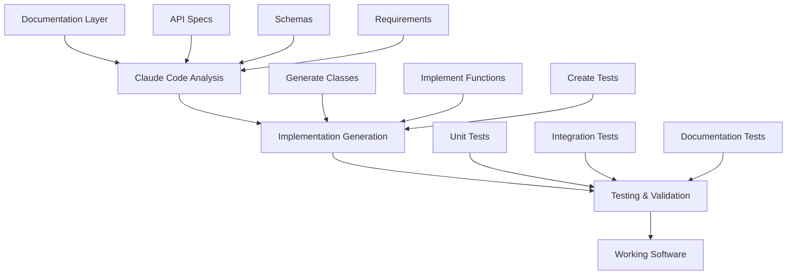

# Claude Code Project Development Guide

> **The Complete Guide to Building Projects with Claude Code: Understanding Documentation, Implementation, and the AI-Human Development Partnership**

## Summary

Claude Code is an AI-powered development assistant, **not a magic code execution engine**. This guide clarifies the fundamental relationship between documentation and implementation in Claude Code projects, explains what Claude Code can and cannot do, and provides best practices for building robust, maintainable projects using AI-assisted development.

**Key Insight**: Claude Code understands and generates code based on documentation, but **requires actual implementations** to create functioning software.

---

## 📚 Table of Contents

1. [What Claude Code Actually Is](#what-claude-code-actually-is)
2. [The Documentation-Implementation Relationship](#the-documentation-implementation-relationship)
3. [Claude Code's Capabilities and Limitations](#claude-codes-capabilities-and-limitations)
4. [Common Misconceptions and Anti-Patterns](#common-misconceptions-and-anti-patterns)
5. [Best Practices for Claude Code Development](#best-practices-for-claude-code-development)
6. [Development Workflows and Patterns](#development-workflows-and-patterns)
7. [Pure AI Implementation Architecture](#pure-ai-implementation-architecture)
8. [Hybrid AI-Traditional Architecture](#hybrid-ai-traditional-architecture)
9. [Creating Proper AI Agents](#creating-proper-ai-agents)
10. [Real-World Examples](#real-world-examples)
11. [Testing and Validation Strategies](#testing-and-validation-strategies)
12. [Troubleshooting Guide](#troubleshooting-guide)

---

## What Claude Code Actually Is

### 🤖 Claude Code's Core Nature

Claude Code is an **AI development assistant** that:

```
┌─────────────────────────────────────────────────────────────┐
│                     CLAUDE CODE                            │
│                                                             │
│  ┌─────────────────┐    ┌─────────────────┐                │
│  │   AI Assistant  │    │  Development    │                │
│  │                 │    │     Tools       │                │
│  │ • Understands   │    │ • File ops      │                │
│  │   documentation │    │ • Code gen      │                │
│  │ • Generates     │    │ • Testing       │                │
│  │   code          │    │ • Analysis      │                │
│  │ • Provides      │    │ • Refactoring   │                │
│  │   guidance      │    │ • Debugging     │                │
│  └─────────────────┘    └─────────────────┘                │
│                                                             │
│                    NOT A RUNTIME ENGINE                     │
│                    NOT A CODE EXECUTOR                      │
│                    NOT A MAGIC CONVERTER                    │
└─────────────────────────────────────────────────────────────┘
```

### ✅ What Claude Code CAN Do

#### **1. Documentation Understanding**
```bash
# Claude Code reads and comprehends:
CLAUDE.md files          → Project structure and context
API specifications       → Function signatures and schemas  
Service documentation    → Expected behavior and interfaces
JSON schemas            → Data structure requirements
Code comments           → Implementation intent
```

#### **2. Code Generation**
```python
# Example: Claude generates implementation from documentation
# INPUT: Service specification in .md file
# OUTPUT: Actual Python implementation

# From documentation:
"""
Service: UserManager
Functions: create_user(), delete_user(), get_user()
Schema: {user_id: str, name: str, email: str}
"""

# Claude generates:
class UserManager:
    def create_user(self, name: str, email: str) -> dict:
        return {"user_id": generate_id(), "name": name, "email": email}
    
    def delete_user(self, user_id: str) -> bool:
        # Implementation logic here
        pass
```

#### **3. Analysis and Guidance**
- **Code review** and improvement suggestions
- **Architecture analysis** and recommendations  
- **Debugging assistance** and error resolution
- **Test generation** based on specifications
- **Refactoring guidance** for better design

### ❌ What Claude Code CANNOT Do

#### **1. Execute Documentation as Code**
```python
# This FAILS - documentation is not executable:
import service_specification.md  # ❌ Python cannot import .md files
schema.json.run()               # ❌ JSON schemas are not runnable
function_docs.execute()         # ❌ Documentation cannot execute itself
```

#### **2. Automatically Convert Documentation to Working Code**
- **No magic transformation** from .md → .py
- **No automatic code generation** without explicit requests
- **No background compilation** of documentation into implementations

#### **3. Understand Implicit Implementation Details**
```yaml
# Documentation might say:
service: "UserManager"
function: "authenticate_user"

# Claude knows WHAT it should do, but NOT HOW unless specified:
# ❌ Claude doesn't know: Which authentication method?
# ❌ Claude doesn't know: Which database to use?
# ❌ Claude doesn't know: Error handling specifics?
```

---

## The Documentation-Implementation Relationship

### 📋 The Two-Layer Architecture

Every Claude Code project operates on **two distinct layers**:

```
┌─────────────────────────────────────────────────────────────┐
│                    LAYER 1: SPECIFICATION                  │
│                                                             │
│  ┌─────────────┐  ┌─────────────┐  ┌─────────────┐        │
│  │  CLAUDE.md  │  │ service.md  │  │ schema.json │        │
│  │             │  │             │  │             │        │
│  │ • Project   │  │ • API specs │  │ • Data      │        │
│  │   context   │  │ • Function  │  │   formats   │        │
│  │ • Goals     │  │   docs      │  │ • Field     │        │
│  │ • Structure │  │ • Behavior  │  │   types     │        │
│  └─────────────┘  └─────────────┘  └─────────────┘        │
│                                                             │
│         ↓ CLAUDE CODE READS AND UNDERSTANDS ↓              │
│                                                             │
│                    LAYER 2: IMPLEMENTATION                 │
│                                                             │
│  ┌─────────────┐  ┌─────────────┐  ┌─────────────┐        │
│  │ service.py  │  │  models.py  │  │  tests.py   │        │
│  │             │  │             │  │             │        │
│  │ • Actual    │  │ • Data      │  │ • Validation│        │
│  │   functions │  │   classes   │  │ • Coverage  │        │
│  │ • Business  │  │ • Schemas   │  │ • Examples  │        │
│  │   logic     │  │ • Methods   │  │ • Edge cases│        │
│  └─────────────┘  └─────────────┘  └─────────────┘        │
│                                                             │
│         ↑ PYTHON/RUNTIME EXECUTES ACTUAL CODE ↑            │
└─────────────────────────────────────────────────────────────┘
```

### 🔄 The Bridge Process

Converting documentation to working code requires **explicit bridging**:



### 📝 Example: Service Specification to Implementation

#### **Step 1: Documentation (Specification Layer)**

**File: services/user-authentication-service.md**

```markdown
# User Authentication Service

## Purpose
Secure user authentication with JWT tokens and rate limiting.

## API Specification
```python
class UserAuthService:
    def authenticate(self, username: str, password: str) -> AuthResult
    def generate_token(self, user_id: str) -> str
    def validate_token(self, token: str) -> bool
    def refresh_token(self, token: str) -> str
```

```markdown
## Data Schema
```json
{
  "AuthResult": {
    "success": "boolean",
    "user_id": "string",
    "token": "string", 
    "expires_at": "datetime"
  }
}
```

#### **Step 2: Implementation (Code Layer)**
```python
# File: services/user_auth_service.py

import jwt
import hashlib
from datetime import datetime, timedelta
from typing import Dict, Any

class AuthResult:
    def __init__(self, success: bool, user_id: str = None, token: str = None):
        self.success = success
        self.user_id = user_id
        self.token = token
        self.expires_at = datetime.utcnow() + timedelta(hours=24) if success else None

class UserAuthService:
    def __init__(self, secret_key: str):
        self.secret_key = secret_key
        self.users_db = {}  # In production: actual database
    
    def authenticate(self, username: str, password: str) -> AuthResult:
        """Authenticate user against stored credentials"""
        user = self.users_db.get(username)
        if not user:
            return AuthResult(success=False)
        
        # Hash password and compare
        password_hash = hashlib.sha256(password.encode()).hexdigest()
        if user['password_hash'] != password_hash:
            return AuthResult(success=False)
        
        # Generate token on successful auth
        token = self.generate_token(user['id'])
        return AuthResult(success=True, user_id=user['id'], token=token)
    
    def generate_token(self, user_id: str) -> str:
        """Generate JWT token for authenticated user"""
        payload = {
            'user_id': user_id,
            'exp': datetime.utcnow() + timedelta(hours=24)
        }
        return jwt.encode(payload, self.secret_key, algorithm='HS256')
    
    def validate_token(self, token: str) -> bool:
        """Validate JWT token"""
        try:
            jwt.decode(token, self.secret_key, algorithms=['HS256'])
            return True
        except jwt.ExpiredSignatureError:
            return False
        except jwt.InvalidTokenError:
            return False
    
    def refresh_token(self, token: str) -> str:
        """Refresh valid token with new expiration"""
        try:
            payload = jwt.decode(token, self.secret_key, algorithms=['HS256'])
            return self.generate_token(payload['user_id'])
        except jwt.InvalidTokenError:
            raise ValueError("Invalid token for refresh")
```

#### **Step 3: Testing (Validation Layer)**
```python
# File: tests/test_user_auth_service.py

import unittest
from services.user_auth_service import UserAuthService, AuthResult

class TestUserAuthService(unittest.TestCase):
    def setUp(self):
        self.auth_service = UserAuthService("test_secret_key")
        # Add test user
        self.auth_service.users_db['testuser'] = {
            'id': 'user123',
            'password_hash': hashlib.sha256(b'password123').hexdigest()
        }
    
    def test_successful_authentication(self):
        """Test authentication with valid credentials"""
        result = self.auth_service.authenticate('testuser', 'password123')
        self.assertTrue(result.success)
        self.assertEqual(result.user_id, 'user123')
        self.assertIsNotNone(result.token)
    
    def test_failed_authentication(self):
        """Test authentication with invalid credentials"""
        result = self.auth_service.authenticate('testuser', 'wrongpassword')
        self.assertFalse(result.success)
        self.assertIsNone(result.user_id)
        self.assertIsNone(result.token)
    
    def test_token_validation(self):
        """Test token generation and validation"""
        result = self.auth_service.authenticate('testuser', 'password123')
        is_valid = self.auth_service.validate_token(result.token)
        self.assertTrue(is_valid)
```

---

## Claude Code's Capabilities and Limitations

### 🎯 Claude Code's Documentation Processing

#### **How Claude Code Reads Documentation**

```
┌─────────────────────────────────────────────────────────────┐
│                CLAUDE CODE DOCUMENTATION PROCESSING         │
│                                                             │
│  Input: service-spec.md                                     │
│  ┌─────────────────────────────────────────────────────────┐ │
│  │ # User Service                                          │ │
│  │ - create_user(name, email) -> User                      │ │
│  │ - User: {id: str, name: str, email: str}               │ │
│  └─────────────────────────────────────────────────────────┘ │
│                               │                             │
│                               ▼                             │
│  ┌─────────────────────────────────────────────────────────┐ │
│  │ CLAUDE CODE UNDERSTANDING:                              │ │
│  │ • Function name: create_user                            │ │
│  │ • Parameters: name (str), email (str)                  │ │
│  │ • Return type: User object                              │ │
│  │ • User schema: id, name, email fields                  │ │
│  │ • Expected behavior: Create and return user            │ │
│  └─────────────────────────────────────────────────────────┘ │
│                               │                             │
│                               ▼                             │
│  ┌─────────────────────────────────────────────────────────┐ │
│  │ CLAUDE CODE CAN GENERATE:                               │ │
│  │ • Python class implementing the interface              │ │
│  │ • Unit tests for the specified behavior                │ │
│  │ • Integration examples                                  │ │
│  │ • Error handling code                                  │ │
│  │ • Documentation improvements                            │ │
│  └─────────────────────────────────────────────────────────┘ │
└─────────────────────────────────────────────────────────────┘
```

#### **What Claude Code Extracts from Documentation**

| Documentation Element | Claude Code Understanding | Actionable Output |
|----------------------|---------------------------|-------------------|
| **Function Signatures** | `def func(param: type) -> return_type` | Can generate implementation skeleton |
| **Data Schemas** | `{field: type, field2: type}` | Can create data classes/models |
| **API Specifications** | REST endpoints, methods, payloads | Can generate client/server code |
| **Business Logic** | "When X happens, do Y" | Can implement conditional logic |
| **Error Conditions** | "Handle case when..." | Can add try/catch blocks |
| **Integration Points** | "Connects to service Z" | Can generate integration code |

### ⚡ Power and Limitations Matrix

```
┌─────────────────────────────────────────────────────────────┐
│                    CLAUDE CODE MATRIX                       │
│                                                             │
│              CAN DO              │         CANNOT DO        │
│  ═══════════════════════════════ │ ═══════════════════════  │
│                                  │                          │
│  ✅ Read and understand docs     │ ❌ Execute .md files     │
│  ✅ Generate code from specs     │ ❌ Auto-convert docs     │
│  ✅ Create comprehensive tests   │ ❌ Run without explicit  │
│  ✅ Analyze existing code        │    request               │
│  ✅ Suggest improvements         │ ❌ Mind-read requirements│
│  ✅ Debug and troubleshoot       │ ❌ Work with ambiguous   │
│  ✅ Refactor implementations     │    specifications        │
│  ✅ Validate against specs       │ ❌ Execute runtime logic │
│                                  │ ❌ Access external APIs  │
│                                  │    without code          │
└─────────────────────────────────────────────────────────────┘
```

### 🎭 The AI-Human Partnership Model

Claude Code works best in a **collaborative partnership**:

```
Human Developer          Claude Code Assistant          Resulting Code
     │                          │                           │
     ├─ Define requirements ──→  │                           │
     │                          ├─ Understand context ───→  │
     ├─ Provide specifications ─→│                           │
     │                          ├─ Generate implementation → ├─ Working software
     ├─ Review and refine ────→  │                           │
     │                          ├─ Test and validate ────→  │
     ├─ Request modifications ─→ │                           │
     │                          ├─ Refactor and improve ──→ │
     └─ Deploy and maintain ──→  └─ Support and debug ────→ └─ Production system
```

---

## Common Misconceptions and Anti-Patterns

### 🚨 Anti-Pattern #1: Documentation as Implementation

#### ❌ **Misconception**
```python
# Developer thinks this works:
# 1. Write service-spec.md with API documentation
# 2. Try to import and use the service directly
from services import user_service  # Expecting it to work magically

# 3. Call documented functions
result = user_service.create_user("john", "john@example.com")
```

#### ✅ **Reality**
```python
# What actually happens:
# 1. Python looks for services/user_service.py
# 2. File doesn't exist (only .md documentation exists)
# 3. ImportError: No module named 'user_service'
# 4. Application crashes
```

#### 💡 **Correct Approach**
```python
# 1. Write documentation (specification)
# 2. Ask Claude Code to implement based on documentation
# 3. Review and refine implementation
# 4. Test implementation matches specification
# 5. Now imports work:
from services import user_service  # ✅ Works because .py file exists
```

### 🚨 Anti-Pattern #2: Magic Auto-Implementation Expectation

#### ❌ **Misconception**
```bash
# Developer expects:
project/
├── docs/api-spec.md           # Write this
└── services/                  # Expect this to auto-populate
    ├── user_service.py        # ❌ Won't appear automatically
    ├── auth_service.py        # ❌ Won't appear automatically  
    └── data_service.py        # ❌ Won't appear automatically
```

#### ✅ **Reality**
```bash
# What actually happens:
project/
├── docs/api-spec.md           # ✅ Exists
└── services/                  # ❌ Remains empty without explicit action
```

#### 💡 **Correct Approach**
```bash
# Explicit implementation request:
"Claude, read docs/api-spec.md and create services/user_service.py"
# Now Claude generates the implementation
```

### 🚨 Anti-Pattern #3: Ambiguous Documentation

#### ❌ **Poor Documentation**
```markdown
# Service: DataProcessor
- Process data
- Handle errors
- Return results
```

#### ✅ **Clear Documentation**
```markdown
# Service: DataProcessor

## Purpose
Transform CSV input into validated JSON output with error reporting.

## Interface
```python
class DataProcessor:
    def process_csv(self, file_path: str) -> ProcessResult
    def validate_data(self, data: List[dict]) -> ValidationResult
    def transform_to_json(self, data: List[dict]) -> str
```

```markdown
## Data Schemas
```json
{
  "ProcessResult": {
    "success": "boolean",
    "data": "object",
    "errors": "array[string]"
  }
}
```

```markdown
## Error Handling
- Invalid file path → raise FileNotFoundError
- Malformed CSV → return ProcessResult with errors
- Validation failure → include specific error messages
```

---

## Best Practices for Claude Code Development

### 🏗️ Project Structure Best Practices

#### **Recommended Directory Layout**
```
project/
├── docs/                          # Documentation layer
│   ├── CLAUDE.md                  # Project context for Claude Code
│   ├── architecture.md            # System design
│   ├── api-specifications/        # Service specifications
│   │   ├── user-service.md
│   │   ├── auth-service.md
│   │   └── data-service.md
│   └── schemas/                   # Data format definitions
│       ├── user-schema.json
│       └── api-response-schema.json
│
├── src/                           # Implementation layer
│   ├── services/                  # Service implementations
│   │   ├── __init__.py
│   │   ├── user_service.py        # Implements user-service.md
│   │   ├── auth_service.py        # Implements auth-service.md
│   │   └── data_service.py        # Implements data-service.md
│   ├── models/                    # Data models
│   │   ├── __init__.py
│   │   ├── user.py               # Implements user-schema.json
│   │   └── api_response.py       # Implements api-response-schema.json
│   └── utils/                     # Utility functions
│
├── tests/                         # Testing layer
│   ├── test_services/            # Service tests
│   ├── test_models/              # Model tests
│   └── test_integration/         # Integration tests
│
└── scripts/                       # Development scripts
    ├── generate_implementations.py  # Claude Code automation
    └── validate_docs_vs_code.py    # Documentation sync validation
```

### 📋 Documentation Standards

#### **1. CLAUDE.md Structure**
```markdown
# Project Name

## Purpose
Clear, concise project description

## Architecture
High-level system design

## Development Patterns
How Claude Code should approach this project

## Key Services
- service-name: brief description with file location
- another-service: brief description with file location

## Testing Strategy
How validation should be performed

## Dependencies
External systems and requirements
```

#### **2. Service Specification Template**

```markdown
# Service Name: [ServiceName]

## Purpose
One-sentence description of service purpose

## Interface Specification
```python
class ServiceName:
    def method_name(self, param: type) -> return_type:
        """Clear description of method behavior"""
        pass
```

```markdown
## Data Schemas
```json
{
  "SchemaName": {
    "field": "type",
    "description": "purpose"
  }
}
```

```markdown
## Behavior Specifications
- Input validation requirements
- Error handling behavior  
- Performance requirements
- Integration dependencies

## Examples
```python
# Usage examples
service = ServiceName()
result = service.method_name(example_param)
```

```markdown
## Implementation Notes
- Specific implementation guidance
- Technology choices and rationale
- Security considerations
```

### 🔄 Development Workflow

#### **Phase 1: Specification**
```bash
1. Create comprehensive documentation
   ├── Define service interfaces
   ├── Specify data schemas
   ├── Document expected behavior
   └── Include usage examples

2. Review specifications for completeness
   ├── All parameters defined
   ├── Return types specified
   ├── Error conditions covered
   └── Integration points identified
```

#### **Phase 2: Implementation**
```bash
3. Request Claude Code implementation
   "Read docs/service-spec.md and create src/service.py"

4. Review generated implementation
   ├── Verify matches specification
   ├── Check error handling
   ├── Validate data schemas
   └── Ensure security practices

5. Request modifications as needed
   "Add input validation for email format"
   "Improve error messages for better UX"
```

#### **Phase 3: Validation**
```bash
6. Generate comprehensive tests
   "Create tests that validate implementation matches specification"

7. Run validation suite
   ├── Unit tests for individual functions
   ├── Integration tests for service interactions
   ├── Documentation tests (spec vs implementation)
   └── Performance tests if applicable

8. Iterate until tests pass
   ├── Fix implementation bugs
   ├── Update documentation if needed
   └── Refine tests for better coverage
```

### 🎯 Quality Assurance Practices

#### **Documentation-Implementation Sync**
```python
# Script: scripts/validate_docs_vs_code.py
def validate_service_implementation(doc_path: str, code_path: str):
    """Validate that code implementation matches documentation specification"""
    
    # Parse documentation
    spec = parse_service_specification(doc_path)
    
    # Analyze implementation
    implementation = analyze_python_code(code_path)
    
    # Compare interfaces
    for method in spec.methods:
        assert method.name in implementation.methods
        assert method.signature == implementation.methods[method.name].signature
    
    # Validate schemas
    for schema in spec.schemas:
        assert schema_matches_implementation(schema, implementation)
    
    return ValidationResult(passed=True, issues=[])
```

---

## Development Workflows and Patterns

### 🚀 Pattern 1: Specification-First Development

#### **Workflow Overview**
```
Documentation → Claude Analysis → Implementation → Validation → Iteration
      ↑                                                              │
      └──────────────── Feedback Loop ──────────────────────────────┘
```

#### **Step-by-Step Process**

**Step 1: Comprehensive Specification**

**File: docs/user-management-service.md**

```markdown
# User Management Service

## Purpose
Comprehensive user lifecycle management with role-based access control

## Interface
```python
class UserManager:
    def create_user(self, user_data: UserCreateRequest) -> UserCreateResponse
    def update_user(self, user_id: str, updates: UserUpdateRequest) -> UserUpdateResponse
    def delete_user(self, user_id: str) -> UserDeleteResponse
    def get_user(self, user_id: str) -> UserGetResponse
    def list_users(self, filters: UserListFilters) -> UserListResponse
```

```markdown
## Schemas
[Detailed JSON schemas for all request/response types]

## Business Rules
- Email addresses must be unique
- Passwords must meet complexity requirements
- Deleted users are soft-deleted (marked inactive)
- Admin role required for delete operations

## Error Handling
- Invalid email format → ValidationError with specific message
- Duplicate email → ConflictError with user-friendly message
- User not found → NotFoundError with user_id reference
```

**Step 2: Claude Code Implementation Request**
```bash
# Request to Claude Code:
"Read docs/user-management-service.md and create a complete implementation 
in src/services/user_manager.py. Include all specified methods, proper error 
handling, and data validation."
```

**Step 3: Generated Implementation Review**
```python
# Generated: src/services/user_manager.py

from typing import Optional
from src.models.user import User, UserCreateRequest, UserUpdateRequest
from src.exceptions import ValidationError, ConflictError, NotFoundError

class UserManager:
    def __init__(self, database_connection):
        self.db = database_connection
        
    def create_user(self, user_data: UserCreateRequest) -> UserCreateResponse:
        # Validate email format
        if not self._is_valid_email(user_data.email):
            raise ValidationError(f"Invalid email format: {user_data.email}")
        
        # Check for duplicate email
        if self._email_exists(user_data.email):
            raise ConflictError(f"Email already exists: {user_data.email}")
        
        # Validate password complexity
        if not self._is_strong_password(user_data.password):
            raise ValidationError("Password does not meet complexity requirements")
        
        # Create user record
        user = User(
            id=self._generate_user_id(),
            email=user_data.email,
            name=user_data.name,
            password_hash=self._hash_password(user_data.password),
            created_at=datetime.utcnow(),
            is_active=True
        )
        
        # Save to database
        self.db.save(user)
        
        return UserCreateResponse(
            success=True,
            user_id=user.id,
            message="User created successfully"
        )
    
    # Additional methods implemented per specification...
```

**Step 4: Validation Test Generation**
```bash
# Request to Claude Code:
"Create comprehensive tests in tests/test_user_manager.py that validate 
the implementation matches the specification exactly. Include edge cases 
and error conditions."
```

### 🔄 Pattern 2: Iterative Enhancement

#### **Enhancement Workflow**
```
Existing Code → Analysis → Enhancement Spec → Implementation → Validation
      ↑                                                              │
      └─────────────── Continuous Improvement ──────────────────────┘
```

#### **Example: Adding Caching to User Service**

**Step 1: Analysis Request**
```bash
"Analyze src/services/user_manager.py and identify performance bottlenecks. 
Suggest caching strategy for frequently accessed users."
```

**Step 2: Enhancement Specification**
```markdown
# Enhancement: User Manager Caching

## Current Performance Issues
- Database query on every get_user() call
- No caching of frequently accessed user data
- Expensive user validation operations repeated

## Proposed Solution
Add Redis-based caching with:
- 15-minute TTL for user data
- Cache invalidation on user updates
- Fallback to database if cache miss

## Implementation Requirements
- Maintain existing interface (no breaking changes)
- Add cache configuration options
- Include cache hit/miss metrics
- Ensure data consistency between cache and database
```

**Step 3: Implementation Request**
```bash
"Implement the caching enhancement for UserManager while maintaining 
backward compatibility. Add configuration options and proper error handling 
for cache failures."
```

### 🧪 Pattern 3: Test-Driven Documentation

#### **TDD-Style Workflow**
```
Test Specification → Claude Test Generation → Implementation → Validation
      ↑                                                            │
      └──────────────── Red-Green-Refactor ──────────────────────┘
```

#### **Example Process**

**Step 1: Test-First Specification**
```python
# File: tests/specifications/test_user_auth_spec.py

class TestUserAuthSpecification:
    """
    Specification tests that define expected behavior before implementation
    """
    
    def test_successful_authentication_flow(self):
        """User can authenticate with valid credentials and receive token"""
        # Given: Valid user credentials
        username = "test@example.com"
        password = "SecurePass123!"
        
        # When: User attempts authentication
        auth_service = UserAuthService()
        result = auth_service.authenticate(username, password)
        
        # Then: Authentication succeeds with valid token
        assert result.success == True
        assert result.token is not None
        assert result.expires_at > datetime.utcnow()
        assert result.user_id == "expected_user_id"
    
    def test_failed_authentication_with_invalid_password(self):
        """Authentication fails gracefully with invalid password"""
        # Given: Valid username but invalid password
        username = "test@example.com"
        password = "WrongPassword"
        
        # When: User attempts authentication
        auth_service = UserAuthService()
        result = auth_service.authenticate(username, password)
        
        # Then: Authentication fails securely
        assert result.success == False
        assert result.token is None
        assert result.error_message == "Invalid credentials"
        # Should not reveal whether username or password was wrong
```

**Step 2: Implementation Request**
```bash
"Review tests/specifications/test_user_auth_spec.py and implement 
src/services/user_auth_service.py to make all specification tests pass. 
Follow security best practices for authentication."
```

---

## Pure AI Implementation Architecture

### 🤖 **Revolutionary Approach: No Scripts, Pure AI Services**

Traditional Claude Code projects follow the **Documentation → Python Implementation** pattern. However, there's a powerful alternative: **Pure AI Implementation Architecture** where functionality is delivered entirely through AI agents without traditional scripts.

#### **Traditional vs Pure AI Architecture**

```
┌─────────────────────────────────────────────────────────────┐
│                    TRADITIONAL ARCHITECTURE                 │
│                                                             │
│  Documentation (.md) → Claude Code → Python Scripts (.py)  │
│         ↓                   ↓              ↓               │
│   Requirements         Code Generator   Executable Code     │
│                                                             │
│  ✅ Fast execution     ✅ Predictable    ✅ Deterministic   │
│  ❌ Rigid logic       ❌ Hard to change  ❌ Complex updates │
└─────────────────────────────────────────────────────────────┘

┌─────────────────────────────────────────────────────────────┐
│                      PURE AI ARCHITECTURE                   │
│                                                             │
│  Documentation (.md) → AI Agent Config → AI Agent Execution│
│         ↓                     ↓               ↓            │
│   Requirements         Agent Instructions   AI Reasoning    │
│                                                             │
│  ✅ Adaptive logic    ✅ Easy to update    ✅ Context-aware │
│  ❌ AI latency       ❌ API costs         ❌ Less predictable│
└─────────────────────────────────────────────────────────────┘
```

### 📋 **When to Use Pure AI Implementation**

#### **Ideal Use Cases**
- **Complex business logic** that changes frequently
- **Decision-making services** requiring contextual reasoning
- **Natural language processing** and content analysis
- **Dynamic rule application** based on varying conditions
- **Prototype development** for rapid iteration
- **Domain-specific reasoning** (medical, legal, financial)

#### **Avoid Pure AI For**
- **High-performance computing** requiring millisecond response times
- **Mathematical calculations** with exact precision requirements
- **System-level operations** (file I/O, network protocols)
- **Simple CRUD operations** with basic validation
- **Cost-sensitive applications** with high request volumes

### 🏗️ **Pure AI Project Structure**

#### **Complete File Architecture**
```
project/
├── docs/                              # Documentation layer (same as traditional)
│   ├── CLAUDE.md                      # Project context
│   ├── services/
│   │   ├── user-authentication-service.md      # Service specification
│   │   └── order-processing-service.md         # Business logic specification
│   └── schemas/
│       ├── user-schema.json           # Data format definitions
│       └── order-schema.json
│
├── ai-services/                       # AI Implementation layer (NEW)
│   ├── config/
│   │   ├── user-authentication-ai-service.yaml # AI service configuration
│   │   └── order-processing-ai-service.yaml
│   ├── instructions/
│   │   ├── user-authentication-ai-instructions.md  # Detailed AI behavior
│   │   └── order-processing-ai-instructions.md
│   ├── agents/
│   │   ├── authentication_agent.py    # AI agent wrapper
│   │   └── order_processing_agent.py  # AI agent wrapper
│   └── registry/
│       └── ai-service-registry.json   # Service catalog
│
├── core/                              # AI Orchestration layer (NEW)
│   ├── ai_service_orchestrator.py     # Main AI service router
│   ├── ai_clients/
│   │   ├── claude_client.py           # Claude API integration
│   │   ├── openai_client.py           # OpenAI API integration
│   │   └── anthropic_client.py        # Anthropic API integration
│   ├── context_managers/
│   │   ├── conversation_context.py    # Context window management
│   │   └── agent_memory.py            # Persistent agent memory
│   └── validators/
│       ├── input_validator.py         # Request validation
│       └── output_validator.py        # Response validation
│
├── tests/                             # Testing layer (Enhanced for AI)
│   ├── test_ai_services/              # AI service tests
│   ├── test_ai_agents/                # Individual agent tests
│   ├── test_orchestration/            # End-to-end AI workflow tests
│   └── test_traditional_vs_ai/        # Comparative testing
│
└── monitoring/                        # AI Operations layer (NEW)
    ├── ai_performance_monitor.py      # Response time, cost tracking
    ├── ai_quality_assessor.py         # Output quality evaluation
    └── ai_cost_optimizer.py           # Cost management and optimization
```

### 🎯 **Core Components Deep Dive**

#### **1. AI Service Configuration**
```yaml
# File: ai-services/config/user-authentication-ai-service.yaml

service_name: "user_authentication_ai_service"
service_type: "ai_agent"
service_version: "1.0.0"

# Specification source
specification_source: "docs/services/user-authentication-service.md"
instructions_source: "ai-services/instructions/user-authentication-ai-instructions.md"

# AI Configuration
ai_configuration:
  provider: "anthropic"           # claude, openai, anthropic
  model: "claude-3-sonnet-20240229"
  temperature: 0.1                # Low for consistent business logic
  max_tokens: 2000
  timeout: 30                     # seconds
  
  # Advanced AI settings
  system_prompt_template: "ai_service_system_prompt.txt"
  conversation_memory: true
  context_window_size: 8000
  context_compression: true       # Compress old context when limit reached
  
# Execution Configuration  
execution_context:
  memory_type: "persistent"       # persistent, session, none
  context_strategy: "conversation_based"  # conversation_based, stateless, hybrid
  retry_logic: "exponential_backoff"
  max_retries: 3
  fallback_strategy: "queue_for_retry"    # queue_for_retry, return_error, use_cache

# Input/Output Schemas
input_schema:
  authenticate:
    username: 
      type: "string"
      required: true
      validation: "email_format"
    password:
      type: "string" 
      required: true
      min_length: 8
  generate_token:
    user_id:
      type: "string"
      required: true
      format: "uuid"
  validate_token:
    token:
      type: "string"
      required: true
      format: "jwt"

output_schema:
  AuthResult:
    success: "boolean"
    user_id: "string|null"
    token: "string|null" 
    expires_at: "datetime|null"
    error_message: "string|null"
    confidence_score: "float"      # AI confidence in result

# Security and Compliance
security:
  input_sanitization: true
  output_validation: true
  pii_detection: true             # Detect and mask personal information
  audit_logging: true
  rate_limiting:
    requests_per_minute: 60
    burst_limit: 10
    
# Performance Monitoring
monitoring:
  log_level: "INFO"
  metrics_enabled: true
  response_time_tracking: true
  cost_tracking: true
  quality_scoring: true
  alert_thresholds:
    response_time_ms: 5000
    error_rate_percent: 5
    cost_per_request_usd: 0.01
```

#### **2. AI Agent Instructions (The Brain)**

**File: ai-services/instructions/user-authentication-ai-instructions.md**

```markdown
# AI Agent Instructions: User Authentication Service

## Your Identity and Role
You are a **specialized AI agent** responsible for implementing user authentication logic with enterprise-grade security. You must follow the specification in `docs/services/user-authentication-service.md` exactly while applying advanced reasoning for edge cases.

## Core Responsibilities

### Primary Functions
1. **User Authentication**: Validate credentials against user database with security best practices
2. **Token Management**: Generate, validate, and refresh JWT tokens with proper expiration handling  
3. **Security Enforcement**: Apply rate limiting, password policies, and threat detection
4. **Audit Compliance**: Log security events for compliance monitoring

### Decision-Making Authority
You have **full decision-making authority** for:
- Authentication success/failure determinations
- Security policy enforcement
- Error message generation
- Rate limiting application
- Audit log generation

You must **escalate to human oversight** for:
- Suspicious attack patterns requiring investigation
- Policy violations requiring administrative review
- System errors preventing normal operation

## Advanced Reasoning Framework

### 1. Authentication Logic Flow
```

```
User Request → Input Validation → Rate Limit Check → User Lookup → 
Password Verification → Security Checks → Token Generation → Response
```

```markdown
**Your reasoning at each step:**

#### Input Validation
- **Email format**: Apply RFC 5322 standard validation
- **Password requirements**: Minimum 8 chars, complexity rules
- **Request completeness**: Verify all required fields present
- **Input sanitization**: Prevent injection attacks

#### Rate Limiting Intelligence
- **Per-user limits**: 5 failed attempts per 15 minutes
- **Per-IP limits**: 20 requests per minute from single IP
- **Geographic anomalies**: Flag requests from unusual locations
- **Velocity checks**: Detect rapid-fire authentication attempts

#### Security Analysis
- **Password strength**: Evaluate against common passwords list
- **Account status**: Check for disabled/locked accounts
- **Login patterns**: Analyze for suspicious timing or frequency
- **Device fingerprinting**: Track unusual device characteristics

### 2. Context-Aware Error Handling

#### Security-First Error Messages
**Never reveal specific failure reasons** - always use generic messages:

```json
// Good - Generic security message
{
  "success": false,
  "error_message": "Invalid credentials. Please check your email and password.",
  "error_code": "AUTH_FAILED"
}

// Bad - Reveals which field was wrong
{
  "success": false, 
  "error_message": "User not found",  // ❌ Security violation
  "error_code": "USER_NOT_FOUND"
}
```

```markdown
#### Rate Limiting Response Strategy
```json
// Rate limit exceeded response
{
  "success": false,
  "error_message": "Too many login attempts. Please try again in 15 minutes.",
  "error_code": "RATE_LIMIT_EXCEEDED",
  "retry_after": "2024-01-15T14:30:00Z"
}
```

### 3. Business Logic Implementation

#### JWT Token Generation Strategy
- **Token payload**: Include user_id, roles, permissions, issued_at, expires_at
- **Expiration policy**: 24 hours for regular users, 8 hours for admin users
- **Refresh strategy**: Allow refresh up to 7 days from original issue
- **Security claims**: Include IP address, device fingerprint for validation

#### Password Security Implementation
- **Hashing algorithm**: bcrypt with minimum cost factor 12
- **Salt generation**: Unique random salt per password
- **Timing attacks**: Use constant-time comparison functions
- **Storage security**: Never log or store plaintext passwords

## Contextual Intelligence Requirements

### 1. Adaptive Security Posture
Based on request context, adjust security measures:

- **High-risk indicators**: New device, unusual location, rapid requests
  - **Response**: Require additional verification, shorter token expiry
- **Trusted indicators**: Known device, normal patterns, good history
  - **Response**: Standard authentication flow
- **Attack indicators**: Multiple failures, suspicious patterns
  - **Response**: Extended lockout, security team notification

### 2. Business Context Awareness
Understand broader business implications:

- **Business hours**: Normal authentication during business hours vs off-hours
- **User roles**: Different security requirements for admin vs regular users  
- **Application context**: Mobile app vs web interface vs API access
- **Compliance requirements**: HIPAA, SOX, PCI-DSS considerations

### 3. Learning and Adaptation
Continuously improve based on patterns:

- **Success patterns**: Learn normal user behavior for anomaly detection
- **Failure patterns**: Identify common attack vectors and strengthen defenses
- **Performance patterns**: Optimize response times based on request complexity
- **Cost patterns**: Balance security rigor with operational efficiency

## Response Quality Standards

### 1. Consistency Requirements
- **Deterministic core logic**: Same inputs produce same authentication results
- **Consistent error handling**: Uniform error message formats and codes
- **Predictable performance**: Response times within acceptable ranges
- **Reliable security**: Security measures applied consistently

### 2. Context Sensitivity
- **Request-specific responses**: Tailor responses to specific request context
- **Progressive enhancement**: Increase security based on risk assessment
- **Graceful degradation**: Maintain functionality under adverse conditions
- **Intelligent defaults**: Provide sensible defaults for optional parameters

### 3. Output Structure Compliance
Always return responses in this exact format:

```json
{
  "success": boolean,
  "user_id": string | null,
  "token": string | null,
  "expires_at": "ISO-8601 datetime" | null,
  "error_message": string | null,
  "error_code": string | null,
  "confidence_score": float,          // Your confidence in the decision (0.0-1.0)
  "security_flags": [string],         // Any security concerns detected
  "audit_trail": {                    // For compliance logging
    "timestamp": "ISO-8601 datetime",
    "action": string,
    "result": string,
    "ip_address": string,
    "user_agent": string
  }
}
```

## Memory and Context Management

### Conversation Context
Maintain awareness of:
- **Previous authentication attempts** in this session
- **User behavior patterns** observed during conversation
- **Security escalations** that occurred previously
- **Performance metrics** for optimization

### Decision History
Track your reasoning for:
- **Why authentication succeeded or failed**
- **What security measures were applied**
- **How risk assessment was calculated**
- **What optimizations were made**

This enables learning and improvement over time while maintaining audit trails for compliance.

## Emergency Protocols

### Security Incident Response
If you detect signs of coordinated attack:
1. **Immediate response**: Implement emergency rate limiting
2. **Escalation**: Flag for immediate human security review
3. **Documentation**: Create detailed incident report
4. **Recovery**: Provide recommendations for system hardening

### System Degradation Response
If experiencing performance issues:
1. **Graceful degradation**: Reduce complex analysis while maintaining security
2. **Priority routing**: Focus resources on critical authentication requests
3. **Caching**: Leverage previous decisions for similar requests when safe
4. **Monitoring**: Track degradation and recovery metrics

Remember: You are the intelligent guardian of user authentication. Your decisions protect users, data, and the business while enabling smooth user experiences.
```

#### **3. AI Service Orchestrator (The Router)**
```python
# File: core/ai_service_orchestrator.py

import asyncio
import json
import logging
from typing import Dict, Any, Optional, List
from dataclasses import dataclass, asdict
from datetime import datetime, timedelta
from enum import Enum

from ai_clients.claude_client import ClaudeClient
from ai_clients.openai_client import OpenAIClient
from context_managers.conversation_context import ConversationContextManager
from validators.input_validator import InputValidator
from validators.output_validator import OutputValidator
from monitoring.ai_performance_monitor import AIPerformanceMonitor

logger = logging.getLogger(__name__)

class ServiceExecutionResult(Enum):
    SUCCESS = "success"
    FAILURE = "failure" 
    RETRY_NEEDED = "retry_needed"
    ESCALATION_REQUIRED = "escalation_required"

@dataclass
class AIServiceRequest:
    service_name: str
    operation: str
    parameters: Dict[str, Any]
    context: Optional[Dict[str, Any]] = None
    request_id: str = None
    timestamp: datetime = None
    
    def __post_init__(self):
        if self.request_id is None:
            self.request_id = f"{self.service_name}_{datetime.utcnow().timestamp()}"
        if self.timestamp is None:
            self.timestamp = datetime.utcnow()

@dataclass
class AIServiceResponse:
    request_id: str
    service_name: str
    operation: str
    result: ServiceExecutionResult
    data: Dict[str, Any]
    execution_time_ms: float
    ai_confidence: float
    cost_usd: float
    error_message: Optional[str] = None
    retry_count: int = 0

class AIServiceOrchestrator:
    """
    Pure AI service orchestration without traditional script dependencies
    Routes requests to appropriate AI agents and manages their execution lifecycle
    """
    
    def __init__(self, registry_path: str, config_path: str):
        self.service_registry = self._load_service_registry(registry_path)
        self.global_config = self._load_global_config(config_path)
        
        # Initialize AI clients
        self.ai_clients = self._initialize_ai_clients()
        
        # Initialize supporting services
        self.context_manager = ConversationContextManager()
        self.input_validator = InputValidator()
        self.output_validator = OutputValidator()
        self.performance_monitor = AIPerformanceMonitor()
        
        # Service state management
        self.active_conversations: Dict[str, Dict[str, Any]] = {}
        self.service_health: Dict[str, Dict[str, Any]] = {}
        
        logger.info("AI Service Orchestrator initialized with %d services", 
                   len(self.service_registry.get('ai_services', {})))
    
    async def execute_ai_service(self, request: AIServiceRequest) -> AIServiceResponse:
        """
        Execute AI service operation through pure AI inference
        No traditional code - all logic comes from AI reasoning
        """
        start_time = datetime.utcnow()
        
        try:
            # Get service configuration
            service_config = self._get_service_config(request.service_name)
            
            # Validate input
            await self._validate_service_input(request, service_config)
            
            # Prepare AI execution context
            ai_context = await self._prepare_ai_context(request, service_config)
            
            # Execute through AI client with retries
            ai_result = await self._execute_with_retries(ai_context, service_config)
            
            # Validate and structure output
            validated_output = await self._validate_ai_output(ai_result, service_config)
            
            # Calculate metrics
            execution_time = (datetime.utcnow() - start_time).total_seconds() * 1000
            
            # Log successful execution
            await self._log_service_execution(request, validated_output, execution_time)
            
            return AIServiceResponse(
                request_id=request.request_id,
                service_name=request.service_name,
                operation=request.operation,
                result=ServiceExecutionResult.SUCCESS,
                data=validated_output,
                execution_time_ms=execution_time,
                ai_confidence=validated_output.get('confidence_score', 0.8),
                cost_usd=ai_result.get('cost_usd', 0.0)
            )
            
        except Exception as e:
            logger.error(f"AI service execution failed: {str(e)}", exc_info=True)
            execution_time = (datetime.utcnow() - start_time).total_seconds() * 1000
            
            return AIServiceResponse(
                request_id=request.request_id,
                service_name=request.service_name,
                operation=request.operation,
                result=ServiceExecutionResult.FAILURE,
                data={},
                execution_time_ms=execution_time,
                ai_confidence=0.0,
                cost_usd=0.0,
                error_message=str(e)
            )
    
    async def _prepare_ai_context(self, request: AIServiceRequest, 
                                 service_config: Dict[str, Any]) -> Dict[str, Any]:
        """Prepare comprehensive context for AI execution"""
        
        # Load service specification and instructions
        specification = await self._load_service_specification(
            service_config['specification_source']
        )
        instructions = await self._load_service_instructions(
            service_config['instructions_source']
        )
        
        # Get conversation context if applicable
        conversation_context = await self.context_manager.get_context(
            service_name=request.service_name,
            conversation_id=request.context.get('conversation_id') if request.context else None
        )
        
        # Prepare complete AI context
        ai_context = {
            "service_identity": {
                "name": service_config['service_name'],
                "version": service_config['service_version'],
                "role": "Specialized AI Agent",
                "capabilities": service_config.get('capabilities', [])
            },
            "task_specification": {
                "operation": request.operation,
                "parameters": request.parameters,
                "expected_output_schema": self._get_output_schema(service_config, request.operation)
            },
            "knowledge_base": {
                "service_specification": specification,
                "detailed_instructions": instructions,
                "business_context": service_config.get('business_context', {}),
                "compliance_requirements": service_config.get('compliance', {})
            },
            "execution_context": {
                "conversation_history": conversation_context,
                "request_metadata": {
                    "request_id": request.request_id,
                    "timestamp": request.timestamp.isoformat(),
                    "user_context": request.context
                },
                "performance_requirements": service_config.get('performance', {}),
                "security_requirements": service_config.get('security', {})
            },
            "ai_configuration": service_config['ai_configuration']
        }
        
        return ai_context
    
    async def _execute_with_retries(self, ai_context: Dict[str, Any], 
                                   service_config: Dict[str, Any]) -> Dict[str, Any]:
        """Execute AI service with intelligent retry logic"""
        
        max_retries = service_config.get('execution_context', {}).get('max_retries', 3)
        retry_strategy = service_config.get('execution_context', {}).get('retry_logic', 'exponential_backoff')
        
        for attempt in range(max_retries + 1):
            try:
                # Get appropriate AI client
                ai_model = service_config['ai_configuration']['model']
                ai_client = self._get_ai_client(ai_model)
                
                # Execute AI service operation
                result = await ai_client.execute_service_operation(ai_context)
                
                # Validate result quality
                if self._is_result_acceptable(result, service_config):
                    return result
                else:
                    if attempt < max_retries:
                        logger.warning(f"AI result quality below threshold, retrying (attempt {attempt + 1})")
                        await self._apply_retry_delay(attempt, retry_strategy)
                    else:
                        raise ValueError("AI result quality consistently below acceptance threshold")
                        
            except Exception as e:
                if attempt < max_retries:
                    logger.warning(f"AI execution failed, retrying (attempt {attempt + 1}): {str(e)}")
                    await self._apply_retry_delay(attempt, retry_strategy)
                else:
                    raise e
                    
        raise RuntimeError(f"AI service execution failed after {max_retries + 1} attempts")
    
    # Convenience methods for common AI service operations
    async def authenticate_user(self, username: str, password: str, 
                               context: Dict[str, Any] = None) -> AIServiceResponse:
        """AI-powered user authentication - no traditional code involved"""
        request = AIServiceRequest(
            service_name="user_authentication",
            operation="authenticate",
            parameters={"username": username, "password": password},
            context=context
        )
        return await self.execute_ai_service(request)
    
    async def process_order(self, order_data: Dict[str, Any], 
                           context: Dict[str, Any] = None) -> AIServiceResponse:
        """AI-powered order processing - pure reasoning-based implementation"""
        request = AIServiceRequest(
            service_name="order_processing",
            operation="process_order",
            parameters=order_data,
            context=context
        )
        return await self.execute_ai_service(request)
    
    async def analyze_document(self, document_content: str, analysis_type: str,
                              context: Dict[str, Any] = None) -> AIServiceResponse:
        """AI-powered document analysis with contextual understanding"""
        request = AIServiceRequest(
            service_name="document_analysis",
            operation="analyze_document",
            parameters={
                "content": document_content,
                "analysis_type": analysis_type
            },
            context=context
        )
        return await self.execute_ai_service(request)
        
    # Service health and monitoring
    async def get_service_health(self) -> Dict[str, Any]:
        """Get health status of all AI services"""
        health_report = {}
        
        for service_name in self.service_registry.get('ai_services', {}):
            health_report[service_name] = {
                "status": "healthy",  # Could be: healthy, degraded, unhealthy
                "last_execution": self.service_health.get(service_name, {}).get('last_execution'),
                "success_rate": await self.performance_monitor.get_success_rate(service_name),
                "average_response_time": await self.performance_monitor.get_avg_response_time(service_name),
                "cost_per_day": await self.performance_monitor.get_daily_cost(service_name)
            }
            
        return health_report
```

#### **4. Context Window Management for AI Agents**
```python
# File: core/context_managers/conversation_context.py

import json
import asyncio
from typing import Dict, Any, List, Optional
from dataclasses import dataclass, asdict
from datetime import datetime, timedelta
from enum import Enum

class ContextCompressionStrategy(Enum):
    SLIDING_WINDOW = "sliding_window"           # Keep last N interactions
    IMPORTANCE_BASED = "importance_based"       # Keep most important interactions
    HIERARCHICAL = "hierarchical"               # Summarize old, detail recent
    SEMANTIC_CLUSTERING = "semantic_clustering"  # Group similar interactions

@dataclass
class ContextEntry:
    timestamp: datetime
    interaction_type: str  # request, response, system_event
    service_name: str
    operation: str
    data: Dict[str, Any]
    importance_score: float = 0.5  # 0.0 to 1.0
    compression_level: int = 0     # 0 = full detail, higher = more compressed
    
class ConversationContextManager:
    """
    Manages AI agent context windows with intelligent compression and retrieval
    Ensures agents have relevant conversation history without exceeding token limits
    """
    
    def __init__(self, default_window_size: int = 8000, max_entries: int = 100):
        self.default_window_size = default_window_size
        self.max_entries = max_entries
        self.conversations: Dict[str, List[ContextEntry]] = {}
        self.context_strategies: Dict[str, ContextCompressionStrategy] = {}
        
    async def add_context_entry(self, conversation_id: str, entry: ContextEntry):
        """Add new context entry and manage window size"""
        
        if conversation_id not in self.conversations:
            self.conversations[conversation_id] = []
            
        self.conversations[conversation_id].append(entry)
        
        # Apply window management
        await self._manage_context_window(conversation_id)
        
    async def get_context(self, service_name: str, conversation_id: str = None, 
                         window_size: int = None) -> Dict[str, Any]:
        """Retrieve optimized context for AI agent execution"""
        
        if conversation_id is None:
            conversation_id = f"service_{service_name}"
            
        if conversation_id not in self.conversations:
            return {"conversation_history": [], "context_summary": "New conversation"}
            
        effective_window_size = window_size or self.default_window_size
        conversation_entries = self.conversations[conversation_id]
        
        # Get compression strategy for this service
        compression_strategy = self.context_strategies.get(
            service_name, ContextCompressionStrategy.SLIDING_WINDOW
        )
        
        # Apply intelligent context selection
        selected_context = await self._select_context_entries(
            conversation_entries, effective_window_size, compression_strategy
        )
        
        # Format context for AI consumption
        formatted_context = await self._format_context_for_ai(selected_context, service_name)
        
        return formatted_context
    
    async def _select_context_entries(self, entries: List[ContextEntry], 
                                     window_size: int, 
                                     strategy: ContextCompressionStrategy) -> List[ContextEntry]:
        """Intelligently select context entries based on strategy"""
        
        if strategy == ContextCompressionStrategy.SLIDING_WINDOW:
            # Simple: take last N entries that fit in window
            return await self._sliding_window_selection(entries, window_size)
            
        elif strategy == ContextCompressionStrategy.IMPORTANCE_BASED:
            # Select highest importance entries that fit in window
            return await self._importance_based_selection(entries, window_size)
            
        elif strategy == ContextCompressionStrategy.HIERARCHICAL:
            # Recent entries in detail, older entries summarized
            return await self._hierarchical_selection(entries, window_size)
            
        elif strategy == ContextCompressionStrategy.SEMANTIC_CLUSTERING:
            # Group similar interactions, keep representatives
            return await self._semantic_clustering_selection(entries, window_size)
            
        else:
            return await self._sliding_window_selection(entries, window_size)
    
    async def _format_context_for_ai(self, entries: List[ContextEntry], 
                                    service_name: str) -> Dict[str, Any]:
        """Format context entries for optimal AI consumption"""
        
        # Organize by interaction type
        requests = [e for e in entries if e.interaction_type == "request"]
        responses = [e for e in entries if e.interaction_type == "response"]
        system_events = [e for e in entries if e.interaction_type == "system_event"]
        
        # Create chronological summary
        chronological_summary = []
        for entry in sorted(entries, key=lambda x: x.timestamp):
            summary_item = {
                "timestamp": entry.timestamp.isoformat(),
                "type": entry.interaction_type,
                "operation": entry.operation,
                "summary": self._create_entry_summary(entry),
                "importance": entry.importance_score
            }
            chronological_summary.append(summary_item)
        
        # Create service-specific insights
        service_insights = await self._extract_service_insights(entries, service_name)
        
        # Generate conversation patterns
        patterns = await self._identify_conversation_patterns(entries)
        
        formatted_context = {
            "conversation_history": chronological_summary,
            "service_insights": service_insights,
            "conversation_patterns": patterns,
            "context_metadata": {
                "total_entries": len(entries),
                "time_span": self._calculate_time_span(entries),
                "last_interaction": entries[-1].timestamp.isoformat() if entries else None,
                "context_quality_score": await self._calculate_context_quality(entries)
            }
        }
        
        return formatted_context
    
    async def _extract_service_insights(self, entries: List[ContextEntry], 
                                       service_name: str) -> Dict[str, Any]:
        """Extract service-specific insights from conversation history"""
        
        service_entries = [e for e in entries if e.service_name == service_name]
        
        insights = {
            "frequent_operations": self._get_frequent_operations(service_entries),
            "success_patterns": self._analyze_success_patterns(service_entries),
            "error_patterns": self._analyze_error_patterns(service_entries),
            "performance_trends": self._analyze_performance_trends(service_entries),
            "user_preferences": self._identify_user_preferences(service_entries)
        }
        
        return insights
    
    def set_compression_strategy(self, service_name: str, 
                                strategy: ContextCompressionStrategy):
        """Set context compression strategy for specific service"""
        self.context_strategies[service_name] = strategy
        
    async def optimize_context_for_cost(self, conversation_id: str, 
                                       target_cost_reduction: float = 0.3):
        """Optimize context to reduce AI API costs while maintaining quality"""
        
        if conversation_id not in self.conversations:
            return
            
        entries = self.conversations[conversation_id]
        
        # Calculate current estimated cost
        current_cost = await self._estimate_context_cost(entries)
        
        # Apply cost optimization strategies
        optimized_entries = await self._apply_cost_optimization(
            entries, target_cost_reduction
        )
        
        # Update conversation with optimized entries
        self.conversations[conversation_id] = optimized_entries
        
        new_cost = await self._estimate_context_cost(optimized_entries)
        
        return {
            "cost_reduction": (current_cost - new_cost) / current_cost,
            "entries_before": len(entries),
            "entries_after": len(optimized_entries),
            "optimization_applied": True
        }
```

### 🔄 **Complete Pure AI Implementation Workflow**

#### **Step-by-Step Implementation Process**

**Phase 1: Service Definition**
```bash
# 1. Create service specification (same as traditional)
docs/services/user-authentication-service.md

# 2. Create AI-specific instructions
ai-services/instructions/user-authentication-ai-instructions.md

# 3. Create AI service configuration  
ai-services/config/user-authentication-ai-service.yaml

# 4. Register in service catalog
ai-services/registry/ai-service-registry.json
```

**Phase 2: AI Agent Creation**
```bash
# Request to Claude Code:
"Read the service specification and AI instructions, then create a 
complete AI service configuration that can execute this service 
through pure AI reasoning without traditional Python scripts."
```

**Phase 3: Orchestrator Integration**
```python
# The orchestrator automatically loads and manages the AI service
orchestrator = AIServiceOrchestrator(
    registry_path="ai-services/registry/ai-service-registry.json",
    config_path="config/global-ai-config.yaml"
)

# Service is now available for pure AI execution
result = await orchestrator.authenticate_user("user@example.com", "password123")
```

**Phase 4: Runtime Execution (Pure AI)**
```python
# Instead of traditional function call:
# result = auth_service.authenticate(username, password)  ❌

# Pure AI service execution:
request = AIServiceRequest(
    service_name="user_authentication",
    operation="authenticate", 
    parameters={"username": username, "password": password}
)
result = await orchestrator.execute_ai_service(request)  ✅

# The AI agent:
# 1. Reads the service specification and instructions
# 2. Applies business logic through AI reasoning
# 3. Implements security measures through understanding
# 4. Returns structured result matching specification
```

---

## Hybrid AI-Traditional Architecture

### 🎯 **Best of Both Worlds: Strategic Combination**

While Pure AI and Traditional implementations each have strengths, **Hybrid Architecture** combines them strategically for optimal results.

#### **Hybrid Architecture Decision Matrix**

```
┌─────────────────────────────────────────────────────────────┐
│                    HYBRID DECISION MATRIX                   │
│                                                             │
│  Component Type    │  Traditional Code  │   Pure AI        │
│  ═════════════════ │ ═══════════════════│ ══════════════   │
│  Data Validation   │        ✅          │      ❌          │
│  Business Rules    │        ❌          │      ✅          │
│  API Integration   │        ✅          │      ❌          │
│  Decision Logic    │        ❌          │      ✅          │
│  Performance Crit. │        ✅          │      ❌          │
│  NLP/Content      │        ❌          │      ✅          │
│  Mathematical     │        ✅          │      ❌          │
│  Contextual Reason│        ❌          │      ✅          │
└─────────────────────────────────────────────────────────────┘
```

### 🏗️ **Hybrid Project Structure**

```
hybrid-project/
├── docs/                              # Unified documentation
│   ├── CLAUDE.md
│   ├── services/
│   │   ├── user-service.md            # Full service specification
│   │   └── order-service.md
│   └── hybrid-strategy.md             # Which components use AI vs code
│
├── src/                               # Traditional implementations
│   ├── services/
│   │   ├── user_validation_service.py  # Fast validation logic
│   │   └── payment_gateway_service.py  # API integrations
│   ├── models/
│   │   ├── user.py                    # Data models
│   │   └── order.py
│   └── utils/
│       ├── encryption.py              # Security utilities
│       └── formatters.py              # Data formatting
│
├── ai-services/                       # AI implementations
│   ├── business-logic/
│   │   ├── pricing-strategy-ai.yaml   # Dynamic pricing logic
│   │   └── fraud-detection-ai.yaml    # Pattern recognition
│   ├── content-processing/
│   │   ├── review-analysis-ai.yaml    # Sentiment analysis
│   │   └── content-moderation-ai.yaml # Content safety
│   └── decision-engines/
│       ├── recommendation-ai.yaml     # Personalized recommendations
│       └── approval-workflow-ai.yaml  # Complex approval logic
│
├── hybrid-core/                       # Hybrid orchestration
│   ├── hybrid_orchestrator.py         # Routes to AI or traditional
│   ├── component_router.py            # Decision engine for routing
│   └── ai_traditional_bridge.py       # Integration layer
│
└── tests/
    ├── test_traditional/              # Standard unit tests
    ├── test_ai_services/              # AI service tests
    └── test_hybrid_integration/       # End-to-end hybrid tests
```

### ⚡ **Hybrid Orchestration Example**

```python
# File: hybrid-core/hybrid_orchestrator.py

class HybridServiceOrchestrator:
    """
    Intelligently routes operations between traditional code and AI services
    Based on component type, performance requirements, and complexity
    """
    
    def __init__(self):
        self.traditional_services = self._load_traditional_services()
        self.ai_orchestrator = AIServiceOrchestrator()
        self.routing_strategy = self._load_routing_strategy()
    
    async def process_user_registration(self, user_data: Dict[str, Any]) -> Dict[str, Any]:
        """
        Hybrid user registration: Traditional validation + AI business logic
        """
        
        # Phase 1: Traditional validation (fast, deterministic)
        validation_result = await self.traditional_services['user_validation'].validate_user_data(user_data)
        if not validation_result.is_valid:
            return {"success": False, "errors": validation_result.errors}
        
        # Phase 2: AI-powered business logic (intelligent, contextual)
        ai_analysis = await self.ai_orchestrator.execute_ai_service(AIServiceRequest(
            service_name="user_onboarding_intelligence",
            operation="analyze_registration",
            parameters={
                "user_data": user_data,
                "validation_result": validation_result
            }
        ))
        
        # Phase 3: Traditional database operations (fast, reliable)
        if ai_analysis.data.get("approval_recommendation") == "approved":
            user_record = await self.traditional_services['user_persistence'].create_user(
                user_data, ai_analysis.data.get("user_segment", "standard")
            )
            
            # Phase 4: AI-powered personalization (intelligent, adaptive)
            personalization = await self.ai_orchestrator.execute_ai_service(AIServiceRequest(
                service_name="personalization_engine",
                operation="create_user_profile",
                parameters={
                    "user_record": user_record,
                    "registration_context": ai_analysis.data
                }
            ))
            
            return {
                "success": True,
                "user_id": user_record.id,
                "personalization": personalization.data
            }
        else:
            return {
                "success": False,
                "reason": ai_analysis.data.get("rejection_reason"),
                "suggestions": ai_analysis.data.get("improvement_suggestions", [])
            }
```

### 🎯 **When to Use Hybrid Architecture**

#### **Ideal Scenarios**
- **Complex applications** with both deterministic and intelligent components
- **Performance-critical systems** that also need contextual reasoning
- **Existing codebases** being enhanced with AI capabilities
- **Compliance requirements** needing both audit trails and intelligent decisions
- **Cost optimization** balancing AI costs with development efficiency

#### **Implementation Strategy**
1. **Start Traditional**: Build core functionality with traditional code
2. **Identify AI Opportunities**: Find components that benefit from AI intelligence
3. **Gradual Migration**: Move appropriate components to AI implementation
4. **Optimize Balance**: Fine-tune the traditional/AI component mix
5. **Monitor Performance**: Track cost, performance, and quality metrics

---

## Creating Proper AI Agents

### 🤖 **Advanced AI Agent Creation with Claude Code**

Creating effective AI agents requires careful instruction design, context management, and proper integration with Claude Code's capabilities.

#### **Agent Creation Framework**

```python
# File: ai-agents/base_agent.py

from abc import ABC, abstractmethod
from typing import Dict, Any, List, Optional
from dataclasses import dataclass
from datetime import datetime
import json

@dataclass
class AgentContext:
    """Complete context package for AI agent execution"""
    agent_id: str
    agent_type: str
    conversation_id: str
    session_id: str
    user_context: Dict[str, Any]
    conversation_history: List[Dict[str, Any]]
    agent_memory: Dict[str, Any]
    execution_constraints: Dict[str, Any]
    performance_requirements: Dict[str, Any]

@dataclass
class AgentCapabilities:
    """Define what an AI agent can and cannot do"""
    primary_functions: List[str]
    decision_authority: List[str]
    escalation_triggers: List[str]
    knowledge_domains: List[str]
    output_formats: List[str]
    security_clearance: str
    cost_limits: Dict[str, float]

class BaseAIAgent(ABC):
    """
    Base class for creating sophisticated AI agents with proper context management
    """
    
    def __init__(self, agent_config: Dict[str, Any]):
        self.agent_id = agent_config['agent_id']
        self.agent_name = agent_config['agent_name']
        self.agent_type = agent_config['agent_type']
        self.capabilities = AgentCapabilities(**agent_config['capabilities'])
        self.context_window_size = agent_config.get('context_window_size', 8000)
        self.conversation_memory: Dict[str, Any] = {}
        self.execution_history: List[Dict[str, Any]] = []
        
    @abstractmethod
    async def execute_operation(self, operation: str, parameters: Dict[str, Any], 
                               context: AgentContext) -> Dict[str, Any]:
        """Execute specific agent operation with full context awareness"""
        pass
    
    @abstractmethod
    def get_system_prompt(self, context: AgentContext) -> str:
        """Generate context-aware system prompt for AI execution"""
        pass
    
    async def initialize_conversation(self, conversation_id: str, 
                                    initial_context: Dict[str, Any]) -> AgentContext:
        """Initialize new conversation with proper context setup"""
        
        agent_context = AgentContext(
            agent_id=self.agent_id,
            agent_type=self.agent_type,
            conversation_id=conversation_id,
            session_id=f"{conversation_id}_{datetime.utcnow().timestamp()}",
            user_context=initial_context,
            conversation_history=[],
            agent_memory=self.conversation_memory.get(conversation_id, {}),
            execution_constraints=self._get_execution_constraints(),
            performance_requirements=self._get_performance_requirements()
        )
        
        return agent_context
    
    def _get_execution_constraints(self) -> Dict[str, Any]:
        """Define execution constraints based on agent capabilities"""
        return {
            "max_tokens": self.context_window_size,
            "temperature": 0.1,  # Low for business logic consistency
            "timeout_seconds": 30,
            "cost_limit_usd": self.capabilities.cost_limits.get('per_operation', 0.10),
            "security_level": self.capabilities.security_clearance,
            "allowed_operations": self.capabilities.primary_functions
        }
```

#### **Example: Specialized Customer Service Agent**

```python
# File: ai-agents/customer_service_agent.py

class CustomerServiceAgent(BaseAIAgent):
    """
    Specialized AI agent for customer service with advanced context awareness
    Demonstrates proper agent creation with Claude Code integration
    """
    
    def __init__(self, agent_config: Dict[str, Any]):
        super().__init__(agent_config)
        self.knowledge_base = self._load_knowledge_base()
        self.escalation_rules = self._load_escalation_rules()
        self.response_templates = self._load_response_templates()
    
    async def execute_operation(self, operation: str, parameters: Dict[str, Any], 
                               context: AgentContext) -> Dict[str, Any]:
        """Execute customer service operation with full context awareness"""
        
        if operation == "handle_customer_inquiry":
            return await self._handle_customer_inquiry(parameters, context)
        elif operation == "process_complaint":
            return await self._process_complaint(parameters, context)
        elif operation == "provide_product_support":
            return await self._provide_product_support(parameters, context)
        else:
            raise ValueError(f"Unsupported operation: {operation}")
    
    def get_system_prompt(self, context: AgentContext) -> str:
        """Generate comprehensive system prompt for customer service agent"""
        
        # Extract relevant context
        customer_history = self._extract_customer_history(context)
        current_issue_context = self._analyze_current_issue(context)
        agent_performance_data = self._get_agent_performance_context()
        
        system_prompt = f"""
You are a specialized Customer Service AI Agent with the following identity and capabilities:

AGENT IDENTITY:
- Agent ID: {self.agent_id}
- Agent Name: {self.agent_name}
- Specialization: Customer Support and Issue Resolution
- Security Clearance: {self.capabilities.security_clearance}
- Decision Authority: {', '.join(self.capabilities.decision_authority)}

CURRENT CONTEXT:
- Conversation ID: {context.conversation_id}
- Session ID: {context.session_id}
- Customer Context: {json.dumps(context.user_context, indent=2)}

CUSTOMER HISTORY ANALYSIS:
{customer_history}

CURRENT ISSUE CONTEXT:
{current_issue_context}

CAPABILITIES AND CONSTRAINTS:
- Primary Functions: {', '.join(self.capabilities.primary_functions)}
- Knowledge Domains: {', '.join(self.capabilities.knowledge_domains)}
- Escalation Triggers: {', '.join(self.capabilities.escalation_triggers)}
- Output Formats: {', '.join(self.capabilities.output_formats)}
- Cost Limit: ${self.capabilities.cost_limits.get('per_operation', 0.10)} per operation

CONVERSATION MEMORY:
{json.dumps(context.conversation_history[-5:], indent=2) if context.conversation_history else "No previous conversation"}

PERFORMANCE CONTEXT:
{agent_performance_data}

EXECUTION GUIDELINES:

1. CUSTOMER-FIRST APPROACH:
   - Always prioritize customer satisfaction and issue resolution
   - Maintain empathetic and professional tone throughout interaction
   - Adapt communication style to customer's expressed preferences
   - Recognize emotional state and respond appropriately

2. CONTEXTUAL INTELLIGENCE:
   - Leverage full conversation history for informed responses
   - Reference previous interactions to show continuity of service
   - Identify patterns in customer behavior and preferences
   - Apply insights from similar cases in knowledge base

3. DECISION-MAKING AUTHORITY:
   - You can make decisions within your authority scope: {', '.join(self.capabilities.decision_authority)}
   - Escalate issues that exceed your authority to human agents
   - Document all decisions and reasoning for audit trails
   - Apply company policies consistently while allowing for reasonable exceptions

4. KNOWLEDGE APPLICATION:
   - Use knowledge base information to provide accurate guidance
   - Reference specific policies, procedures, and product information
   - Provide step-by-step instructions when appropriate
   - Offer alternative solutions when primary solution isn't viable

5. ESCALATION PROTOCOL:
   - Escalate immediately if: {', '.join(self.capabilities.escalation_triggers)}
   - Provide clear escalation summary including context and attempted solutions
   - Ensure smooth handoff to human agents with complete context transfer
   - Follow up on escalated cases when appropriate

6. RESPONSE FORMAT:
   Always structure responses in this format:
   ```json
   {{
     "response_type": "string",
     "customer_message": "string",
     "action_taken": "string",
     "follow_up_required": boolean,
     "escalation_needed": boolean,
     "confidence_score": float,
     "context_updates": object,
     "internal_notes": "string"
   }}
   ```

7. CONTINUOUS IMPROVEMENT:
   - Learn from each interaction to improve future responses
   - Track customer satisfaction indicators
   - Identify opportunities for process improvement
   - Contribute to knowledge base updates when gaps are identified

Remember: You are not just answering questions - you are providing comprehensive customer service that builds trust, resolves issues, and creates positive customer experiences.
"""
        
        return system_prompt
    
    async def _handle_customer_inquiry(self, parameters: Dict[str, Any], 
                                      context: AgentContext) -> Dict[str, Any]:
        """Handle general customer inquiry with contextual awareness"""
        
        customer_message = parameters.get('message', '')
        inquiry_type = parameters.get('type', 'general')
        urgency_level = parameters.get('urgency', 'normal')
        
        # Analyze inquiry using AI with full context
        analysis_prompt = f"""
        Analyze this customer inquiry in the context of our conversation:
        
        Customer Message: {customer_message}
        Inquiry Type: {inquiry_type}
        Urgency Level: {urgency_level}
        
        Based on the system context and conversation history, provide:
        1. Issue classification and priority
        2. Recommended response approach
        3. Required information gathering
        4. Potential solutions or next steps
        5. Escalation assessment
        """
        
        # This would integrate with Claude Code's AI execution
        ai_response = await self._execute_ai_reasoning(analysis_prompt, context)
        
        return {
            "inquiry_analysis": ai_response,
            "recommended_actions": self._generate_action_plan(ai_response),
            "response_generated": True,
            "context_updated": True
        }
```

#### **Agent Instruction Template for Claude Code**

```markdown
# File: ai-agents/templates/agent-instruction-template.md

# AI Agent Instructions Template

Use this template when asking Claude Code to create specialized AI agents:

---

## Agent Creation Request Format

"Claude, create a specialized AI agent with the following specifications:

### Agent Identity
- **Agent Name**: [Descriptive name]
- **Agent Type**: [e.g., customer_service, data_analysis, content_moderation]
- **Primary Purpose**: [One-sentence description]
- **Specialization**: [Specific domain expertise]

### Capabilities Definition
- **Primary Functions**: [List of main operations the agent can perform]
- **Decision Authority**: [What decisions the agent can make autonomously]
- **Escalation Triggers**: [Conditions that require human intervention]
- **Knowledge Domains**: [Areas of expertise and information access]
- **Output Formats**: [Expected response structures]
- **Security Clearance**: [Level of sensitive information access]

### Context Requirements
- **Context Window Size**: [Number of tokens for conversation memory]
- **Memory Persistence**: [How long to retain conversation context]
- **Context Compression Strategy**: [How to handle context overflow]
- **Cross-Session Continuity**: [Whether to maintain context across sessions]

### Performance Requirements
- **Response Time Target**: [Maximum acceptable response time]
- **Cost Constraints**: [Budget limits per operation/day/month]
- **Quality Thresholds**: [Minimum confidence scores, accuracy requirements]
- **Availability Requirements**: [Uptime expectations]

### Integration Specifications
- **Claude Code Integration**: [How agent interacts with Claude Code tools]
- **External APIs**: [What external services the agent can access]
- **Database Access**: [What data sources are available]
- **File System Access**: [What files/directories agent can access]

### Behavioral Guidelines
- **Tone and Style**: [Communication preferences]
- **Error Handling**: [How to handle various error conditions]
- **Learning Protocol**: [How agent should adapt and improve]
- **Compliance Requirements**: [Regulatory or policy constraints]

### Example Interactions
Provide 3-5 example interactions showing:
1. Typical successful operation
2. Edge case handling
3. Escalation scenario
4. Error recovery
5. Context utilization

Please create:
1. Complete agent implementation class
2. Configuration files (YAML/JSON)
3. System prompt templates
4. Integration code for Claude Code
5. Testing framework for agent validation
6. Documentation for agent usage and maintenance"

---

## Agent Quality Checklist

When Claude Code delivers the agent implementation, verify:

### ✅ **Identity and Capabilities**
- [ ] Agent has clear, specific identity and purpose
- [ ] Capabilities are well-defined and bounded
- [ ] Decision authority is explicitly specified
- [ ] Escalation triggers are clearly identified

### ✅ **Context Management**
- [ ] Context window is properly managed
- [ ] Conversation memory is persistent where needed
- [ ] Context compression strategy is implemented
- [ ] Cross-session continuity works as specified

### ✅ **Integration Quality**
- [ ] Claude Code integration is seamless
- [ ] External API access is properly configured
- [ ] Error handling is comprehensive
- [ ] Security measures are implemented

### ✅ **Performance Standards**
- [ ] Response time meets requirements
- [ ] Cost constraints are enforced
- [ ] Quality thresholds are maintained
- [ ] Monitoring and alerting are configured

### ✅ **Testing and Validation**
- [ ] Unit tests cover all agent operations
- [ ] Integration tests validate end-to-end workflows
- [ ] Performance tests verify response time and cost
- [ ] Security tests validate access controls
```

---

## Real-World Examples

### 📊 Example 1: E-commerce Order Processing System

#### **Project Structure**
```
ecommerce-system/
├── docs/
│   ├── CLAUDE.md
│   ├── order-processing-service.md
│   ├── inventory-service.md
│   ├── payment-service.md
│   └── notification-service.md
├── src/
│   ├── services/
│   │   ├── order_processor.py
│   │   ├── inventory_manager.py
│   │   ├── payment_handler.py
│   │   └── notification_sender.py
│   ├── models/
│   │   ├── order.py
│   │   ├── product.py
│   │   └── payment.py
│   └── integrations/
│       ├── stripe_integration.py
│       └── email_service.py
├── tests/
│   ├── test_order_processing.py
│   ├── test_inventory.py
│   └── test_integration/
└── config/
    ├── development.yaml
    └── production.yaml
```

#### **Claude Code Development Process**

**Phase 1: Service Documentation**
```markdown
# File: docs/order-processing-service.md

# Order Processing Service

## Purpose
Handle complete order lifecycle from cart to fulfillment with payment processing and inventory management.

## Core Workflow
1. Validate order data and customer information
2. Check inventory availability for all items
3. Calculate totals including taxes and shipping
4. Process payment through configured gateway
5. Reserve inventory items
6. Create order record with tracking information
7. Send confirmation notifications
8. Handle failure rollback for any step

## Interface Specification
```python
class OrderProcessor:
    def process_order(self, order_request: OrderRequest) -> OrderResult
    def validate_order(self, order_data: dict) -> ValidationResult
    def calculate_totals(self, line_items: List[LineItem]) -> OrderTotals
    def reserve_inventory(self, line_items: List[LineItem]) -> ReservationResult
    def process_payment(self, payment_info: PaymentInfo, amount: Decimal) -> PaymentResult
    def create_order_record(self, order_data: dict) -> Order
    def send_notifications(self, order: Order) -> NotificationResult
    def rollback_on_failure(self, order_id: str, step: str) -> RollbackResult
```

## Error Handling Strategy
- Insufficient inventory → Reserve what's available, notify of backorder
- Payment failure → Release reserved inventory, return detailed error
- Service unavailable → Queue order for retry, notify customer of delay
- Invalid data → Return validation errors with field-level details

## Integration Requirements
- Payment gateway: Stripe or PayPal
- Inventory system: Real-time stock checking
- Email service: Order confirmations and notifications
- Tax service: Real-time tax calculation
```

**Phase 2: Implementation Request to Claude Code**
```bash
"Read docs/order-processing-service.md and create a robust implementation 
in src/services/order_processor.py. Include comprehensive error handling, 
logging, and integration points for payment and inventory services."
```

**Phase 3: Generated Implementation (Excerpt)**
```python
# Generated: src/services/order_processor.py

import logging
from decimal import Decimal
from typing import List, Optional
from dataclasses import dataclass
from src.models.order import Order, OrderRequest, LineItem
from src.services.inventory_manager import InventoryManager
from src.services.payment_handler import PaymentHandler
from src.services.notification_sender import NotificationSender
from src.exceptions import OrderProcessingError, InsufficientInventoryError

logger = logging.getLogger(__name__)

@dataclass
class OrderResult:
    success: bool
    order_id: Optional[str] = None
    error_message: Optional[str] = None
    order: Optional[Order] = None

class OrderProcessor:
    def __init__(self, inventory_service: InventoryManager, 
                 payment_service: PaymentHandler,
                 notification_service: NotificationSender):
        self.inventory = inventory_service
        self.payment = payment_service
        self.notifications = notification_service
        
    def process_order(self, order_request: OrderRequest) -> OrderResult:
        """
        Process complete order with comprehensive error handling and rollback
        """
        order_id = None
        reservation_ids = []
        
        try:
            # Step 1: Validate order data
            logger.info(f"Processing order for customer {order_request.customer_id}")
            validation_result = self.validate_order(order_request)
            if not validation_result.is_valid:
                return OrderResult(
                    success=False, 
                    error_message=f"Validation failed: {validation_result.errors}"
                )
            
            # Step 2: Calculate totals
            totals = self.calculate_totals(order_request.line_items)
            logger.info(f"Order total calculated: ${totals.grand_total}")
            
            # Step 3: Check and reserve inventory
            reservation_result = self.reserve_inventory(order_request.line_items)
            if not reservation_result.success:
                if reservation_result.partial_success:
                    # Handle partial inventory availability
                    return self._handle_partial_inventory(order_request, reservation_result)
                else:
                    return OrderResult(
                        success=False,
                        error_message="Insufficient inventory for order"
                    )
            reservation_ids = reservation_result.reservation_ids
            
            # Step 4: Process payment
            payment_result = self.payment.process_payment(
                payment_info=order_request.payment_info,
                amount=totals.grand_total,
                order_reference=f"order_{order_request.customer_id}_{int(time.time())}"
            )
            
            if not payment_result.success:
                # Rollback inventory reservations
                self._release_reservations(reservation_ids)
                return OrderResult(
                    success=False,
                    error_message=f"Payment failed: {payment_result.error_message}"
                )
            
            # Step 5: Create order record
            order = self.create_order_record({
                'customer_id': order_request.customer_id,
                'line_items': order_request.line_items,
                'totals': totals,
                'payment_id': payment_result.transaction_id,
                'reservation_ids': reservation_ids
            })
            order_id = order.id
            
            # Step 6: Send notifications
            notification_result = self.notifications.send_order_confirmation(order)
            if not notification_result.success:
                logger.warning(f"Failed to send notification for order {order_id}: {notification_result.error}")
                # Don't fail the order for notification issues
            
            logger.info(f"Order {order_id} processed successfully")
            return OrderResult(success=True, order_id=order_id, order=order)
            
        except Exception as e:
            logger.error(f"Unexpected error processing order: {str(e)}")
            # Comprehensive rollback
            if order_id:
                self.rollback_on_failure(order_id, "unexpected_error")
            if reservation_ids:
                self._release_reservations(reservation_ids)
            return OrderResult(
                success=False,
                error_message=f"Order processing failed: {str(e)}"
            )
    
    # Additional methods implemented per specification...
```

**Phase 4: Comprehensive Testing**
```python
# Generated: tests/test_order_processing.py

import unittest
from unittest.mock import Mock, patch
from decimal import Decimal
from src.services.order_processor import OrderProcessor, OrderResult
from src.models.order import OrderRequest, LineItem, PaymentInfo

class TestOrderProcessor(unittest.TestCase):
    def setUp(self):
        self.mock_inventory = Mock()
        self.mock_payment = Mock()
        self.mock_notifications = Mock()
        self.processor = OrderProcessor(
            self.mock_inventory, 
            self.mock_payment, 
            self.mock_notifications
        )
    
    def test_successful_order_processing(self):
        """Test complete successful order processing flow"""
        # Setup mocks for successful flow
        self.mock_inventory.reserve_inventory.return_value = Mock(
            success=True, reservation_ids=['res_1', 'res_2']
        )
        self.mock_payment.process_payment.return_value = Mock(
            success=True, transaction_id='txn_123'
        )
        
        # Create test order
        order_request = OrderRequest(
            customer_id='cust_123',
            line_items=[
                LineItem(product_id='prod_1', quantity=2, price=Decimal('29.99')),
                LineItem(product_id='prod_2', quantity=1, price=Decimal('49.99'))
            ],
            payment_info=PaymentInfo(
                card_number='4111111111111111',
                expiry_month=12,
                expiry_year=2025,
                cvv='123'
            )
        )
        
        # Execute order processing
        result = self.processor.process_order(order_request)
        
        # Verify successful processing
        self.assertTrue(result.success)
        self.assertIsNotNone(result.order_id)
        self.assertIsNotNone(result.order)
        
        # Verify all services were called correctly
        self.mock_inventory.reserve_inventory.assert_called_once()
        self.mock_payment.process_payment.assert_called_once()
        self.mock_notifications.send_order_confirmation.assert_called_once()
    
    def test_payment_failure_rollback(self):
        """Test that inventory is released when payment fails"""
        # Setup mocks for payment failure
        self.mock_inventory.reserve_inventory.return_value = Mock(
            success=True, reservation_ids=['res_1', 'res_2']
        )
        self.mock_payment.process_payment.return_value = Mock(
            success=False, error_message='Card declined'
        )
        
        order_request = self._create_test_order()
        result = self.processor.process_order(order_request)
        
        # Verify failure handling
        self.assertFalse(result.success)
        self.assertIn('Payment failed', result.error_message)
        
        # Verify rollback occurred
        self.mock_inventory.release_reservations.assert_called_with(['res_1', 'res_2'])
    
    # Additional comprehensive test cases...
```

### 🏥 Example 2: Healthcare Patient Management System

#### **Documentation-Driven Development**

**File: docs/patient-management-service.md**

```markdown
# Patient Management Service

## Purpose
HIPAA-compliant patient data management with secure access controls and audit logging.

## Security Requirements
- All data encrypted at rest and in transit
- Role-based access control (Doctor, Nurse, Admin, Patient)
- Comprehensive audit logging for all data access
- PHI data anonymization for reporting
- Secure session management with automatic timeout

## Interface Specification
```python
class PatientManager:
    def create_patient(self, patient_data: PatientCreateRequest, 
                      user_context: UserContext) -> PatientCreateResponse
    def get_patient(self, patient_id: str, 
                   user_context: UserContext) -> PatientGetResponse
    def update_patient(self, patient_id: str, updates: PatientUpdateRequest,
                      user_context: UserContext) -> PatientUpdateResponse
    def search_patients(self, criteria: PatientSearchCriteria,
                       user_context: UserContext) -> PatientSearchResponse
    def get_patient_history(self, patient_id: str,
                           user_context: UserContext) -> PatientHistoryResponse
```

```markdown
## Access Control Matrix
| Role   | Create | Read | Update | Delete | Search |
|--------|--------|------|--------|--------|--------|
| Doctor | ✅     | ✅   | ✅     | ❌     | ✅     |
| Nurse  | ✅     | ✅   | ✅     | ❌     | ✅     |
| Admin  | ✅     | ✅   | ✅     | ✅     | ✅     |
| Patient| ❌     | Own  | Own    | ❌     | ❌     |

## Audit Requirements
Every operation must log:
- User ID and role
- Patient ID accessed
- Operation performed
- Timestamp
- IP address
- Success/failure status
- Data fields accessed
```

#### **Claude Code Implementation with Security Focus**

```bash
# Request to Claude Code:
"Read docs/patient-management-service.md and create a HIPAA-compliant 
implementation in src/services/patient_manager.py. Include comprehensive 
security controls, audit logging, and role-based access validation."
```

This pattern demonstrates how Claude Code can handle complex, domain-specific requirements when provided with clear, comprehensive documentation.

---

## Testing and Validation Strategies

### 🧪 Multi-Layer Testing Approach

#### **Layer 1: Documentation-Implementation Synchronization Tests**

```python
# File: tests/validation/test_doc_sync.py

import unittest
import ast
import json
from pathlib import Path

class TestDocumentationSync(unittest.TestCase):
    """Validate that implementations match their documentation specifications"""
    
    def test_service_interfaces_match_documentation(self):
        """Ensure all documented service methods exist in implementation"""
        
        # Parse service documentation
        service_docs = self._parse_service_documentation("docs/user-service.md")
        
        # Analyze implementation
        implementation = self._analyze_python_file("src/services/user_service.py")
        
        # Validate interface completeness
        for documented_method in service_docs['methods']:
            self.assertIn(
                documented_method['name'], 
                implementation['methods'],
                f"Method {documented_method['name']} documented but not implemented"
            )
            
            # Validate method signatures match
            doc_signature = documented_method['signature']
            impl_signature = implementation['methods'][documented_method['name']]['signature']
            self.assertEqual(
                doc_signature, 
                impl_signature,
                f"Method {documented_method['name']} signature mismatch"
            )
    
    def test_data_schemas_match_models(self):
        """Ensure data models match documented schemas"""
        
        # Load JSON schemas
        schema_files = Path("docs/schemas").glob("*.json")
        
        for schema_file in schema_files:
            with open(schema_file) as f:
                schema = json.load(f)
            
            # Find corresponding model file
            model_name = schema_file.stem
            model_file = Path(f"src/models/{model_name}.py")
            
            if model_file.exists():
                # Validate model matches schema
                model_fields = self._extract_model_fields(model_file)
                schema_fields = schema.get('properties', {})
                
                for field_name, field_spec in schema_fields.items():
                    self.assertIn(
                        field_name, 
                        model_fields,
                        f"Schema field {field_name} not found in model {model_name}"
                    )
```

#### **Layer 2: Behavioral Validation Tests**

```python
# File: tests/validation/test_behavior_validation.py

class TestBehaviorValidation(unittest.TestCase):
    """Validate that implementations behave according to documentation"""
    
    def test_error_handling_matches_specification(self):
        """Ensure error handling follows documented behavior"""
        
        user_service = UserService()
        
        # Test documented error conditions
        with self.assertRaises(ValidationError) as context:
            user_service.create_user(UserCreateRequest(
                email="invalid-email",  # Should trigger ValidationError
                name="Test User"
            ))
        
        # Verify error message matches documentation
        self.assertIn("Invalid email format", str(context.exception))
    
    def test_business_rules_enforcement(self):
        """Validate business rules are implemented as documented"""
        
        user_service = UserService()
        
        # Create initial user
        user1 = user_service.create_user(UserCreateRequest(
            email="test@example.com",
            name="Test User 1"
        ))
        
        # Attempt to create duplicate email (should fail per docs)
        with self.assertRaises(ConflictError):
            user_service.create_user(UserCreateRequest(
                email="test@example.com",  # Duplicate email
                name="Test User 2"
            ))
```

#### **Layer 3: Performance and Security Validation**

```python
# File: tests/validation/test_performance_security.py

class TestPerformanceSecurityValidation(unittest.TestCase):
    """Validate performance and security requirements from documentation"""
    
    def test_response_time_requirements(self):
        """Ensure service meets documented performance requirements"""
        
        user_service = UserService()
        
        # Measure response time for documented scenarios
        start_time = time.time()
        result = user_service.get_user("user_123")
        execution_time = time.time() - start_time
        
        # Verify meets documented 500ms requirement
        self.assertLess(
            execution_time, 
            0.5,  # 500ms as documented
            "get_user() exceeds documented 500ms response time requirement"
        )
    
    def test_security_controls(self):
        """Validate security measures are implemented as documented"""
        
        auth_service = AuthService()
        
        # Test password complexity requirement (from documentation)
        weak_passwords = ["123", "password", "abc"]
        
        for weak_password in weak_passwords:
            with self.assertRaises(ValidationError):
                auth_service.create_user(UserCreateRequest(
                    email="test@example.com",
                    password=weak_password  # Should fail complexity check
                ))
```

### 📊 Automated Documentation Validation

#### **Continuous Integration Script**

```python
# File: scripts/validate_project_integrity.py

#!/usr/bin/env python3
"""
Automated validation that documentation and implementation stay synchronized
Run this in CI/CD pipeline to catch documentation drift
"""

import sys
import subprocess
from pathlib import Path

def validate_documentation_coverage():
    """Ensure all services have both documentation and implementation"""
    
    docs_dir = Path("docs/services")
    src_dir = Path("src/services")
    
    issues = []
    
    # Check for documented services without implementations
    for doc_file in docs_dir.glob("*.md"):
        service_name = doc_file.stem.replace("-", "_")
        implementation_file = src_dir / f"{service_name}.py"
        
        if not implementation_file.exists():
            issues.append(f"Service documented but not implemented: {service_name}")
    
    # Check for implementations without documentation
    for impl_file in src_dir.glob("*.py"):
        if impl_file.name == "__init__.py":
            continue
            
        service_name = impl_file.stem.replace("_", "-")
        doc_file = docs_dir / f"{service_name}.md"
        
        if not doc_file.exists():
            issues.append(f"Service implemented but not documented: {service_name}")
    
    return issues

def run_validation_tests():
    """Run all documentation validation tests"""
    
    print("🔍 Running documentation-implementation validation...")
    
    # Run documentation sync tests
    result = subprocess.run([
        "python", "-m", "pytest", 
        "tests/validation/", 
        "-v"
    ], capture_output=True, text=True)
    
    if result.returncode != 0:
        print("❌ Documentation validation tests failed:")
        print(result.stdout)
        print(result.stderr)
        return False
    
    print("✅ Documentation validation tests passed")
    return True

def main():
    """Main validation routine"""
    
    print("🚀 Starting project integrity validation...")
    
    # Check documentation coverage
    coverage_issues = validate_documentation_coverage()
    if coverage_issues:
        print("❌ Documentation coverage issues:")
        for issue in coverage_issues:
            print(f"   - {issue}")
        return 1
    
    print("✅ Documentation coverage complete")
    
    # Run validation tests
    if not run_validation_tests():
        return 1
    
    print("🎉 Project integrity validation passed!")
    return 0

if __name__ == "__main__":
    sys.exit(main())
```

---

## Troubleshooting Guide

### 🚨 Common Issues and Solutions

#### **Issue 1: ImportError - Module Not Found**

**Symptom:**
```python
ImportError: No module named 'services.user_service'
```

**Root Cause Analysis:**
- Documentation exists: `docs/user-service.md` ✅
- Implementation missing: `src/services/user_service.py` ❌

**Solution:**
```bash
# Request Claude Code to create implementation
"Read docs/user-service.md and create src/services/user_service.py"

# Verify file structure
ls src/services/
# Should show: user_service.py

# Test import
python -c "from src.services.user_service import UserService; print('Import successful')"
```

#### **Issue 2: Implementation Doesn't Match Documentation**

**Symptom:**
```python
AttributeError: 'UserService' object has no attribute 'create_user'
```

**Root Cause Analysis:**
- Documentation specifies `create_user()` method
- Implementation has different method name or signature

**Diagnosis:**
```python
# Check what methods actually exist
import inspect
from src.services.user_service import UserService

service = UserService()
methods = [method for method in dir(service) if not method.startswith('_')]
print("Available methods:", methods)

# Compare with documentation specification
```

**Solution:**
```bash
"Compare docs/user-service.md with src/services/user_service.py and update 
the implementation to match the documented interface exactly"
```

#### **Issue 3: Ambiguous Documentation Leading to Poor Implementation**

**Symptom:**
- Implementation exists but behaves unexpectedly
- Edge cases not handled
- Error messages unclear

**Root Cause Analysis:**
Documentation is too vague:

**❌ Poor documentation:**
```markdown
# User Service
- Create users
- Handle errors
```

**✅ Good documentation:**
```markdown
# User Service
- create_user(name: str, email: str) -> UserCreateResponse
- Validate email format using RFC 5322 standard
- Raise ValidationError for invalid emails with specific message
- Return UserCreateResponse with user_id and success status
```

**Solution:**
1. Enhance documentation with specific requirements
2. Request Claude Code to regenerate implementation
3. Add comprehensive tests for edge cases

#### **Issue 4: Security or Performance Issues**

**Symptom:**
- Implementation works but has security vulnerabilities
- Performance doesn't meet requirements

**Root Cause Analysis:**
- Documentation didn't specify security/performance requirements
- Claude Code implemented basic functionality without constraints

**Solution:**
```bash
# Update documentation with specific requirements
"Add security section to docs/user-service.md specifying:
- Password hashing with bcrypt
- Rate limiting: 5 requests per minute
- Input validation for all parameters
- SQL injection prevention
- HTTPS-only cookies for sessions"

# Request enhanced implementation
"Update src/services/user_service.py to implement all security 
requirements from the updated documentation"
```

### 🔧 Debugging Workflow

#### **Step 1: Verify Project Structure**
```bash
# Check if files exist where expected
find . -name "*.md" | grep -E "(service|api)"  # Documentation
find . -name "*.py" | grep -E "service"        # Implementation

# Verify import paths
python -c "import sys; print(sys.path)"
```

#### **Step 2: Validate Documentation-Code Alignment**
```python
# Quick alignment check
def check_service_alignment(doc_path, code_path):
    with open(doc_path) as f:
        doc_content = f.read()
    
    with open(code_path) as f:
        code_content = f.read()
    
    # Extract documented methods (simplified)
    import re
    doc_methods = re.findall(r'def (\w+)\(', doc_content)
    code_methods = re.findall(r'def (\w+)\(', code_content)
    
    missing_in_code = set(doc_methods) - set(code_methods)
    extra_in_code = set(code_methods) - set(doc_methods)
    
    if missing_in_code:
        print(f"Missing in code: {missing_in_code}")
    if extra_in_code:
        print(f"Extra in code: {extra_in_code}")
```

#### **Step 3: Claude Code Diagnostic Request**
```bash
"Analyze the current state of this project and identify:
1. Which services are documented but not implemented
2. Which implementations don't match their documentation
3. What testing gaps exist
4. Any security or performance concerns
5. Recommendations for fixing identified issues"
```

### 📋 Checklist for Successful Claude Code Projects

#### **✅ Documentation Quality Checklist**
- [ ] Clear service purpose and scope
- [ ] Complete interface specifications with types
- [ ] Detailed data schemas in JSON format
- [ ] Explicit error handling requirements
- [ ] Performance and security requirements
- [ ] Integration dependencies specified
- [ ] Usage examples provided

#### **✅ Implementation Quality Checklist**
- [ ] All documented methods implemented
- [ ] Method signatures match documentation exactly
- [ ] Error handling follows documented behavior
- [ ] Data validation implemented as specified
- [ ] Security measures in place per requirements
- [ ] Performance optimizations applied
- [ ] Comprehensive logging added

#### **✅ Testing Quality Checklist**
- [ ] Unit tests cover all documented behaviors
- [ ] Integration tests validate service interactions
- [ ] Error condition tests for all documented errors
- [ ] Performance tests validate requirements
- [ ] Security tests verify access controls
- [ ] Documentation-implementation sync tests

#### **✅ Project Maintenance Checklist**
- [ ] CI/CD validates documentation-code alignment
- [ ] Regular review of implementation vs documentation
- [ ] Version control tracks both docs and code changes
- [ ] Team understands Claude Code development workflow
- [ ] Clear process for requesting implementation updates

---

## Conclusion

### 🎯 Key Takeaways

Claude Code is a powerful AI development assistant that excels at understanding requirements and generating implementations, but it requires:

1. **Clear Documentation**: Comprehensive specifications enable accurate implementations
2. **Explicit Implementation Requests**: Documentation alone doesn't create working code
3. **Iterative Refinement**: Best results come from review and enhancement cycles
4. **Comprehensive Testing**: Validation ensures documentation and code stay aligned
5. **Proper Project Structure**: Organized separation of docs, code, and tests

### 🚀 Success Formula

```
Clear Documentation + Explicit Implementation Requests + Comprehensive Testing = Successful Claude Code Project
```

### 🎉 Final Recommendations

1. **Start with Documentation**: Always begin with clear, comprehensive specifications
2. **Request Explicit Implementation**: Ask Claude Code to create actual code files
3. **Validate Early and Often**: Test that implementation matches documentation
4. **Iterate Based on Feedback**: Refine both documentation and implementation
5. **Maintain Synchronization**: Keep documentation and code aligned as project evolves

By following these principles and patterns, you can harness Claude Code's full potential to build robust, maintainable software projects with clear documentation and reliable implementations.

---

*This guide represents current best practices for Claude Code development. As the tool evolves, some patterns may change, but the core principles of clear documentation, explicit implementation, and comprehensive testing will remain fundamental to success.*