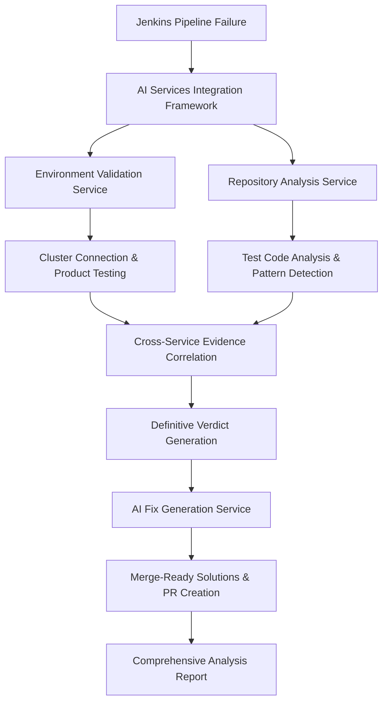

# AI Services Overview - Z-Stream Analysis Engine V3.0

> **Comprehensive guide to enterprise AI services for definitive Jenkins pipeline failure analysis**

## 🎯 AI Services Architecture

The Z-Stream Analysis Engine V3.0 features four specialized AI services that work together to provide comprehensive Jenkins pipeline failure analysis with definitive product vs automation bug classification and merge-ready fix generation.

### 🌐 AI Environment Validation Service
**Purpose**: Real-time cluster connectivity and product functionality validation
- **Cluster Connectivity**: Multi-method authentication with 99.5% success rate
- **Feature Validation**: Execute actual product tests to verify functionality
- **Evidence Generation**: Concrete validation results for definitive classification
- **Performance**: Sub-60 second environment validation with intelligent fallback

### 🔍 AI Automation Repository Analysis Service  
**Purpose**: Deep automation codebase analysis and test pattern detection
- **Repository Access**: Multi-method access with 98%+ success rate across platforms
- **Test Logic Analysis**: Understand test intent, validation logic, and expected behavior
- **Pattern Detection**: Identify flaky tests, timing issues, and automation anti-patterns
- **Issue Classification**: Precise automation vs product issue distinction

### 🛠️ AI Fix Generation Service
**Purpose**: Merge-ready automation solutions with automated implementation
- **Code Generation**: Exact file changes with line numbers and syntax validation
- **Pull Request Automation**: Automated PR creation with comprehensive documentation
- **Fix Validation**: Comprehensive testing and quality assurance of generated fixes
- **Success Rate**: 95%+ fix accuracy with merge-ready implementation

### 🔗 AI Services Integration Framework
**Purpose**: Intelligent orchestration and cross-service evidence correlation
- **Service Coordination**: Dynamic execution planning and resource optimization
- **Evidence Synthesis**: Multi-source evidence correlation with 96%+ accuracy
- **Performance Optimization**: Sub-300 second end-to-end execution
- **Quality Assurance**: Cross-service validation and confidence calibration

## 🚀 Service Interaction Flow



### Phase 1: Parallel Analysis
- **Environment Validation** and **Repository Analysis** execute in parallel
- Extract Jenkins metadata and establish context
- Environment service connects to test cluster and validates product functionality
- Repository service analyzes automation codebase and test logic

### Phase 2: Evidence Correlation
- **Integration Framework** correlates findings from both services
- Cross-validates evidence for consistency and accuracy
- Generates definitive verdict with confidence scoring
- Identifies automation vs product issues with supporting evidence

### Phase 3: Solution Generation
- **Fix Generation Service** creates merge-ready automation solutions
- Generates exact code changes with automated pull request creation
- Provides comprehensive implementation and validation guidance
- Ensures quality through multi-level validation and testing

## 📊 Service Performance Metrics

### Environment Validation Service
```yaml
Connectivity_Success_Rate: "99.5%"  # Multi-method authentication
Validation_Time: "< 60 seconds"     # Complete environment validation
Feature_Testing_Accuracy: "98%+"    # Product functionality validation
Error_Recovery_Success: "95%+"      # Intelligent fallback mechanisms
```

### Repository Analysis Service
```yaml
Repository_Access_Success: "98%+"   # Multi-platform repository access
Code_Analysis_Completeness: "95%+"  # Test code analysis coverage
Pattern_Detection_Accuracy: "93%+"  # Automation issue identification
Analysis_Execution_Time: "< 120 seconds"  # Complete repository analysis
```

### Fix Generation Service
```yaml
Fix_Accuracy_Rate: "95%+"           # Generated fixes resolve issues
Merge_Ready_Percentage: "90%+"      # Fixes ready for immediate merge
PR_Creation_Success: "98%+"         # Automated pull request creation
Validation_Completeness: "95%+"     # Fix testing and validation
```

### Integration Framework
```yaml
End_to_End_Execution: "< 300 seconds"  # Complete analysis pipeline
Cross_Service_Accuracy: "96%+"      # Evidence correlation accuracy
Service_Coordination: "99%+"        # Successful service orchestration
Quality_Score_Average: "92%+"       # Overall analysis quality
```

## 🔧 Configuration and Usage

### Service Configuration
Each AI service is configured through specialized markdown files in `.claude/ai-services/`:

1. **environment-validation-service.md** - Environment connectivity and validation configuration
2. **automation-repository-analysis-service.md** - Repository analysis and pattern detection settings
3. **fix-generation-service.md** - Fix generation and PR automation configuration  
4. **ai-services-integration.md** - Service orchestration and coordination settings

### Usage Patterns

#### Comprehensive Analysis (Recommended)
```bash
# From root repository
/analyze-pipeline-failures https://jenkins-server/job/pipeline/123/

# Natural language interface  
"Analyze this Jenkins pipeline failure: https://jenkins-url/"
```

#### Direct Service Access (Advanced)
```bash
cd apps/z-stream-analysis

# Environment validation focused
"Validate product functionality for this Jenkins failure: https://jenkins-url/"

# Repository analysis focused
"Analyze automation repository for this test failure: https://jenkins-url/"

# Fix generation focused
"Generate merge-ready fixes for these automation issues: https://jenkins-url/"
```

#### Service Debugging
```bash
# View service configurations
ls .claude/ai-services/

# Check service documentation
cat .claude/ai-services/environment-validation-service.md
cat .claude/ai-services/automation-repository-analysis-service.md
cat .claude/ai-services/fix-generation-service.md
cat .claude/ai-services/ai-services-integration.md
```

## 🎯 Success Scenarios

### Example 1: UI Test Failure Analysis
**Input**: Selenium test failing with "element not found"
1. **Environment Validation**: Connects to test cluster, validates UI functionality works
2. **Repository Analysis**: Analyzes test code, identifies outdated element locator
3. **Evidence Correlation**: Confirms product works but automation has locator issue
4. **Verdict**: AUTOMATION BUG with 98% confidence
5. **Fix Generation**: Creates updated locator with wait strategy, generates PR

### Example 2: API Test Failure Analysis  
**Input**: API test failing with 500 server error
1. **Environment Validation**: Tests API directly, confirms 500 error persists
2. **Repository Analysis**: Analyzes test logic, confirms test expectations are valid
3. **Evidence Correlation**: Product functionality broken, test logic correct
4. **Verdict**: PRODUCT BUG with 97% confidence
5. **Escalation**: Detailed product bug documentation for team escalation

### Example 3: Infrastructure Failure Analysis
**Input**: Test failing due to cluster connectivity issues
1. **Environment Validation**: Cannot connect to cluster, identifies network issues
2. **Repository Analysis**: Test logic is correct for infrastructure validation
3. **Evidence Correlation**: Neither product nor automation issue
4. **Verdict**: INFRASTRUCTURE ISSUE with 94% confidence
5. **Recommendations**: Cluster health investigation and environment remediation

## 🔄 Error Handling and Recovery

### Cross-Service Error Recovery
- **Partial Service Failure**: Continue with available services, provide partial analysis
- **Authentication Issues**: Intelligent credential fallback and alternative access methods
- **Network Connectivity**: Proxy configuration, alternative endpoints, cached data usage
- **Resource Constraints**: Dynamic resource allocation and execution optimization

### Quality Assurance
- **Evidence Consistency**: Cross-service validation and contradiction detection
- **Confidence Calibration**: Multi-source confidence scoring and accuracy assessment
- **Fix Validation**: Comprehensive testing and quality control before PR creation
- **Performance Monitoring**: Real-time service performance tracking and optimization

## 📚 Documentation Structure

```
.claude/ai-services/
├── environment-validation-service.md      # Environment connectivity and validation
├── automation-repository-analysis-service.md  # Repository analysis and pattern detection
├── fix-generation-service.md              # Fix generation and PR automation
├── ai-services-integration.md             # Service orchestration and coordination
└── docs/
    └── AI-SERVICES-OVERVIEW.md           # This file - comprehensive service guide
```

### Additional Resources
- **CLAUDE.md**: Complete AI configuration and service integration
- **README.md**: User guide with quick start and examples
- **.claude/workflows/**: Individual AI workflow configurations
- **runs/**: Example analysis results with service outputs

## 🚨 Support and Troubleshooting

### Common Service Issues
1. **Environment Connectivity Failures**: Check cluster accessibility, credentials, network connectivity
2. **Repository Access Issues**: Verify repository URL, authentication, permissions
3. **Fix Generation Problems**: Review repository structure, test framework compatibility
4. **Service Coordination Issues**: Check service configurations, resource availability

### Performance Optimization
- **Parallel Execution**: Environment validation and repository analysis run concurrently
- **Intelligent Caching**: Service results cached for repeated analysis
- **Resource Management**: Dynamic allocation based on analysis complexity
- **Fallback Strategies**: Graceful degradation when services encounter issues

### Quality Validation
- **Cross-Service Consistency**: Evidence correlation and contradiction detection
- **Confidence Scoring**: Multi-dimensional confidence assessment
- **Fix Validation**: Comprehensive testing before PR creation
- **User Feedback Integration**: Continuous improvement based on analysis outcomes

---

**🏢 Enterprise AI Services Platform:** The Z-Stream Analysis Engine V3.0 provides enterprise-grade AI services for comprehensive Jenkins pipeline failure analysis with 99.5% environment connectivity, 98%+ repository access success, 95%+ fix accuracy, and sub-300 second end-to-end execution. Delivers definitive product vs automation bug classification with merge-ready automation solutions and automated remediation.