# Universal AI Knowledge Assistant: A Claude-Powered Enterprise Intelligence Platform

## 🌟 Executive Summary

The **Universal AI Knowledge Assistant** is an AI-powered platform that can answer **ANY** question within an organization by intelligently accessing and analyzing all available data sources. Whether it's technical (deployment times), HR (vacation policies), financial (salary bands), legal (compliance requirements), or operational (process documentation) - if the data exists somewhere in your organization, this assistant can find it, understand it, and provide accurate, evidence-based answers.

**This is NOT a typical AI assistant** that gives generic responses based on general knowledge. This system:

• **Investigates** like a detective across multiple data sources simultaneously  
• **Analyzes** thousands of real data points to find patterns humans miss  
• **Understands** complex relationships between technical, business, and human factors  
• **Delivers** precise answers with statistical confidence, not generic estimates

**Key Insight**: The ONLY limitation is data access. The AI doesn't just search documents - it follows digital trails left by every human action. Every deployment, every decision, every transaction leaves traces across multiple systems. By analyzing these trails, the AI can answer questions that seem impossible - even providing insights more accurate than human experience, because it can process thousands of examples where humans might remember only dozens.

---

## 🎯 Core Concept

### The Problem with Current Solutions

#### What Typical AI Assistants Provide:
```
User: "How long do our deployments take?"
ChatGPT/Typical AI: "Cloud deployments typically take 15-30 minutes depending on size and complexity."
Result: Generic answer with no relevance to YOUR specific environment
```

#### What Employees Actually Need:
```
User: "How long do our deployments take?"
What they need: "YOUR ROSA-HCP deployments average 12-15 minutes based on 
547 deployments in the last 90 days, with 94% completing within this window.
Factors affecting timing: network latency (adds 2-3 min), cluster size 
(1 min per node), and time of day (20% slower during business hours)."
```

Currently, employees waste countless hours:

• Searching through multiple systems for information  
• Asking colleagues the same questions repeatedly  
• Missing critical information buried in logs, documents, or databases  
• Getting outdated or incorrect answers based on "tribal knowledge"  
• Using AI assistants that give generic, unhelpful responses

### The Solution
A single AI assistant that:
1. **Understands** natural language questions in any domain
2. **Discovers** where relevant information might exist - not just in documents, but in logs, comments, tickets, and digital trails
3. **Accesses** multiple data sources simultaneously to reconstruct the complete picture
4. **Analyzes** complex data using AI to extract insights from patterns humans might miss
5. **Delivers** accurate, evidence-based answers with full traceability to actual data

### The Power of Universal Access


### Beyond Documentation: Intelligence from Digital Trails

Here's what makes this system truly revolutionary: it can answer questions that might seem impossible at first - questions that no single document contains, questions that typically require years of engineering experience to answer accurately.

Consider the question: "How long do ROSA-HCP control planes take to be ready?" This isn't documented anywhere. It depends on countless factors - infrastructure type, network conditions, cluster size, resource availability. An experienced engineer might give you an estimate based on their memory of past deployments. But here's the key insight: **every piece of engineering experience leaves digital trails**.

When an engineer gains experience deploying clusters, they:

• Run Jenkins builds that generate timestamped logs  
• Create Jira tickets with deployment details  
• Write comments in PRs about timing issues  
• Send Slack messages discussing delays  
• Generate monitoring metrics during deployments  
• Leave error logs when things go wrong

The AI assistant doesn't just search for a document titled "Deployment Times." Instead, it:
1. **Analyzes hundreds of Jenkins logs** to find actual deployment durations
2. **Correlates with infrastructure details** from the logs to understand factors affecting timing
3. **Identifies patterns** across different environments and conditions
4. **Extracts phase-by-phase timing** from log timestamps
5. **Learns from failure logs** to understand what causes delays

This is exactly how engineers build their experience - through repeated exposure to real deployments. The difference is that the AI can analyze thousands of deployments in seconds, finding patterns that even experienced engineers might miss. It can provide not just an average, but a breakdown by environment type, time of day, cluster size, and other factors that affect deployment time.

The same principle applies across all domains:

• **Salary information** isn't just in HR documents - it's in offer letters, promotion announcements, budget discussions  
• **Compliance requirements** aren't just in policy docs - they're in audit reports, ticket resolutions, email threads  
• **Customer impact** isn't just in databases - it's in support tickets, deployment records, incident reports

The AI finds answers by following the same digital trails that humans create through their work. It just does it faster, more thoroughly, and without forgetting.

---

## 🚀 The Fundamental Difference: Beyond Traditional AI

### Intelligence Capabilities Spectrum

```mermaid
graph TB
    subgraph "Intelligence Spectrum"
        subgraph "Basic Search Tools"
            SEARCH["Keyword Search<br/>✗ Literal matching only<br/>✗ Single source<br/>✗ No understanding"]
        end
        
        subgraph "Typical AI Assistants"
            TYPICAL["ChatGPT, Copilot, etc.<br/>✓ Natural language<br/>✗ Generic knowledge<br/>✗ No org data access<br/>✗ No investigation"]
        end
        
        subgraph "Universal AI Knowledge Assistant"
            UNIVERSAL["Enhanced AI Intelligence<br/>✓ Natural language<br/>✓ Org-specific data<br/>✓ Multi-source investigation<br/>✓ Pattern analysis<br/>✓ Statistical confidence<br/>✓ Digital trail following<br/>✓ Cross-domain synthesis"]
        end
        
        SEARCH -->|"Limited"| TYPICAL
        TYPICAL -->|"Revolutionary<br/>Leap"| UNIVERSAL
    end
    
    style SEARCH fill:#ffeeee,stroke:#cc0000,stroke-width:2px,color:#000
    style TYPICAL fill:#ffffcc,stroke:#cccc00,stroke-width:2px,color:#000
    style UNIVERSAL fill:#eeffee,stroke:#00cc00,stroke-width:3px,color:#000
```

### Comparing Different Approaches

Standard AI tools are fundamentally limited - they can only work with information you explicitly provide them. The Universal AI Knowledge Assistant operates on a completely different level:

```mermaid
graph TB
    subgraph "Typical AI Assistant"
        USER1["User: How long do<br/>ROSA deployments take?"]
        TYPICAL_AI["Standard AI Assistant"]
        LIMITED["Limited to:<br/>• General knowledge<br/>• User-provided context<br/>• Basic web search"]
        TYPICAL_RESPONSE["ROSA deployments typically<br/>take 15-30 minutes based on<br/>general cloud knowledge<br/><br/>✗ Generic estimate<br/>✗ No real data<br/>✗ No specifics"]
        
        USER1 --> TYPICAL_AI
        TYPICAL_AI --> LIMITED
        LIMITED --> TYPICAL_RESPONSE
    end
    
    subgraph "Universal AI Knowledge Assistant"
        USER2["User: How long do<br/>ROSA deployments take?"]
        UNIVERSAL_AI["Universal AI Assistant<br/>with Enhanced Logic"]
        
        subgraph "Intelligent Analysis"
            ANALYZE["1. Understands deployment<br/>timing is complex"]
            PLAN["2. Creates multi-source<br/>investigation plan"]
            EXECUTE["3. Analyzes 1000s of<br/>data points in parallel"]
            SYNTHESIZE["4. Correlates patterns<br/>across all sources"]
        end
        
        subgraph "Data Sources Accessed"
            JENKINS_DATA["Jenkins - 500 deployment logs"]
            JIRA_DATA["Jira - 50 deployment tickets"]
            GITHUB_DATA["GitHub - PR discussions"]
            SLACK_DATA["Slack - Engineering threads"]
            METRICS["Monitoring - Performance data"]
        end
        
        ACCURATE_RESPONSE["ROSA-HCP deployments average<br/>12-15 minutes in your environment<br/><br/>✓ Based on 547 actual deployments<br/>✓ Breakdown by phase<br/>✓ Factors affecting timing<br/>✓ 94% confidence level"]
        
        USER2 --> UNIVERSAL_AI
        UNIVERSAL_AI --> ANALYZE
        ANALYZE --> PLAN
        PLAN --> EXECUTE
        
        EXECUTE --> JENKINS_DATA
        EXECUTE --> JIRA_DATA
        EXECUTE --> GITHUB_DATA
        EXECUTE --> SLACK_DATA
        EXECUTE --> METRICS
        
        JENKINS_DATA --> SYNTHESIZE
        JIRA_DATA --> SYNTHESIZE
        GITHUB_DATA --> SYNTHESIZE
        SLACK_DATA --> SYNTHESIZE
        METRICS --> SYNTHESIZE
        
        SYNTHESIZE --> ACCURATE_RESPONSE
    end
    
    style TYPICAL_AI fill:#ffcccc,stroke:#cc0000,stroke-width:2px,color:#000
    style UNIVERSAL_AI fill:#ccffcc,stroke:#00cc00,stroke-width:3px,color:#000
    style TYPICAL_RESPONSE fill:#ffeeee,stroke:#cc0000,stroke-width:2px,color:#000
    style ACCURATE_RESPONSE fill:#eeffee,stroke:#00cc00,stroke-width:2px,color:#000
```

### The Power of Enhanced Understanding and Logic

The Universal AI Knowledge Assistant isn't just querying databases - it's applying sophisticated reasoning across multiple dimensions:

#### 1. **Complex Query Decomposition**
```python
# Typical AI Assistant approach:
def typical_ai_response(query):
    # Simple pattern matching
    if "deployment time" in query:
        return "Deployments typically take 15-30 minutes"
    
# Universal AI Assistant approach:
async def universal_ai_response(query):
    # Deep understanding of what the question really needs
    understanding = await claude.analyze(f"""
    Query: {query}
    
    Decompose this into:
    1. What specific metric is needed (average, range, percentiles)
    2. What factors might affect this (environment, size, time of day)
    3. What evidence would make the answer trustworthy
    4. What related insights would be valuable
    """)
    
    # Create intelligent multi-phase investigation
    investigation_plan = await create_investigation_plan(understanding)
    
    # Execute parallel analysis across all relevant sources
    evidence = await gather_evidence(investigation_plan)
    
    # Apply statistical analysis and pattern recognition
    insights = await analyze_patterns(evidence)
    
    # Generate response with confidence levels and evidence
    return comprehensive_answer(insights)
```

#### 2. **Multi-Dimensional Pattern Recognition**

The system recognizes complex patterns across multiple dimensions:


### Real-World Example: Complex Cross-Domain Query with Branching Intelligence

Let's examine how the system handles a complex, multi-faceted question that requires branching into specialized knowledge domains:

**Query**: "What's the customer and legal impact of the virtualization UI bug in ACM 2.15 where live migration status isn't showing correctly?"

#### Standard AI Response:
```
"I don't have access to your bug tracking system, customer deployments, 
or legal contracts. This would require consulting multiple teams."
```

#### Universal AI Knowledge Assistant's Branching Approach:

```mermaid
flowchart TD
    QUERY["Query: Virtualization UI Bug Impact"]
    
    subgraph "Root Intelligence"
        ROOT["Root AI Orchestrator<br/>Understands: UI bug + virtualization + legal + customer impact"]
    end
    
    subgraph "Branch 1: Technical Analysis"
        TECH_AI["Technical Domain AI"]
        BUG["Analyze bug in Jira:<br/>ACM-15234 - Live migration<br/>status not updating in UI"]
        CODE["GitHub: Console changes,<br/>Multi-cluster SDK,<br/>Virtualization perspective"]
        SCOPE["Impact: UI only,<br/>Backend working correctly,<br/>Affects 2.15.0-2.15.2"]
    end
    
    subgraph "Branch 2: Customer Intelligence"
        CUST_AI["Customer Domain AI"]
        DEPLOY["Check deployments:<br/>147 customers on 2.15"]
        USAGE["Virtualization usage:<br/>42 actively use live migration"]
        CRITICAL["Critical customers:<br/>FinanceCore, HealthNet,<br/>GlobalManufacturing"]
    end
    
    subgraph "Branch 3: Legal/Contract Analysis"
        LEGAL_AI["Legal Domain AI"]
        CONTRACTS["Review contracts:<br/>3 customers have<br/>virtualization SLAs"]
        COMPLIANCE["Compliance check:<br/>UI accuracy requirements<br/>in healthcare sector"]
        LIABILITY["Liability assessment:<br/>No data loss = limited exposure"]
    end
    
    subgraph "Branch 4: Financial Impact"
        FIN_AI["Financial Domain AI"]
        REVENUE["At-risk revenue:<br/>$890K/month from<br/>affected customers"]
        PENALTIES["SLA penalties:<br/>Up to $50K if not<br/>fixed within 30 days"]
        COSTS["Fix costs:<br/>40 eng hours (~$6K)"]
    end
    
    subgraph "Synthesis Layer"
        SYNTHESIS["Unified Intelligence Synthesis"]
        REPORT["📊 Comprehensive Report:<br/>• 42 customers actively affected<br/>• 3 have contractual SLAs<br/>• $890K monthly revenue at risk<br/>• Healthcare compliance concern<br/>• Fix available in 2.15.3<br/>• Workaround: Use CLI for status"]
    end
    
    QUERY --> ROOT
    ROOT --> TECH_AI
    ROOT --> CUST_AI
    ROOT --> LEGAL_AI
    ROOT --> FIN_AI
    
    TECH_AI --> BUG
    TECH_AI --> CODE
    TECH_AI --> SCOPE
    
    CUST_AI --> DEPLOY
    CUST_AI --> USAGE
    CUST_AI --> CRITICAL
    
    LEGAL_AI --> CONTRACTS
    LEGAL_AI --> COMPLIANCE
    LEGAL_AI --> LIABILITY
    
    FIN_AI --> REVENUE
    FIN_AI --> PENALTIES
    FIN_AI --> COSTS
    
    SCOPE --> SYNTHESIS
    CRITICAL --> SYNTHESIS
    LIABILITY --> SYNTHESIS
    COSTS --> SYNTHESIS
    
    SYNTHESIS --> REPORT
    
    style ROOT fill:#f3e5f5,stroke:#7b1fa2,stroke-width:4px,color:#000
    style TECH_AI fill:#e8f4fd,stroke:#1565c0,stroke-width:3px,color:#000
    style CUST_AI fill:#fff3e0,stroke:#e65100,stroke-width:3px,color:#000
    style LEGAL_AI fill:#fce4ec,stroke:#c2185b,stroke-width:3px,color:#000
    style FIN_AI fill:#e8f5e8,stroke:#388e3c,stroke-width:3px,color:#000
    style SYNTHESIS fill:#f3e5f5,stroke:#7b1fa2,stroke-width:3px,color:#000
    style REPORT fill:#e0f7fa,stroke:#00acc1,stroke-width:4px,color:#000
```

**The Power of Branching Architecture**:

Just like your Claude Test Generator Framework where each agent is standalone but accessible from the root, this system operates with:

1. **Root Orchestrator**: Understands the query and identifies which specialized domains to engage
2. **Domain-Specific AI Branches**: Each branch has deep expertise in its area (technical, customer, legal, financial)
3. **Intelligent Routing**: The root AI knows exactly which branches to activate based on the query
4. **Parallel Processing**: All branches work simultaneously, not sequentially
5. **Unified Synthesis**: Results from all branches are intelligently combined

**Universal AI Response**:
```
TECHNICAL SUMMARY:
- Bug: ACM-15234 affects virtualization UI in versions 2.15.0-2.15.2
- Issue: Live migration completes successfully but UI doesn't update status
- Root cause: WebSocket event handling error in console code
- Fix: Available in 2.15.3 (released) or hotfix patch

CUSTOMER IMPACT:
- Total affected: 42 customers actively using live migration
- Critical accounts: FinanceCore, HealthNet, GlobalManufacturing
- User experience: Confusion about migration status, requiring CLI verification
- No data loss or functional impact - purely visual

LEGAL/COMPLIANCE ANALYSIS:
- 3 customers have specific virtualization SLA clauses
- HealthNet requires UI accuracy for healthcare compliance (HIPAA)
- Limited liability due to no data/functional impact
- Recommendation: Proactive notification to avoid breach claims

FINANCIAL ASSESSMENT:
- Monthly recurring revenue at risk: $890K
- Potential SLA penalties: $50K (if not resolved within 30 days)
- Engineering cost to fix: Already complete in 2.15.3
- Customer retention risk: Low with proper communication

RECOMMENDATIONS:
1. Immediate: Push 2.15.3 upgrade to affected customers
2. Workaround: Document CLI commands for status verification
3. Communication: Proactive outreach to SLA customers today
4. Future: Add UI regression tests for virtualization features

Evidence: Analysis based on 147 deployment records, 12 support tickets,
3 contract reviews, and virtualization feature usage metrics.
```

### Why This Level of Intelligence Matters

The Universal AI Knowledge Assistant provides:

1. **Contextual Understanding**: Knows that deployment times vary by environment
2. **Investigative Intelligence**: Automatically plans multi-source investigations
3. **Pattern Recognition**: Identifies trends humans miss across thousands of data points
4. **Confidence Levels**: Provides statistical backing for every answer
5. **Actionable Insights**: Goes beyond answering to provide recommendations

This isn't just automation - it's augmented intelligence that combines:

• The breadth of AI's data processing capabilities  
• The depth of domain-specific understanding  
• The nuance of human-like reasoning  
• The accuracy of evidence-based analysis

### The Sophistication of AI Reasoning

What makes this system truly revolutionary is its ability to reason about complex organizational dynamics:


**Example of Deep Reasoning**:

When asked "Why are deployments slower on Fridays?", the system doesn't just search for "Friday deployment" - it:

1. **Hypothesizes** multiple possible causes (resource contention, team availability, change freeze proximity)
2. **Investigates** each hypothesis across different data sources
3. **Correlates** deployment times with resource metrics, team calendars, and incident reports
4. **Discovers** that Friday deployments coincide with backup jobs causing resource contention
5. **Recommends** scheduling deployments before 2 PM to avoid backup window

This level of investigative reasoning is what separates it from any typical AI assistant.

---

## 🏗️ Architecture Overview

### High-Level System Architecture

```mermaid
graph TB
    subgraph "User Interfaces"
        SLACK["💬 Slack Bot"]
        TEAMS["👥 Teams Bot"]
        WEB["🌐 Web Portal"]
        CLI["⌨️ CLI Tool"]
        EMAIL["📧 Email Interface"]
        MOBILE["📱 Mobile App"]
    end
    
    subgraph "AI Core Platform"
        subgraph "Intelligence Layer"
            CLAUDE["🧠 Claude AI Engine<br/>Query Understanding & Planning"]
            ORCHESTRATOR["🎭 Query Orchestrator<br/>Execution Management"]
            ROUTER["🔀 Intent Router<br/>Source Selection"]
        end
        
        subgraph "Processing Layer"
            ANALYZER["📊 Data Analyzer<br/>Pattern Recognition"]
            AGGREGATOR["🔗 Result Aggregator<br/>Multi-Source Synthesis"]
            VALIDATOR["✓ Evidence Validator<br/>Accuracy Assurance"]
        end
        
        subgraph "Knowledge Layer"
            CACHE["💾 Knowledge Cache<br/>Fast Retrieval"]
            LEARNER["📚 Continuous Learner<br/>Pattern Updates"]
            CONTEXT["🗂️ Context Manager<br/>User/Org Context"]
        end
    end
    
    subgraph "Universal Connectors"
        subgraph "Technical"
            GITHUB["GitHub"]
            JENKINS["Jenkins"]
            JIRA["Jira"]
            K8S["Kubernetes"]
            SPLUNK["Splunk"]
        end
        
        subgraph "Business"
            WORKDAY["Workday"]
            SAP["SAP"]
            SALESFORCE["Salesforce"]
            CONFLUENCE["Confluence"]
            SHAREPOINT["SharePoint"]
        end
        
        subgraph "Infrastructure"
            AWS["AWS"]
            AZURE["Azure"]
            GCP["GCP"]
            MONGODB["MongoDB"]
            POSTGRES["PostgreSQL"]
        end
    end
    
    SLACK --> CLAUDE
    TEAMS --> CLAUDE
    WEB --> CLAUDE
    CLI --> CLAUDE
    EMAIL --> CLAUDE
    MOBILE --> CLAUDE
    
    CLAUDE --> ROUTER
    ROUTER --> ORCHESTRATOR
    
    ORCHESTRATOR --> GITHUB
    ORCHESTRATOR --> JENKINS
    ORCHESTRATOR --> WORKDAY
    ORCHESTRATOR --> SAP
    ORCHESTRATOR --> AWS
    
    GITHUB --> ANALYZER
    JENKINS --> ANALYZER
    WORKDAY --> ANALYZER
    SAP --> ANALYZER
    AWS --> ANALYZER
    
    ANALYZER --> AGGREGATOR
    AGGREGATOR --> VALIDATOR
    VALIDATOR --> CACHE
    
    CACHE --> CLAUDE
    LEARNER --> CLAUDE
    CONTEXT --> CLAUDE
    
    style CLAUDE fill:#f3e5f5,stroke:#7b1fa2,stroke-width:4px,color:#000
    style ORCHESTRATOR fill:#e8f4fd,stroke:#1565c0,stroke-width:3px,color:#000
    style ANALYZER fill:#fff3e0,stroke:#e65100,stroke-width:3px,color:#000
    style VALIDATOR fill:#e8f5e8,stroke:#388e3c,stroke-width:3px,color:#000
```

---

## 🔄 How It Works: The Universal Query Flow

### Step-by-Step Process


### Example: Cross-Domain Query Resolution

Let's see how the system handles a complex HR query:

**User Query**: "How many vacation days do I have left, and what's the company policy on carrying them over to next year?"

```mermaid
flowchart LR
    subgraph "1. Query Analysis"
        QUERY["User asks about<br/>vacation days"]
        CLAUDE1["Claude identifies:<br/>• Personal data needed<br/>• Policy info needed<br/>• User context required"]
    end
    
    subgraph "2. Data Collection"
        WORKDAY["Query Workday:<br/>User's vacation balance"]
        CONFLUENCE["Search Confluence:<br/>Vacation policies"]
        SHAREPOINT["Check SharePoint:<br/>HR handbook"]
        EMAIL["Scan emails:<br/>Recent approvals"]
    end
    
    subgraph "3. Intelligent Analysis"
        ANALYZE["Claude analyzes:<br/>• Current balance: 12 days<br/>• Used this year: 13 days<br/>• Policy: Max 5 days carryover<br/>• Deadline: Dec 31"]
    end
    
    subgraph "4. Personalized Response"
        RESPONSE["You have 12 vacation days remaining.<br/>Company policy allows carrying over<br/>maximum 5 days to next year.<br/>You must use 7 days by Dec 31<br/>or forfeit them."]
    end
    
    QUERY --> CLAUDE1
    CLAUDE1 --> WORKDAY
    CLAUDE1 --> CONFLUENCE
    CLAUDE1 --> SHAREPOINT
    CLAUDE1 --> EMAIL
    
    WORKDAY --> ANALYZE
    CONFLUENCE --> ANALYZE
    SHAREPOINT --> ANALYZE
    EMAIL --> ANALYZE
    
    ANALYZE --> RESPONSE
    
    style CLAUDE1 fill:#f3e5f5,stroke:#7b1fa2,stroke-width:3px,color:#000
    style ANALYZE fill:#fff3e0,stroke:#e65100,stroke-width:2px,color:#000
    style RESPONSE fill:#e8f5e8,stroke:#388e3c,stroke-width:2px,color:#000
```

---

## 💡 Why Claude/Cloud Code is Perfect for This

### 1. **Natural Language Understanding**
Claude excels at understanding context, intent, and nuance in questions across ANY domain:

```python
# Claude can understand all these variations mean the same thing:
queries = [
    "How long does ROSA-HCP take to deploy?",
    "What's the deployment time for ROSA HCP control planes?",
    "ROSA-HCP deployment duration?",
    "Time to ready for ROSA hypershift clusters?"
]

# Claude understands they all ask about: ROSA-HCP deployment timing
```

### 2. **Intelligent Data Source Selection**
Claude can determine which systems to query based on the question:

```python
async def determine_data_sources(query: str) -> List[DataSource]:
    prompt = f"""
    Analyze this query and determine which organizational systems to search:
    Query: {query}
    
    Available systems:
    - Technical: GitHub, Jenkins, Jira, Kubernetes, CloudWatch
    - HR: Workday, Confluence (HR docs), Email
    - Finance: SAP, Payroll system, Expense tools
    - Legal: Contract database, Compliance repos
    
    Return the most relevant systems to query.
    """
    
    # Claude intelligently selects only relevant sources
    # Reduces unnecessary API calls and improves performance
```

### 3. **Complex Data Analysis**
Claude can analyze diverse data types and extract insights:

```python
# Example: Analyzing Jenkins logs for deployment patterns
async def analyze_jenkins_logs(logs: List[str]) -> DeploymentInsights:
    analysis_prompt = f"""
    Analyze these Jenkins deployment logs to find:
    1. Control plane initialization start time
    2. Each phase completion (with timestamps)
    3. Final ready state confirmation
    4. Any delays or retries
    5. Environmental factors affecting timing
    
    Logs: {logs}
    
    Extract precise timing information and patterns.
    """
    
    # Claude can understand log formats, extract timestamps,
    # identify patterns, and calculate statistics
```

### 4. **Cross-Domain Knowledge Synthesis**
Claude can connect information from completely different domains:

```python
# Example: A complex cross-domain query
query = "Which customer deployments will be affected by the bug in ACM-12345, and what's their contract status?"

# Claude will:
# 1. Check Jira for bug details (Technical)
# 2. Query deployment database for affected versions (Technical)
# 3. Cross-reference with Salesforce for customer data (Business)
# 4. Check contract database for support status (Legal/Business)
# 5. Synthesize a comprehensive answer
```

### 5. **Digital Trail Analysis**
Claude can extract insights from digital trails that humans create but don't consciously track:

```python
# Example: Finding deployment timing from digital trails
async def analyze_deployment_experience(component: str):
    """
    Engineers don't document "ROSA-HCP takes 12-15 minutes"
    But their actions leave trails everywhere:
    """
    
    digital_trails = {
        'jenkins_logs': "Timestamps showing actual deployment durations",
        'jira_comments': "Engineers discussing delays and issues",  
        'github_prs': "Comments about performance improvements",
        'slack_archives': "Real-time discussions during deployments",
        'monitoring_data': "Resource utilization during deployments",
        'support_tickets': "Customer reports about deployment times"
    }
    
    # Claude analyzes these trails to extract knowledge that was never
    # formally documented but exists in the organization's digital DNA
    
    insights = await claude.analyze_digital_trails(digital_trails)
    
    # Result: More accurate than asking any single engineer
    # because it's based on hundreds of real experiences
```

The AI reconstructs organizational knowledge from the digital footprints of actual work - providing answers that are often more accurate and comprehensive than human memory.

---

## 🚀 Implementation Approach

### Claude Code-Based Project Structure

Following Claude Code development principles with documentation-driven implementation and systematic branching architecture:

```
universal-ai-assistant/
├── .claude/                          # Claude Code Configuration
│   ├── CLAUDE.md                     # Main project context for Claude
│   ├── config/
│   │   ├── ai-models-config.json     # AI model configurations
│   │   ├── branch-strategy.yaml      # Branching and expansion rules
│   │   └── orchestration-config.yaml # Root orchestrator settings
│   └── ai-services/                  # AI Service Definitions
│       ├── agents/                   # Specialized AI Agents
│       │   ├── root-orchestrator.yaml          # Main intelligence router
│       │   ├── technical-intelligence.yaml     # Technical domain agent
│       │   ├── business-intelligence.yaml      # Business domain agent
│       │   ├── hr-intelligence.yaml           # HR domain agent
│       │   ├── legal-intelligence.yaml        # Legal domain agent
│       │   └── financial-intelligence.yaml    # Financial domain agent
│       ├── instructions/             # Detailed AI Instructions
│       │   ├── root-orchestrator-instructions.md
│       │   ├── technical-domain-instructions.md
│       │   ├── business-domain-instructions.md
│       │   └── branch-expansion-instructions.md
│       └── registry/
│           └── ai-service-registry.json # Service catalog
│
├── docs/                             # Documentation Layer (Specifications)
│   ├── architecture/
│   │   ├── system-overview.md        # Complete system architecture
│   │   ├── branching-strategy.md     # How branches work and expand
│   │   └── data-flow-architecture.md # Information flow design
│   ├── services/                     # Service Specifications
│   │   ├── root-orchestrator-service.md
│   │   ├── technical-intelligence-service.md
│   │   ├── business-intelligence-service.md
│   │   ├── connector-framework-service.md
│   │   └── query-processing-service.md
│   ├── connectors/                   # Data Source Specifications
│   │   ├── technical-connectors/
│   │   │   ├── jenkins-connector-spec.md
│   │   │   ├── github-connector-spec.md
│   │   │   └── jira-connector-spec.md
│   │   ├── business-connectors/
│   │   │   ├── workday-connector-spec.md
│   │   │   ├── salesforce-connector-spec.md
│   │   │   └── confluence-connector-spec.md
│   │   └── infrastructure-connectors/
│   │       ├── aws-connector-spec.md
│   │       └── database-connector-spec.md
│   └── schemas/                      # Data Format Definitions
│       ├── query-request-schema.json
│       ├── intelligence-response-schema.json
│       └── connector-data-schema.json
│
├── src/                             # Implementation Layer
│   ├── core/                        # Core Framework
│   │   ├── orchestrator/            # Root Intelligence Orchestrator
│   │   │   ├── root_orchestrator.py        # Main query router
│   │   │   ├── branch_manager.py           # Manages domain branches
│   │   │   ├── context_synthesizer.py      # Combines branch results
│   │   │   └── expansion_engine.py         # Adds new capabilities
│   │   ├── branches/                # Domain-Specific Intelligence Branches
│   │   │   ├── technical_branch/
│   │   │   │   ├── technical_intelligence.py
│   │   │   │   ├── deployment_analyzer.py
│   │   │   │   ├── code_analyzer.py
│   │   │   │   └── infrastructure_analyzer.py
│   │   │   ├── business_branch/
│   │   │   │   ├── business_intelligence.py
│   │   │   │   ├── customer_analyzer.py
│   │   │   │   ├── sales_analyzer.py
│   │   │   │   └── operations_analyzer.py
│   │   │   ├── hr_branch/
│   │   │   │   ├── hr_intelligence.py
│   │   │   │   ├── policy_analyzer.py
│   │   │   │   ├── employee_analyzer.py
│   │   │   │   └── compliance_analyzer.py
│   │   │   └── financial_branch/
│   │   │       ├── financial_intelligence.py
│   │   │       ├── budget_analyzer.py
│   │   │       ├── cost_analyzer.py
│   │   │       └── revenue_analyzer.py
│   │   ├── connectors/              # Universal Connector Framework
│   │   │   ├── base_connector.py    # Abstract connector interface
│   │   │   ├── connector_factory.py # Dynamic connector creation
│   │   │   ├── technical/
│   │   │   ├── business/
│   │   │   └── infrastructure/
│   │   └── ai_clients/              # AI Integration Layer
│   │       ├── claude_client.py     # Claude API integration
│   │       ├── context_manager.py   # Context window management
│   │       └── prompt_engine.py     # Dynamic prompt generation
│   ├── interfaces/                  # User Interface Layer
│   │   ├── slack_bot.py
│   │   ├── web_api.py
│   │   ├── cli.py
│   │   └── email_handler.py
│   └── utils/                       # Utility Functions
│       ├── security/
│       ├── monitoring/
│       └── validation/
│
├── tests/                           # Testing Layer
│   ├── test_orchestration/          # Test root orchestrator
│   ├── test_branches/               # Test each intelligence branch
│   │   ├── test_technical_branch/
│   │   ├── test_business_branch/
│   │   ├── test_hr_branch/
│   │   └── test_financial_branch/
│   ├── test_connectors/             # Test connector implementations
│   ├── test_integration/            # End-to-end system tests
│   └── test_branch_expansion/       # Test capability expansion
│
├── monitoring/                      # System Monitoring
│   ├── performance_monitor.py       # Performance tracking
│   ├── cost_optimizer.py           # AI cost management
│   └── quality_assessor.py         # Response quality evaluation
│
├── scripts/                         # Development Scripts
│   ├── expand_branch.py             # Add new intelligence branches
│   ├── deploy_connector.py          # Deploy new data connectors
│   └── validate_system.py          # System integrity validation
│
└── config/                          # Configuration Files
    ├── production.yaml              # Production settings
    ├── development.yaml            # Development settings
    └── branch-definitions.yaml     # Available intelligence branches
```

## 📋 Claude Code Development Framework

### Documentation-Driven Development Workflow

Following Claude Code principles, the Universal AI Knowledge Assistant is built using **Documentation-First Development** with **Systematic Branch Expansion**.

#### Phase 1: Foundation Documentation
```bash
# 1. Create main project context
.claude/CLAUDE.md                     # Project overview and development strategy

# 2. Define system architecture  
docs/architecture/system-overview.md  # Complete system design
docs/architecture/branching-strategy.md # How intelligence branches work

# 3. Specify core services
docs/services/root-orchestrator-service.md    # Main query router
docs/services/technical-intelligence-service.md # Technical domain agent
```

#### Phase 2: AI Service Configuration
```yaml
# .claude/ai-services/agents/root-orchestrator.yaml
agent_metadata:
  agent_id: "root_orchestrator"
  agent_name: "Universal AI Knowledge Orchestrator"
  agent_type: "query_router"
  version: "1.0.0"
  
ai_capabilities:
  - "query_understanding"
  - "intent_classification" 
  - "branch_routing"
  - "context_synthesis"
  
branch_management:
  available_branches:
    - technical_intelligence
    - business_intelligence
    - hr_intelligence
    - legal_intelligence
    - financial_intelligence
  
  expansion_strategy: "dynamic_routing"
  parallel_processing: true
  context_sharing: true

execution_workflow:
  - "analyze_user_query"
  - "classify_query_domain"
  - "route_to_appropriate_branches"
  - "coordinate_parallel_execution"
  - "synthesize_branch_responses"
  - "generate_unified_response"
```

### Systematic Branch Expansion Architecture

#### Core Branching Principles

The system uses a **hierarchical branching architecture** where each domain has specialized intelligence:

```mermaid
graph TD
    USER["User Query"]
    ROOT["Root Orchestrator<br/>🧠 Main Intelligence"]
    
    subgraph "Domain Intelligence Branches"
        TECH["Technical Branch<br/>🔧 Infrastructure & Code"]
        BIZ["Business Branch<br/>📈 Operations & Strategy"]
        HR["HR Branch<br/>👥 People & Policies"]
        LEGAL["Legal Branch<br/>⚖️ Compliance & Contracts"]
        FIN["Financial Branch<br/>💰 Budget & Revenue"]
    end
    
    subgraph "Sub-Branch Specializations"
        DEPLOY["Deployment<br/>Analyzer"]
        CODE["Code<br/>Analyzer"]
        INFRA["Infrastructure<br/>Analyzer"]
        
        CUSTOMER["Customer<br/>Analyzer"]
        SALES["Sales<br/>Analyzer"]
        OPS["Operations<br/>Analyzer"]
    end
    
    USER --> ROOT
    ROOT --> TECH
    ROOT --> BIZ
    ROOT --> HR
    ROOT --> LEGAL
    ROOT --> FIN
    
    TECH --> DEPLOY
    TECH --> CODE
    TECH --> INFRA
    
    BIZ --> CUSTOMER
    BIZ --> SALES
    BIZ --> OPS
    
    style ROOT fill:#f3e5f5,stroke:#7b1fa2,stroke-width:4px,color:#000
    style TECH fill:#e8f4fd,stroke:#1565c0,stroke-width:3px,color:#000
    style BIZ fill:#fff3e0,stroke:#e65100,stroke-width:3px,color:#000
    style HR fill:#e8f5e8,stroke:#388e3c,stroke-width:3px,color:#000
    style LEGAL fill:#fce4ec,stroke:#c2185b,stroke-width:3px,color:#000
    style FIN fill:#f3e5f5,stroke:#7b1fa2,stroke-width:3px,color:#000
```

#### Branch Expansion Process

**Adding New Intelligence Branches:**

1. **Document the New Domain**
```markdown
# docs/services/security-intelligence-service.md

# Security Intelligence Branch

## Purpose
Specialized AI agent for cybersecurity analysis, threat detection, and compliance monitoring.

## Capabilities
- Security incident analysis
- Threat pattern recognition
- Compliance assessment
- Vulnerability analysis
- Risk evaluation

## Integration Points
- SIEM systems (Splunk, ELK)
- Vulnerability scanners
- Compliance databases
- Incident response tools
```

2. **Create AI Agent Configuration**
```yaml
# .claude/ai-services/agents/security-intelligence.yaml
agent_metadata:
  agent_id: "security_intelligence"
  agent_name: "Security Intelligence Branch"
  parent_branch: "root_orchestrator"
  specialization: "cybersecurity"

ai_capabilities:
  - "threat_analysis"
  - "incident_investigation" 
  - "compliance_checking"
  - "risk_assessment"

data_sources:
  - splunk_security_logs
  - vulnerability_databases
  - incident_management_systems
  - compliance_frameworks
```

3. **Implement Branch Logic**
```bash
# Request to Claude Code:
"Read docs/services/security-intelligence-service.md and create 
src/core/branches/security_branch/security_intelligence.py following 
the established branch pattern. Include threat detection, incident 
analysis, and compliance checking capabilities."
```

4. **Register Branch in System**
```yaml
# config/branch-definitions.yaml
intelligence_branches:
  security_intelligence:
    enabled: true
    priority: high
    triggers:
      - security
      - threat
      - vulnerability
      - incident
      - compliance
    connectors:
      - splunk_connector
      - vulnerability_scanner
      - siem_connector
```

### Development Workflow Using Claude Code

#### Step 1: Specification-First Development

**Root Orchestrator Service Documentation:**

```markdown
# docs/services/root-orchestrator-service.md

# Root Orchestrator Service

## Purpose
Central intelligence hub that routes queries to appropriate domain branches and synthesizes responses.

## Core Responsibilities

### 1. Query Understanding
- Parse natural language queries
- Identify query intent and scope
- Extract key entities and context
- Determine complexity level

### 2. Branch Routing
- Classify query by domain(s)
- Route to single branch (simple queries)
- Route to multiple branches (complex queries)
- Manage parallel execution coordination

### 3. Response Synthesis
- Collect responses from all branches
- Resolve conflicts between branch responses
- Create unified, coherent response
- Maintain source attribution

## Interface Specification
```python
class RootOrchestrator:
    def process_query(self, query: str, user_context: dict) -> OrchestrationResult
    def classify_query_domain(self, query: str) -> List[str]
    def route_to_branches(self, query: str, domains: List[str]) -> Dict[str, BranchTask]
    def synthesize_responses(self, branch_responses: Dict[str, Any]) -> UnifiedResponse
    def handle_branch_conflicts(self, conflicts: List[Conflict]) -> ConflictResolution
```

**System Integration Requirements:**
- Support for dynamic branch addition without restart
- Real-time performance monitoring per branch
- Cost optimization across all AI calls
- Context sharing between branches
- Failure handling with graceful degradation
```

#### Step 2: Implementation Request to Claude Code

```bash
"Read docs/services/root-orchestrator-service.md and create a complete 
implementation in src/core/orchestrator/root_orchestrator.py. The system 
should support dynamic branch routing, parallel execution, and response 
synthesis. Include comprehensive error handling and monitoring integration."
```

#### Step 3: Branch-Specific Implementation

**Technical Intelligence Branch:**

```bash
"Read docs/services/technical-intelligence-service.md and create 
src/core/branches/technical_branch/technical_intelligence.py. This branch 
should handle deployment questions, infrastructure analysis, and code 
investigation queries. Integrate with Jenkins, GitHub, Jira, and Kubernetes 
connectors as specified."
```

### Advanced Branching Capabilities

#### 1. Dynamic Branch Loading

```python
# src/core/orchestrator/expansion_engine.py (Claude Code Generated)

class ExpansionEngine:
    """Dynamically loads and manages intelligence branches"""
    
    def __init__(self, config_path: str):
        self.branch_registry = self._load_branch_definitions(config_path)
        self.active_branches: Dict[str, IntelligenceBranch] = {}
        
    async def expand_capability(self, domain: str, specification_path: str):
        """Add new intelligence branch capability"""
        
        # Read branch specification
        spec = await self._load_branch_specification(specification_path)
        
        # Request Claude Code to implement the branch
        implementation = await self._request_claude_implementation(spec)
        
        # Validate and register new branch
        branch = await self._instantiate_branch(implementation)
        self.active_branches[domain] = branch
        
        return f"Successfully added {domain} intelligence branch"
```

#### 2. Cross-Branch Collaboration

```python
# Example: Complex query requiring multiple branches
query = "What's the financial impact of the ACM virtualization bug on our Q4 customer commitments?"

# Root orchestrator routes to:
branches_involved = {
    "technical": "Analyze bug impact and affected versions",
    "business": "Identify affected customers and deployments", 
    "legal": "Review contract obligations and SLAs",
    "financial": "Calculate revenue impact and penalties"
}

# Each branch works in parallel, shares context, and contributes to final answer
```

### Core Implementation Examples

#### 1. Root Orchestrator Pattern
```python
# Generated by Claude Code from documentation specification
from abc import ABC, abstractmethod
from typing import Dict, Any, List, Optional
import asyncio
from dataclasses import dataclass
from datetime import datetime
from src.core.ai_clients.claude_client import ClaudeClient

@dataclass
class QueryContext:
    query: str
    user_id: str
    session_id: str
    timestamp: datetime
    user_permissions: Dict[str, Any]
    conversation_history: List[Dict[str, Any]]

@dataclass
class BranchResponse:
    branch_name: str
    response_data: Dict[str, Any]
    confidence_score: float
    execution_time_ms: float
    cost_usd: float
    sources_accessed: List[str]

@dataclass 
class OrchestrationResult:
    unified_response: str
    branch_contributions: Dict[str, BranchResponse]
    total_confidence: float
    total_cost: float
    execution_summary: Dict[str, Any]

class RootOrchestrator:
    """
    Central intelligence hub that routes queries to domain branches
    Generated by Claude Code from service specification
    """
    
    def __init__(self, branch_config_path: str, claude_client: ClaudeClient):
        self.claude = claude_client
        self.available_branches = self._load_branch_registry(branch_config_path)
        self.context_manager = ConversationContextManager()
        
    async def process_query(self, query: str, user_context: dict) -> OrchestrationResult:
        """Main query processing orchestration"""
        start_time = datetime.utcnow()
        
        # Build complete context
        query_context = QueryContext(
            query=query,
            user_id=user_context.get('user_id'),
            session_id=user_context.get('session_id'),
            timestamp=start_time,
            user_permissions=user_context.get('permissions', {}),
            conversation_history=await self.context_manager.get_history(user_context.get('session_id'))
        )
        
        # Classify query domains
        domains = await self.classify_query_domain(query_context)
        
        # Route to appropriate branches in parallel
        branch_tasks = await self.route_to_branches(query_context, domains)
        
        # Execute all branches concurrently
        branch_responses = await self._execute_branches_parallel(branch_tasks)
        
        # Synthesize unified response
        unified_response = await self.synthesize_responses(query_context, branch_responses)
        
        # Update conversation context
        await self.context_manager.add_interaction(
            user_context.get('session_id'), 
            query, 
            unified_response
        )
        
        return OrchestrationResult(
            unified_response=unified_response.response_text,
            branch_contributions=branch_responses,
            total_confidence=unified_response.confidence_score,
            total_cost=sum(r.cost_usd for r in branch_responses.values()),
            execution_summary={
                'domains_involved': domains,
                'branches_activated': list(branch_responses.keys()),
                'total_execution_time_ms': (datetime.utcnow() - start_time).total_seconds() * 1000
            }
        )
    
    async def classify_query_domain(self, context: QueryContext) -> List[str]:
        """Use Claude AI to intelligently classify query domains"""
        
        classification_prompt = f"""
        Analyze this user query and determine which organizational domains are involved:
        
        Query: {context.query}
        User Context: {context.user_permissions}
        Recent Context: {context.conversation_history[-3:] if context.conversation_history else "None"}
        
        Available Intelligence Branches:
        - technical: Infrastructure, deployments, code, DevOps
        - business: Customer operations, sales, strategy
        - hr: Employee policies, benefits, compliance
        - legal: Contracts, regulations, compliance
        - financial: Budget, costs, revenue, expenses
        - security: Cybersecurity, threats, vulnerabilities
        
        For each relevant domain, provide:
        1. Relevance score (0.0-1.0)
        2. Specific aspect to investigate
        3. Expected contribution to final answer
        
        Return as JSON array of domain classifications.
        """
        
        classification_result = await self.claude.analyze(classification_prompt)
        
        # Extract domains with relevance > 0.3
        relevant_domains = [
            domain['name'] for domain in classification_result 
            if domain.get('relevance_score', 0) > 0.3
        ]
        
        return relevant_domains
    
    async def route_to_branches(self, context: QueryContext, domains: List[str]) -> Dict[str, BranchTask]:
        """Create specific tasks for each relevant branch"""
        
        branch_tasks = {}
        
        for domain in domains:
            if domain in self.available_branches:
                # Create domain-specific task
                task_prompt = await self._create_branch_task_prompt(context, domain)
                
                branch_tasks[domain] = BranchTask(
                    branch_name=domain,
                    task_specification=task_prompt,
                    context=context,
                    priority=self._calculate_branch_priority(domain, context.query)
                )
        
        return branch_tasks
    
    async def synthesize_responses(self, context: QueryContext, 
                                 branch_responses: Dict[str, BranchResponse]) -> UnifiedResponse:
        """Synthesize branch responses into coherent answer"""
        
        synthesis_prompt = f"""
        You are synthesizing responses from multiple intelligence branches for this query:
        
        Original Query: {context.query}
        
        Branch Contributions:
        {self._format_branch_responses_for_synthesis(branch_responses)}
        
        Your task:
        1. Create a coherent, comprehensive answer
        2. Resolve any conflicts between branches
        3. Attribute information to sources
        4. Identify gaps or limitations
        5. Provide actionable recommendations where appropriate
        
        Ensure the response:
        - Directly answers the user's question
        - Integrates all relevant branch insights
        - Maintains proper source attribution
        - Is clear and actionable
        """
        
        synthesis_result = await self.claude.synthesize(synthesis_prompt)
        
        return UnifiedResponse(
            response_text=synthesis_result['unified_answer'],
            confidence_score=synthesis_result['overall_confidence'],
            sources_used=self._extract_all_sources(branch_responses),
            recommendations=synthesis_result.get('recommendations', [])
        )
```

#### 2. Intelligence Branch Implementation Pattern

```python
# Generated by Claude Code from technical branch specification
from abc import ABC, abstractmethod
from typing import Dict, Any, List
from src.core.connectors.technical.jenkins_connector import JenkinsConnector
from src.core.connectors.technical.github_connector import GitHubConnector

class IntelligenceBranch(ABC):
    """Base class for all intelligence branches"""
    
    @abstractmethod
    async def analyze_query(self, query: str, context: QueryContext) -> BranchResponse:
        pass
    
    @abstractmethod
    def get_specializations(self) -> List[str]:
        pass

class TechnicalIntelligenceBranch(IntelligenceBranch):
    """
    Technical domain intelligence branch
    Generated by Claude Code from technical-intelligence-service.md
    """
    
    def __init__(self, connectors_config: Dict[str, Any]):
        self.jenkins = JenkinsConnector(connectors_config['jenkins'])
        self.github = GitHubConnector(connectors_config['github'])
        self.jira = JiraConnector(connectors_config['jira'])
        self.k8s = KubernetesConnector(connectors_config['kubernetes'])
        
    async def analyze_query(self, query: str, context: QueryContext) -> BranchResponse:
        """Analyze technical queries using specialized knowledge"""
        
        # Classify technical sub-domain
        tech_domain = await self._classify_technical_domain(query)
        
        if tech_domain == "deployment":
            return await self._analyze_deployment_query(query, context)
        elif tech_domain == "infrastructure":
            return await self._analyze_infrastructure_query(query, context)
        elif tech_domain == "code":
            return await self._analyze_code_query(query, context)
        else:
            return await self._analyze_general_technical_query(query, context)
    
    async def _analyze_deployment_query(self, query: str, context: QueryContext) -> BranchResponse:
        """Handle deployment-specific questions"""
        
        # Example: "How long do ROSA-HCP deployments take?"
        if "deployment time" in query.lower() or "how long" in query.lower():
            
            # Gather deployment data from multiple sources
            jenkins_data = await self.jenkins.get_deployment_history("ROSA-HCP", limit=100)
            jira_tickets = await self.jira.search_deployment_issues("ROSA-HCP")
            
            # Analyze patterns using AI
            analysis_prompt = f"""
            Analyze deployment timing data to answer: {query}
            
            Jenkins Data: {len(jenkins_data)} recent deployments
            Deployment durations: {[d.duration_minutes for d in jenkins_data]}
            Success rate: {sum(1 for d in jenkins_data if d.success) / len(jenkins_data) * 100}%
            
            Jira Issues: {len(jira_tickets)} related tickets
            Common issues: {self._extract_common_issues(jira_tickets)}
            
            Provide:
            1. Average deployment time with confidence interval
            2. Factors affecting deployment duration
            3. Recommendations for optimization
            4. Historical trends and patterns
            """
            
            analysis_result = await self.claude.analyze(analysis_prompt)
            
            return BranchResponse(
                branch_name="technical",
                response_data=analysis_result,
                confidence_score=analysis_result.get('confidence', 0.8),
                execution_time_ms=150,  # Measured execution time
                cost_usd=0.02,  # AI API cost
                sources_accessed=['Jenkins', 'Jira']
            )
    
    def get_specializations(self) -> List[str]:
        return [
            "deployment_analysis",
            "infrastructure_monitoring", 
            "code_investigation",
            "performance_analysis",
            "system_troubleshooting"
        ]
```

### Systematic Capability Expansion

#### Adding New Sub-Branches

The system supports adding specialized sub-branches within domains:

```python
# scripts/expand_branch.py (Generated by Claude Code)

class BranchExpansionTool:
    """Tool for systematically adding new intelligence capabilities"""
    
    async def add_sub_branch(self, parent_branch: str, specialization: str, 
                           specification_path: str):
        """Add new specialized capability to existing branch"""
        
        # 1. Read specialization specification
        spec = await self._load_specification(specification_path)
        
        # 2. Generate implementation using Claude Code
        implementation_request = f"""
        Read {specification_path} and create a specialized analyzer for {specialization}
        within the {parent_branch} intelligence branch.
        
        Follow the established pattern in src/core/branches/{parent_branch}_branch/
        and integrate with existing connectors and analysis capabilities.
        """
        
        # 3. Request Claude Code implementation
        await self._request_claude_implementation(implementation_request)
        
        # 4. Update branch registry
        await self._register_sub_branch(parent_branch, specialization)
        
        # 5. Run validation tests
        await self._validate_new_capability(parent_branch, specialization)

# Usage example:
expansion_tool = BranchExpansionTool()
await expansion_tool.add_sub_branch(
    parent_branch="technical",
    specialization="container_security_analysis",
    specification_path="docs/specializations/container-security-spec.md"
)
```

#### Dynamic Connector Addition

```python
# scripts/deploy_connector.py (Generated by Claude Code)

class ConnectorDeploymentTool:
    """Tool for adding new data source connectors"""
    
    async def deploy_new_connector(self, connector_type: str, specification_path: str):
        """Deploy new data source connector following Claude Code patterns"""
        
        # 1. Validate connector specification
        spec = await self._validate_connector_spec(specification_path)
        
        # 2. Generate connector implementation
        implementation_request = f"""
        Read {specification_path} and create a new {connector_type} connector
        following the base connector pattern in src/core/connectors/base_connector.py.
        
        Include:
        - Authentication and connection management
        - Data extraction and transformation methods
        - Error handling and retry logic
        - Integration tests and validation
        """
        
        # 3. Request Claude Code implementation
        connector_impl = await self._request_claude_implementation(implementation_request)
        
        # 4. Register connector in system
        await self._register_connector(connector_type, connector_impl)
        
        # 5. Update branch configurations to use new connector
        await self._update_branch_configurations(connector_type)

# Usage example:
connector_tool = ConnectorDeploymentTool()
await connector_tool.deploy_new_connector(
    connector_type="ServiceNow",
    specification_path="docs/connectors/servicenow-connector-spec.md"
)
```

## 🔄 Development Process Summary

### Claude Code Development Cycle

1. **Documentation First**: Create comprehensive specifications for all services and branches
2. **AI Configuration**: Define AI agents and their capabilities in YAML configurations  
3. **Implementation Request**: Ask Claude Code to generate implementations from specifications
4. **Integration**: Connect new components to the branching architecture
5. **Validation**: Test that implementations match specifications exactly
6. **Expansion**: Add new capabilities by extending the branch structure

### Benefits of This Architecture

• **Systematic Scalability**: Add new domains by following established patterns
• **Consistent Quality**: All implementations follow the same documented standards  
• **Rapid Development**: Claude Code generates implementations from clear specifications
• **Maintainable Code**: Documentation and code stay synchronized through Claude Code
• **Flexible Routing**: Root orchestrator can dynamically route to any available branch
• **Parallel Processing**: Multiple branches can work simultaneously on complex queries

This approach leverages Claude Code's strengths in understanding documentation and generating consistent, well-structured implementations while providing a clear framework for systematic capability expansion.

---

## 🌐 Universal Application Examples

### Complex Organizational Questions

The Universal AI Knowledge Assistant can handle sophisticated, multi-dimensional queries that typically require extensive human investigation. Here are examples of how the Claude Code-based branching architecture enables these capabilities:

#### Example 1: Technical Impact Assessment

**Query**: *"How will the ACM 2.15 virtualization UI bug affect our Q4 customer commitments?"*

**Root Orchestrator Analysis**:
The system identifies this as a complex multi-domain question requiring:
- Technical analysis (bug impact and scope)
- Business analysis (customer commitments and contracts)
- Legal analysis (SLA obligations and liabilities)  
- Financial analysis (revenue impact and penalties)

```mermaid
graph TD
    QUERY["🎯 User Query:<br/>How will ACM 2.15<br/>virtualization UI bug affect<br/>Q4 customer commitments?"]
    
    ROOT["🧠 Root Orchestrator<br/>• Analyzes query complexity<br/>• Identifies domains: Technical, Business, Legal, Financial<br/>• Creates parallel execution plan<br/>• Coordinates branch responses"]
    
    subgraph "🔀 Parallel Branch Processing"
        TECH["🔧 Technical Branch<br/>• Bug impact analysis<br/>• Version compatibility<br/>• Workaround assessment<br/>• Performance monitoring"]
        
        BIZ["📈 Business Branch<br/>• Customer commitments<br/>• Q4 deployment schedules<br/>• Account tier analysis<br/>• Support capacity"]
        
        LEGAL["⚖️ Legal Branch<br/>• SLA obligations<br/>• Contract penalties<br/>• Liability assessment<br/>• Compliance impact"]
        
        FIN["💰 Financial Branch<br/>• Revenue impact<br/>• Penalty calculations<br/>• Cost analysis<br/>• Risk assessment"]
    end
    
    subgraph "📊 Data Sources Accessed"
        TECH_DATA["• Jira: Bug details & status<br/>• GitHub: Version control<br/>• Jenkins: Deployment logs<br/>• Monitoring: Performance data"]
        
        BIZ_DATA["• Salesforce: Customer accounts<br/>• Deployment schedules<br/>• Support ticket history<br/>• Account management notes"]
        
        LEGAL_DATA["• Contract database<br/>• SLA templates<br/>• Legal precedents<br/>• Compliance frameworks"]
        
        FIN_DATA["• Revenue reports<br/>• Cost centers<br/>• Budget allocations<br/>• Risk models"]
    end
    
    SYNTHESIS["🎯 Response Synthesis<br/>• Combines all branch insights<br/>• Resolves conflicts between branches<br/>• Generates unified response<br/>• Provides actionable recommendations"]
    
    RESPONSE["✅ Unified Response:<br/><br/>23 customers affected ($2.8M)<br/>UI bug confirmed, backend functional<br/>SLA exposure: $180K → $50K with action<br/><br/>Recommended Actions:<br/>1) Immediate customer communication<br/>2) Deploy workarounds in 48h<br/>3) Fast-track 2.16 UI fix<br/><br/>Confidence: 94% based on 847 data points"]
    
    QUERY --> ROOT
    ROOT --> TECH
    ROOT --> BIZ
    ROOT --> LEGAL
    ROOT --> FIN
    
    TECH --> TECH_DATA
    BIZ --> BIZ_DATA
    LEGAL --> LEGAL_DATA
    FIN --> FIN_DATA
    
    TECH_DATA --> SYNTHESIS
    BIZ_DATA --> SYNTHESIS
    LEGAL_DATA --> SYNTHESIS
    FIN_DATA --> SYNTHESIS
    
    SYNTHESIS --> RESPONSE
    
    style QUERY fill:#e3f2fd,stroke:#1976d2,stroke-width:3px,color:#000
    style ROOT fill:#f3e5f5,stroke:#7b1fa2,stroke-width:4px,color:#000
    style TECH fill:#e8f4fd,stroke:#1565c0,stroke-width:3px,color:#000
    style BIZ fill:#fff3e0,stroke:#e65100,stroke-width:3px,color:#000
    style LEGAL fill:#fce4ec,stroke:#c2185b,stroke-width:3px,color:#000
    style FIN fill:#e8f5e8,stroke:#388e3c,stroke-width:3px,color:#000
    style SYNTHESIS fill:#fff8e1,stroke:#f57f17,stroke-width:4px,color:#000
    style RESPONSE fill:#e8f5e8,stroke:#2e7d32,stroke-width:3px,color:#000
```

**Parallel Branch Processing**:

**Technical Branch** investigates:
- Affected ACM versions and deployment timelines
- Customer environments using virtualization features
- Workaround feasibility and timeline
- Performance impact data from monitoring

**Business Branch** analyzes:  
- Q4 customer deployment schedules
- Affected customer tiers and contract values
- Communication strategies and escalation paths
- Support team capacity for remediation

**Legal Branch** reviews:
- SLA performance clauses and penalties
- Contract obligations for feature availability
- Liability limitations and customer remedies
- Regulatory compliance implications

**Financial Branch** calculates:
- Potential SLA penalty exposure
- Customer churn risk and revenue impact
- Support and engineering resource costs
- Timeline for revenue recovery

**Synthesized Response**:
*"Based on analysis across all domains: The ACM 2.15 virtualization UI bug affects 23 Q4 customers (representing $2.8M in commitments). While live migration works on the backend, the UI issue affects customer operations. Recommended actions: 1) Immediate customer communication, 2) Deploy workaround scripts within 48 hours, 3) Fast-track UI fix for 2.16 release. Estimated SLA exposure: $180K, but proactive response should minimize actual penalties to under $50K."*

#### Example 2: Deployment Performance Analysis

**Query**: *"Why are our ROSA-SCP control plane deployments taking longer lately?"*

```mermaid
graph TD
    QUERY2["🎯 User Query:<br/>Why are ROSA-SCP deployments<br/>taking longer lately?"]
    
    ROOT2["🧠 Root Orchestrator<br/>• Identifies technical performance query<br/>• Routes primarily to Technical Branch<br/>• Requests Business context for impact<br/>• Coordinates pattern analysis"]
    
    subgraph "🔍 Primary Analysis Path"
        TECH2["🔧 Technical Branch<br/>• Deployment timing analysis<br/>• Infrastructure comparison<br/>• Code change correlation<br/>• Performance trend analysis"]
        
        BIZ2["📈 Business Branch<br/>• Customer impact assessment<br/>• Support ticket correlation<br/>• Service quality metrics<br/>• User satisfaction trends"]
    end
    
    subgraph "📊 Deep Data Analysis"
        JENKINS2["Jenkins Logs:<br/>547 deployments analyzed<br/>Timing patterns extracted<br/>Failure correlation identified"]
        
        GITHUB2["GitHub Analysis:<br/>Recent PR changes<br/>Performance regressions<br/>Code review patterns"]
        
        MONITOR2["Monitoring Data:<br/>Infrastructure metrics<br/>Network latency tracking<br/>Resource utilization"]
        
        SUPPORT2["Support Tickets:<br/>Customer complaints<br/>30% volume increase<br/>Satisfaction decline"]
    end
    
    AI_ANALYSIS["🤖 AI Pattern Recognition<br/>• Time-based patterns (Friday slowdowns)<br/>• Geographic patterns (East-1 vs West-2)<br/>• Version correlation (4.12.15 regression)<br/>• Root cause identification (etcd init delay)"]
    
    SOLUTION["✅ Actionable Solution:<br/><br/>Root Cause: etcd initialization delays<br/>Introduced in: v4.12.15 (PR #4521)<br/>Contributing factors: Friday backup conflicts<br/><br/>Immediate Actions:<br/>1) Revert PR #4521 networking changes<br/>2) Reschedule backup jobs<br/>3) Route East-1 → West-2 temporarily<br/><br/>Expected Result: 12-15min average restored<br/>Confidence: 96% based on 547 deployments"]
    
    QUERY2 --> ROOT2
    ROOT2 --> TECH2
    ROOT2 --> BIZ2
    
    TECH2 --> JENKINS2
    TECH2 --> GITHUB2
    TECH2 --> MONITOR2
    BIZ2 --> SUPPORT2
    
    JENKINS2 --> AI_ANALYSIS
    GITHUB2 --> AI_ANALYSIS
    MONITOR2 --> AI_ANALYSIS
    SUPPORT2 --> AI_ANALYSIS
    
    AI_ANALYSIS --> SOLUTION
    
    style QUERY2 fill:#e3f2fd,stroke:#1976d2,stroke-width:3px,color:#000
    style ROOT2 fill:#f3e5f5,stroke:#7b1fa2,stroke-width:4px,color:#000
    style TECH2 fill:#e8f4fd,stroke:#1565c0,stroke-width:3px,color:#000
    style BIZ2 fill:#fff3e0,stroke:#e65100,stroke-width:3px,color:#000
    style AI_ANALYSIS fill:#f3e5f5,stroke:#7b1fa2,stroke-width:4px,color:#000
    style SOLUTION fill:#e8f5e8,stroke:#2e7d32,stroke-width:3px,color:#000
```

**Technical Branch Deep Dive**:
```python
# The system analyzes actual deployment data patterns
deployment_analysis = {
    "historical_data": "547 deployments over 6 months",
    "recent_trend": "Average time increased from 12 to 18 minutes (50% increase)",
    "pattern_analysis": {
        "time_based": "Slowdowns correlate with Friday deployments (backup jobs)",
        "environment_based": "AWS East-1 20% slower than West-2",
        "version_based": "Performance degradation started with 4.12.15"
    },
    "root_cause_investigation": {
        "jenkins_logs": "Increased etcd initialization time",
        "monitoring_data": "Network latency spikes during cert generation",
        "github_analysis": "Recent networking changes in PR #4521"
    }
}
```

**Business Branch Correlation**:
- Customer complaints about deployment delays
- Support ticket volume increase by 30%
- Customer satisfaction scores declining

**Actionable Response**:
*"ROSA-SCP deployments are taking 50% longer due to etcd initialization delays introduced in version 4.12.15 (PR #4521). The issue is exacerbated by Friday backup job conflicts and higher latency in AWS East-1. Immediate fixes: 1) Revert networking changes in PR #4521, 2) Reschedule backup jobs, 3) Route East-1 deployments through West-2 temporarily. Expected resolution: Deployment times back to 12-minute average within 48 hours."*

#### Example 3: Cross-Domain HR and Financial Analysis

**Query**: *"What's the real cost of our current hiring delays in the engineering team?"*

```mermaid
graph TD
    QUERY3["🎯 User Query:<br/>What's the real cost of<br/>engineering hiring delays?"]
    
    ROOT3["🧠 Root Orchestrator<br/>• Identifies multi-domain cost analysis<br/>• Routes to HR, Financial, Business branches<br/>• Requests strategic impact assessment<br/>• Coordinates comprehensive analysis"]
    
    subgraph "🔀 Cross-Domain Analysis"
        HR3["👥 HR Branch<br/>• Hiring pipeline analysis<br/>• Time-to-fill metrics<br/>• Process bottlenecks<br/>• Market comparisons"]
        
        FIN3["💰 Financial Branch<br/>• Opportunity cost calculation<br/>• Overtime cost analysis<br/>• Revenue per engineer<br/>• ROI projections"]
        
        BIZ3["📈 Business Branch<br/>• Project delivery impact<br/>• Customer relationship risk<br/>• Team productivity metrics<br/>• Strategic goal alignment"]
    end
    
    subgraph "📊 Multi-Source Data Fusion"
        HR_DATA3["Workday Data:<br/>• 20 open positions<br/>• 89-day avg time-to-fill<br/>• Interview process stages<br/>• Candidate pipeline metrics"]
        
        FIN_DATA3["Financial Systems:<br/>• $185K revenue per engineer/quarter<br/>• $280K monthly overtime costs<br/>• $45K recruiting costs per hire<br/>• Budget allocation analysis"]
        
        BIZ_DATA3["Project Management:<br/>• 3 features delayed<br/>• 2 enterprise deals at risk<br/>• Team utilization at 140%<br/>• Morale survey declining"]
        
        MARKET3["Market Intelligence:<br/>• Industry hiring: 3.5 weeks avg<br/>• Salary benchmarks<br/>• Remote work trends<br/>• Competitive analysis"]
    end
    
    STRATEGIC["🎯 Strategic Analysis<br/>• Cost-benefit modeling<br/>• Process optimization opportunities<br/>• Risk mitigation strategies<br/>• ROI calculations for changes"]
    
    RECOMMENDATION["✅ Strategic Recommendations:<br/><br/>Total Cost Impact: $3.8M/quarter<br/>• Opportunity cost: $3.2M (unfilled positions)<br/>• Overtime premium: $280K/month<br/>• Customer risk: 2 deals ($1.2M) at risk<br/><br/>Root Causes Identified:<br/>• 6-week interview (vs 3.5 industry avg)<br/>• Salary bands 15% below market<br/>• Remote restrictions cut candidates 60%<br/><br/>Action Plan (2.3 month payback):<br/>1) Streamline interview process<br/>2) Adjust compensation ($2.4M investment)<br/>3) Enable full remote work<br/><br/>Expected Result: 45% faster hiring"]
    
    QUERY3 --> ROOT3
    ROOT3 --> HR3
    ROOT3 --> FIN3
    ROOT3 --> BIZ3
    
    HR3 --> HR_DATA3
    FIN3 --> FIN_DATA3
    BIZ3 --> BIZ_DATA3
    
    HR_DATA3 --> STRATEGIC
    FIN_DATA3 --> STRATEGIC
    BIZ_DATA3 --> STRATEGIC
    MARKET3 --> STRATEGIC
    
    STRATEGIC --> RECOMMENDATION
    
    style QUERY3 fill:#e3f2fd,stroke:#1976d2,stroke-width:3px,color:#000
    style ROOT3 fill:#f3e5f5,stroke:#7b1fa2,stroke-width:4px,color:#000
    style HR3 fill:#e8f5e8,stroke:#388e3c,stroke-width:3px,color:#000
    style FIN3 fill:#e8f5e8,stroke:#388e3c,stroke-width:3px,color:#000
    style BIZ3 fill:#fff3e0,stroke:#e65100,stroke-width:3px,color:#000
    style STRATEGIC fill:#f3e5f5,stroke:#7b1fa2,stroke-width:4px,color:#000
    style RECOMMENDATION fill:#e8f5e8,stroke:#2e7d32,stroke-width:3px,color:#000
```

**HR Branch Analysis**:
- Current open positions: 12 senior engineers, 8 mid-level
- Average time-to-fill: 89 days (up from 65 days last year)  
- Candidate pipeline quality and conversion rates
- Team workload distribution and overtime trends

**Financial Branch Calculation**:
- Revenue per engineer per quarter: $185K
- Opportunity cost of unfilled positions: $3.2M per quarter
- Overtime costs for existing team: $280K additional per month
- Recruiting costs and agency fees: $45K per successful hire

**Business Branch Impact Assessment**:
- Project delivery delays: 3 major features postponed
- Customer impact: 2 enterprise deals delayed due to delivery concerns
- Team morale metrics and retention risk analysis

**Synthesized Strategic Response**:
*"Engineering hiring delays are costing $3.8M per quarter in opportunity cost and overtime. Root causes: 1) Interview process takes 6 weeks (industry average: 3.5 weeks), 2) Salary bands 15% below market for senior roles, 3) Remote work restrictions eliminating 60% of qualified candidates. Recommended actions: 1) Streamline interview process, 2) Adjust compensation bands ($2.4M budget increase pays for itself in 2.3 months), 3) Full remote policy could accelerate hiring by 45%."*

### System Capabilities Demonstration

#### Query Complexity and Branch Routing Intelligence

The Universal AI Knowledge Assistant demonstrates different routing strategies based on query complexity and domain requirements:

```mermaid
graph TB
    subgraph "🎯 Query Types and Routing Patterns"
        Q_MULTI["Multi-Domain Impact Query<br/>(ACM Bug + Q4 Commitments)<br/>🔀 Routes to: Technical + Business + Legal + Financial"]
        
        Q_TECH["Technical Performance Query<br/>(ROSA Deployment Delays)<br/>🔧 Primary: Technical Branch<br/>📈 Support: Business Context"]
        
        Q_STRATEGIC["Strategic Business Query<br/>(Engineering Hiring Costs)<br/>👥💰📈 Routes to: HR + Financial + Business"]
    end
    
    subgraph "🧠 Orchestrator Intelligence"
        ROOT_LOGIC["Root Orchestrator Decision Logic:<br/>• Complexity analysis<br/>• Domain classification<br/>• Parallel vs Sequential routing<br/>• Context sharing coordination"]
    end
    
    subgraph "⚡ Execution Patterns"
        PARALLEL["Parallel Execution<br/>All branches work simultaneously<br/>Results synthesized together<br/>Maximum speed & comprehensiveness"]
        
        HIERARCHICAL["Hierarchical Analysis<br/>Primary branch leads investigation<br/>Support branches provide context<br/>Focused deep-dive approach"]
        
        STRATEGIC_COORD["Strategic Coordination<br/>Cross-functional analysis<br/>Multi-perspective synthesis<br/>Business impact modeling"]
    end
    
    Q_MULTI --> ROOT_LOGIC
    Q_TECH --> ROOT_LOGIC
    Q_STRATEGIC --> ROOT_LOGIC
    
    ROOT_LOGIC --> PARALLEL
    ROOT_LOGIC --> HIERARCHICAL
    ROOT_LOGIC --> STRATEGIC_COORD
    
    style Q_MULTI fill:#fce4ec,stroke:#c2185b,stroke-width:3px,color:#000
    style Q_TECH fill:#e8f4fd,stroke:#1565c0,stroke-width:3px,color:#000
    style Q_STRATEGIC fill:#e8f5e8,stroke:#388e3c,stroke-width:3px,color:#000
    style ROOT_LOGIC fill:#f3e5f5,stroke:#7b1fa2,stroke-width:4px,color:#000
    style PARALLEL fill:#fff8e1,stroke:#f57f17,stroke-width:3px,color:#000
    style HIERARCHICAL fill:#e3f2fd,stroke:#1976d2,stroke-width:3px,color:#000
    style STRATEGIC_COORD fill:#f1f8e9,stroke:#558b2f,stroke-width:3px,color:#000
```

#### Intelligent Data Trail Following

The system demonstrates its ability to **follow digital trails** rather than relying on formal documentation:

```mermaid
graph TD
    QUERY["User Query:<br/>How long do deployments take?"]
    
    subgraph "Digital Trail Sources"
        JENKINS["Jenkins Logs<br/>• 547 deployment records<br/>• Success/failure patterns<br/>• Timing data per stage"]
        JIRA["Jira Tickets<br/>• Deployment-related issues<br/>• Resolution times<br/>• Common problems"]
        SLACK["Slack Messages<br/>• Engineer discussions<br/>• Troubleshooting patterns<br/>• Informal knowledge"]
        MONITOR["Monitoring Data<br/>• Resource utilization<br/>• Performance metrics<br/>• Infrastructure load"]
    end
    
    SYNTHESIS["AI Synthesis<br/>• Pattern recognition<br/>• Statistical analysis<br/>• Context correlation<br/>• Actionable insights"]
    
    RESPONSE["Evidence-Based Answer:<br/>• Actual average: 12-15 minutes<br/>• Variance factors identified<br/>• Optimization opportunities<br/>• Confidence: 94% based on 547 data points"]
    
    QUERY --> JENKINS
    QUERY --> JIRA  
    QUERY --> SLACK
    QUERY --> MONITOR
    
    JENKINS --> SYNTHESIS
    JIRA --> SYNTHESIS
    SLACK --> SYNTHESIS
    MONITOR --> SYNTHESIS
    
    SYNTHESIS --> RESPONSE
    
    style QUERY fill:#e1f5fe,stroke:#0277bd,stroke-width:3px,color:#000
    style SYNTHESIS fill:#f3e5f5,stroke:#7b1fa2,stroke-width:4px,color:#000
    style RESPONSE fill:#e8f5e8,stroke:#2e7d32,stroke-width:3px,color:#000
```

#### Systematic Branch Expansion in Action

**Adding New Security Intelligence Branch:**

1. **Document New Domain**:
   ```markdown
   # docs/services/security-intelligence-service.md
   
   ## Purpose
   Cybersecurity analysis, threat detection, and compliance monitoring
   
   ## Capabilities
   - Incident response analysis
   - Threat pattern recognition
   - Vulnerability assessment
   - Compliance gap analysis
   ```

2. **Configure AI Agent**:
   ```yaml
   # .claude/ai-services/agents/security-intelligence.yaml
   agent_metadata:
     agent_id: "security_intelligence"
     parent_branch: "root_orchestrator"
     specialization: "cybersecurity"
   
   ai_capabilities:
     - "threat_analysis"
     - "incident_investigation" 
     - "compliance_checking"
   ```

3. **Request Claude Code Implementation**:
   ```bash
   "Read docs/services/security-intelligence-service.md and create 
   src/core/branches/security_branch/security_intelligence.py following 
   the established branch pattern."
   ```

4. **Automatic Integration**:
   - New branch auto-registers with root orchestrator
   - Security-related queries automatically route to new branch
   - Parallel processing with other branches for complex queries

**Result**: System now handles security questions like *"What's our current threat posture based on recent incidents?"* by analyzing SIEM logs, vulnerability scans, and security tickets.

### Implementation Roadmap Using Claude Code

#### Phase 1: Foundation (Weeks 1-4)
• Root orchestrator and technical branch
• Jenkins, GitHub, Jira connectors  
• Basic query processing and response synthesis

#### Phase 2: Domain Expansion (Weeks 5-8)  
• Business and HR intelligence branches
• Salesforce, Workday, Confluence connectors
• Cross-branch collaboration capabilities

#### Phase 3: Advanced Features (Weeks 9-12)
• Legal and financial branches
• Advanced pattern recognition
• Proactive insights and recommendations  

#### Phase 4: Enterprise Scale (Weeks 13-16)
• Security and compliance branches
• Complete connector ecosystem
• Advanced monitoring and optimization

Each phase follows the **Documentation → AI Configuration → Claude Code Implementation → Integration** pattern, ensuring consistent quality and systematic expansion.

---

## 💰 ROI & Business Impact

### Quantifiable Benefits

1. **Time Savings**
   - Average query resolution: 30 min → 30 sec
   - 1000 queries/day = 500 hours saved daily
   - Annual savings: $5M+ in productivity

2. **Accuracy Improvement**
   - Reduce incorrect information by 90%
   - Prevent costly mistakes from bad data
   - Ensure compliance with accurate info

3. **Knowledge Democratization**
   - New employees productive in days, not months
   - No more single points of failure
   - 24/7 availability across time zones

4. **Decision Speed**
   - Real-time data-driven decisions
   - No waiting for experts to be available
   - Instant cross-functional insights

---

## 🎯 Conclusion

The Universal AI Knowledge Assistant represents a paradigm shift in how organizations access and utilize their collective knowledge. By leveraging Claude's advanced AI capabilities with a systematic branching architecture, we can create a system that:

1. **Understands** any question in natural language - even those that seem impossible to answer
2. **Follows digital trails** left by every human action - deployments, decisions, discussions, and transactions  
3. **Analyzes thousands of data points** to find patterns that humans miss due to limited memory
4. **Delivers** accurate, evidence-based answers that often exceed human expertise
5. **Learns** continuously from every interaction to improve over time

**The key insight**: Every piece of organizational knowledge exists as digital trails across your systems. The AI doesn't need perfect documentation - it needs access to the same data trails that humans create through their daily work. An engineer's experience deploying systems leaves logs. HR decisions leave approval trails. Financial transactions leave audit records. The AI can follow these trails faster and more thoroughly than any human.

**The key differentiator**:
• **Generic approach**: "Based on general knowledge, deployments usually take 15-30 minutes"  
• **This System**: "Based on analyzing 547 of YOUR deployments, they take 12-15 minutes, 20% slower on Fridays due to backup job conflicts, with these specific optimization opportunities..."

This isn't just another chatbot or search tool - it's like having a colleague with:

• Perfect memory of every deployment, ticket, and log  
• The ability to instantly analyze patterns across thousands of data points  
• Deep investigative skills to uncover root causes  
• The wisdom to provide actionable recommendations

The only limit is granting it access to these digital trails.

**The Claude Code Advantage**: By using Claude Code's documentation-driven development approach with systematic branching architecture, we can build this system incrementally, ensuring each new capability follows established patterns while maintaining consistent quality and performance.

---

## 📞 Next Steps

1. **Pilot Program**: Start with technical domain (Jenkins, GitHub, Jira)
2. **Proof of Value**: Demonstrate time savings and accuracy  
3. **Gradual Expansion**: Add domains based on demand using branching architecture
4. **Full Deployment**: Enterprise-wide rollout with all intelligence branches

The future of organizational knowledge management is here. Let's build it together using Claude Code.
